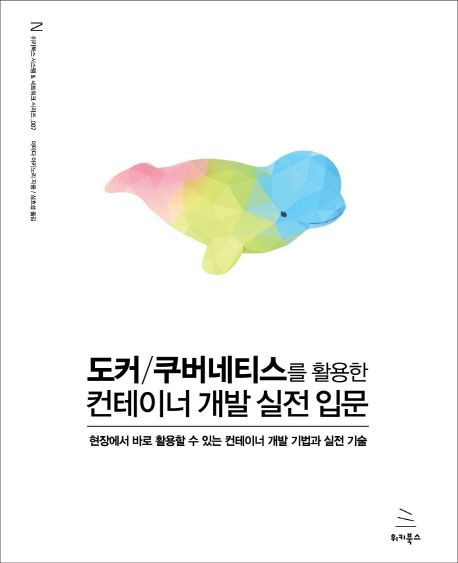

## 도커/쿠버네티스를 활용한 컨테이너 개발 실전 입문

 

 

## Period

_2023-10-18 ~ in progress_

 

## Participants

| Nickname                                                                      | Completed | 
|-------------------------------------------------------------------------------|-----------|
| [@pursue503](https://github.com/2mz1/theory/tree/main/unit-testing/pursue503) | 📖        |
| [@gngsn](https://github.com/2mz1/theory/tree/main/unit-testing/gngsn)              | 📖        |
| [@Mingsicogi](https://github.com/2mz1/theory/tree/main/unit-testing/bbangdi.ming)  | 📖        |

<small><i>📖 - processing, ✔️- completed, ❌- stopped</i></small>