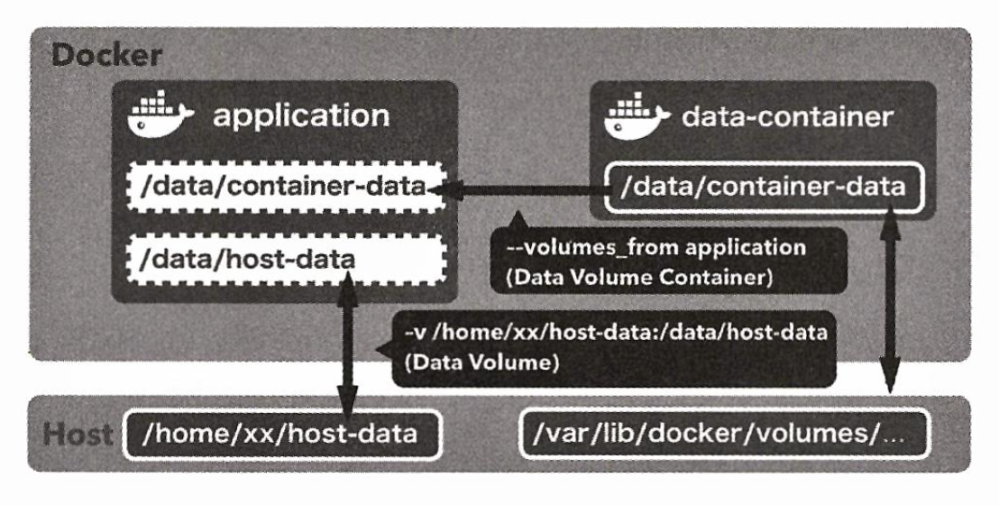
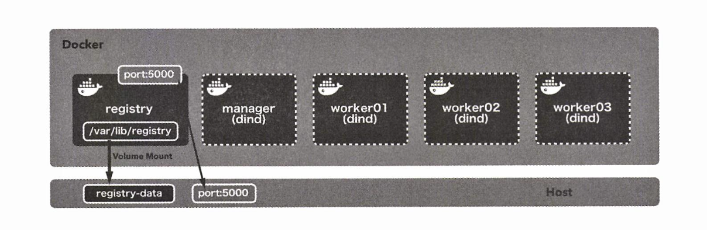

# CHAPTER 3. 컨테이너 실정 구축 및 배포

**목표**

- 시스템에서 단일 컨테이너의 비중, 이식성을 고려해 도커 친화적인 애플리케이션을 개발하는 방법
- 퍼시스턴스(persistence) 데이터를 다루는 방법
- 도커 스웜이나 스택(Stack)을 이용한 컨테이너 배포 전략

<br/>

## 01. 애플리케이션과 시스템 내 단일 컨테이너의 적정 비중

실제운영에서는 애플리케이션을 컨테이너 안에 어떻게 배치하는지가 매우 중요

- 컨테이너 하나가 맡을 수 있는 적정 수준의 책임은 어느정도일까?
- 세세하게 역할을 나누다가 시스템 전체의 복잡도가 올라가지는 않을까?

👉🏻 애플리케이션 내 단일 컨테이너의 적정 비중은 이런 다양한 측면을 고려할 필요가 있음

<br/>

### 컨테이너 1개 = 프로세스 1개?

**✔️ 정기적으로 작업을 실행하는 애플리케이션**

- 스케줄러 기능이 있는 애플리케이션
  - 컨테이너 1개 = 프로세스 1개 가능
- 스케줄러 기능이 없는 애플리케이션
  - 대부분 cron을 사용
  - cron은 하나의 프로세스

```dockerfile
RUM ubuntu: 16.04         # ①

RUN apt update            # ②
RUN apt install -y cron   # ②

COPY task.sh /usr/local/bin/    # ③
COPY cron-example /etc/cron.d/  # ③
RUN chmod 0644 /etc/cron.d/cron-example   # ④

CMD ["cron" "-f"]   # ⑤
```

- ① `ubuntu: 16.04` 사용
- ② 패키지 관리자 apt 사용해서 cron 설치
- ③ task.sh 과 cron-example을 컨테이너로 복사
- ④ 실행을 위해 0644 로 권한 조정
- ⑤ cron 을 foreground 실행
  - cron 은 background 에서 실행하는 프로세스라서 CMD 명령 후 바로 종료 되기 때문에 실행 상태로 남겨둠

```shell
❯ docker image build -t gngsn/cronjob:latest .
[+] Building 18.7s (12/12) FINISHED                                                                docker:desktop-linux
 => [internal] load .dockerignore                                                                                  0.0s
 => => transferring context: 2B                                                                                    0.0s
 => [internal] load build definition from Dockerfile                                                               0.0s
 => => transferring dockerfile: 253B                                                                               0.0s
 => [internal] load metadata for docker.io/library/ubuntu:16.04                                                    3.3s
 => [auth] library/ubuntu:pull token for registry-1.docker.io                                                      0.0s
 => CACHED [1/6] FROM docker.io/library/ubuntu:16.04@sha256:1f1a2d56de1d604801a9671f301190704c25d604a416f59e03c04  0.0s
 => [internal] load build context                                                                                  0.0s
 => => transferring context: 244B                                                                                  0.0s
 => [2/6] RUN apt update                                                                                          11.8s
 => [3/6] RUN apt install -y cron                                                                                  3.3s
 => [4/6] COPY task.sh /usr/local/bin/                                                                             0.0s
 => [5/6] COPY cronfile /etc/cron.d/                                                                           0.0s
 => [6/6] RUN chmod 0644 /etc/cron.d/cronfile                                                                  0.2s
 => exporting to image                                                                                             0.1s
 => => exporting layers                                                                                            0.1s
 => => writing image sha256:7292182058857c96677b99b4934c9d2bb0ad59ca2461d17d7b3a9c9773d6e93a                       0.0s
 => => naming to docker.io/gngsn/cronjob:latest
```

- docker 실행

```shell
❯ docker container run -d --rm --name cronjob gngsn/cronjob:latest
0a081727212cee7fcb77779c0e7d68a511afb7152f073c93716fa8b2903f6f7b
```

- 실행중인 컨테이너 로그 확인

실행중인 컨테이너의 `/var/log/cron.log` 파일의 내용을 보면 `task.sh` 에서 출력한 문자열이 1분마다 추가 되고 있음을 알 수 있음

```shell
❯ docker container exec -it cronjob tail -f /var/log/cron.log
```

- 컨테이너 하나에서 cron 작업까지 총 2개 프로세스를 모두 실행하는 형태
- 억지로 별도의 컨테이너로 분리하는 것보다 훨씬 깔끔

<br/>

### 컨테이너 1개에 하나의 관심사

> Each container should have only one concern.
>
> 컨테이너는 하나의 관심사에만 집중해야 한다.
>
> - 'Best Practices for writing Dockerfiles', 도커 공식문서

애플리케이션과 컨테이너가 전체 시스템에서 차지해야 하는 적정 비중을 고려하면, "각 컨테이너가 맡은 역할을 적절히 나누고, 그 역할에 따라 배치한 컨테이너를 복제해도 전체 구조에서 부작용이 일어나지 않는가?" 를
따져가며 시스템을 설계해야 함

<br/>

## 02. 컨테이너 이식성

- 도커를 사용하면 애플리케이션과 인프라를 컨테이너라는 단위로 분리할 수 있으며, 도커가 설치된 환경이라면 어떤 호스트 운영체제와 플랫폼, 온프레미스 및 클라우드 환경에서도 그대로 동작
- 도커의 이식성은 완벽하지 않아서 몇 가지 예외가 존재

<br/>

### 커널 및 아키텍처의 차이

- 도커에서 사용되는 컨테이너형 가상화 기술은 호스트 운영 체제와 커널 리소스를 공유
- 도커 컨테이너를 실행하려면 호스트가 특정 CPU 아키텍처 혹은 운영 체제를 사용햐야 한다는 의미

가령, 라즈베리 파이(Raspberry Pi, ARM 계열의 armv71 아키텍처)와 인텔 x86_64 아키텍처에서 빌드한 도커 컨테이너 호환 불가

<br/>

### 라이브러리와 동적 링크 문제

- 정적 링크는 애플리케이션에 사용된 라이브러리를 내부에 포함하는 형태이므로 애플리케이션의 크기가 비대해지는 경향의 있지만 이식성은 뛰어남
- 동적 링크는 애플리케이션이 실행할 때 라이브러리가 링크되므로 애플리케이션 크기는 작아지지만 애플리케이션을 실행할 호스트 라이브러리를 갖춰야 함
- COPY를 통해 컨테이너 외부에서 주입시키는 경우도 많음

<br/>

## 03. 도커 친화적인 애플리케이션

컨테이너의 제어와 설정을 고려해서 이식성 높은 애플리케이션을 구축하기 좋게 제작할 수 있음

<br/>

### 환경 변수 사용

- 애플리케이션을 만들 때는 일반적으로 재사용성과 유연성을 가질 수 있도록 옵션을 만들어 두고 동작 제어
- 애플리케이션의 동작을 제어하는 방법으로는 아래와 같은 사항이 있음

**✔️ 실행 시 인자를 사용**

- 장점
  - 외부에서 값을 주입받을 수 있음
- 단점
  - 너무 많은 인자를 받으면, 인자를 내부 변수로 매핑해주는 처리가 복잡해짐
  - CMD 및 ENTRYPOINT 인스트럭션 내용을 관리하기가 어려워질 수 있음

**✔️ 설정 파일 사용**

**✔️ 환경 변수 제어**

<br/>

## 04. 퍼시스턴스 데아터를 다루는 방법

### 데이터 볼륨 (data volume):

- 호스트와 컨테이너 사이의 디렉터리 공유 및 재사용 기능을 제공
- 컨테이너를 파기해도 디스크에 그대로 남으므로 컨테이너로 상태를 갖는 애플리케이션을 실행하는데 적합

  : 도커 컨테이너 안의 디렉터리를 디스크에 퍼시스턴스 데이터로 남기기 위한 메커니즘

  - 도커 이미지를 수정하고 새로 컨테이너를 생성해도 같은 데이터 볼륨을 계속 사용할 수 있음

<br/>

#### `docker run -v` option

```shell
❯ docker container run [options] -v 호스트_디렉터리:컨테이너_디렉터리 리포지토리명[:태그] [명령] [명령인자]
```

데이터 볼륨 생성 명령어

- 젠킨스 도커 이미지는 `/var/jenkins_home`을 홈 디레터리로 삼아 여러 파일을 보관
- 컨테이너 생성 시, 데이터 볼륨 설정을 통해 컨테이너 내의 `/var/jenkins_home` 디렉터리가 **호스트의 지정 경로와 공유**되기 때문에 컨테이너가 정지되거나 파기돼도 그 파일이 그대로 유지됨
- 컨테이너 내 설정 파일을 쉽게 수정할 수 있지만, 특정 호스트 파일 경로에 의존성 발생

<br/>

### 데이터 볼륨 컨테이너

**데이터 볼륨 컨테이너**

- 데이터를 저장하는 것만이 목적인 컨테이너
- 컨테이너가 갖는 퍼시스턴스 데이터로 볼륨으로 활용해 컨테이너에 공유하는 컨테이너
- 컨테이너의 데이터 퍼시스턴스 기법으로 추천

<br/>

> **📌 Data Volume vs Data Volume Container**
>
> ✔️ Data Volume: 컨테이너와 호스트 사이의 디렉터리를 공유
> ✔️ Data Volume Container: 컨테이너 간에 디렉터리를 공유\*\*.

<br/><br/>

**데이터 볼륨 컨테이너 + 호스트 머신**

- 데이터 볼륨 컨테이너가 공유한 디렉터리 역시 호스트 머신의 스토리지에 저장된다는 점에서는 데이터 볼륨과 똑같음
- Data container volume의 볼륨은 호스트 쪽 특정 디렉터리에 의존성을 갖는데, 도커에서 관리하는 영역이 지정되어 있기 때문
  - **호스트 머신의 `/var/lib/docker/volumes/` 아래에 위치**
- 호스트-컨테이너 데이터 볼륨과 비교하면 호스트 머신이 컨테이너에 미치는 영향을 최소한으로 억제

<br/>

### 데이터 볼륨에 MySQL 데이터 저장

Demo - mysql 참고

```dockerfile
FROM busybox

VOLUME /var/lib/mysql

CMD ["bin/true"]
```

- 데이터 볼륨 컨테이너는 데이터를 저장하는 것만을 목적으로 하는 컨테이너이기 때문에 busybox 처럼 작은 이미지를 사용하는 것이 효과적

<small>busybox: 최소한의 운영체제 기능만 제공하는 경량 운영체제. 도커 이미지의 기반 이미지로 많이 사용됨</small>

```shell
❯ docker image build -t gngsn/mysql-data:latest .
[+] Building 3.4s (6/6) FINISHED
...
=> => naming to docker.io/gngsn/mysql-data:latest                                                                     0.0s
```

```shell
❯ docker container run -d --name mysql-data gngsn/mysql-data:latest
5370d167c0bb8c5edec60c95a1e8efc152da92a8e720fafe6825e2410e5687be                                                                0.0s
```

```shell
❯ docker container run -d --rm --name mysql \
  -e "MYSQL_ALLOW_EMPTY_PASSWORD=yes" \
  -e "MYSQL_DATABASE=volume_test" \
  -e "MYSQL_USER=example" \
  -e "MYSQL_PASSWORD=example" \
  --volumes-from mysql-data \
  --platform linux/amd64 \
  mysql:5.7
```

- Apple M1 & M2 Chip에서는 `--platform linux/amd64` 옵션 입력 필요
- 위 컨테이너는 CMD 인스트리션에서 셀을 실행하는 것이 전부기 때문에 실행이 끝나면 컨테이너가 바로 종료됨

```shell
docker container exec -it mysql mysql -u root -p volume_test
Enter password:
...
mysql> CREATE TABLE user(
    ->    id int PRIMARY KEY AUTO_INCREMENT,
    ->    name VARCHAR(255)
    ->  ) ENGINE=InnoDB DEFAULT CHARSET=utf8mb4 COLLATE utf8mb4_unicode_ci;
Query OK, 0 rows affected (0.04 sec)

mysql> INSERT INTO user (name) VALUES ('gngsn'), ('docker'), ('sunny');
Query OK, 3 rows affected (0.04 sec)
Records: 3  Duplicates: 0  Warnings: 0

mysql> SELECT * FROM user;
+----+--------+
| id | name   |
+----+--------+
|  1 | gngsn  |
|  2 | docker |
|  3 | sunny  |
+----+--------+
3 rows in set (0.00 sec)
```

**컨테이너 정지**

```shell
❯ docker container stop mysql
mysql
```

컨테이너 다시 실행 후 확인해도 데이터 남아있는 것을 확인할 수 있음

```shell
❯ docker container stop mysql
mysql
❯ docker container run -d --rm --name mysql \
  -e "MYSQL_ALLOW_EMPTY_PASSWORD=yes" \
  -e "MYSQL_DATABASE=volume_test" \
  -e "MYSQL_USER=example" \
  -e "MYSQL_PASSWORD=example" \
  --volumes-from mysql-data \
  --platform linux/amd64 \
  mysql:5.7
773041ee734fd0da665597a8568e03e6da47dc4f9a26d43c14d26d871bdfa01b

❯ docker container exec -it mysql mysql -u root -p volume_test
Enter password:
...
mysql> SELECT * FROM user;
+----+--------+
| id | name   |
+----+--------+
|  1 | gngsn  |
|  2 | docker |
|  3 | sunny  |
+----+--------+
3 rows in set (0.00 sec)
```

<br/>

### 데이터 익스포트 및 복원

**데이터를 Export 후 다른 위치에 복원하는 방법**

1. busybox 컨테이너를 새로 실행
2. 데이터 볼륨 컨테이너를 mysql-data 로 지정
3. 컨테이너 안에서 따로 데이터를 압축한 다음, 압축된 파일이 위치한 /tmp 디렉터리를 현재 작업 디렉터리에 마운트

```shell
❯ docker container run -v ${PWD}:/tmp \
--volumes-from mysql-data \
busybox \
tar cvzf /tmp/mysql-backup.tar.gz /var/lib/mysql
```

압축된 데이터를 호스트의 /tmp 디렉터리 아래에서 확인 가능

> `docker image save`
> 도커 이미지를 파일Format Document로 아카이빙하는 명령
> 데이터 볼륨에는 사용할 수 없음

<br/>

### 도커 스웜 (Docker Swarm)

- 도커 스웜은 여러 도커 호스트를 클러스터로 묶어 주는 컨테이너 오케스트레이션 도구의 한 종류

<br/>

| 이름   | 역할                                                 |   대응하는명령어   |
| ------ | -------------------------------------------------- | ---------------- |
| 컴포즈 | 여러 컨테이너로 구성된 도커 애플리케이션을 관리 (주로 단일 호스트)  | `docker-compose` |
| 스웜   | 클러스터 구축 및 관리(주로 멀티 호스트)                      | `docker swarm`   |
| 서비스 | 스웜에서 클러스터 안의 서비스(컨테이너 하나 이상의 집합)를 관리    | `docker service` |
| 스택   | 스웜에서 여러개의 서비스를 합한 전체 애플리케이션을 관리          | `docker stack`   |

<br/>

#### ✔️ 여러 대의 도커 호스트로 스웜 클러스터 구성하기

1. 도커 머신즈(Docker Machines)
    - 여러 대의 도커 호스트를 만들 수 있음
    - 도커 머신즈를 사용하려면 macos 에서는 virtualbox 드라이버, 윈도우에서는 hyperv 드라이버가 각각 필요
2. 버추얼 박스
    - 같은 가상화 소프트웨어를 사용하면 물리 호스트 1대에 여러 대의 도커 호스트를 실행할 수 있음 도커공식참조문서에서도이방법을소개
3. **도커 인 도커(Docker in Docker, dind)**
    - 도커 호스트 역할을 할 도커 컨테이너를 여러 개 실행하는 방법
    - 도커 컨테이너 안에서 도커 호스트를 실행할 수 있음


<br/><br/>

- 사용할 컨테이너: 다음 3종류로 모두 합해 5개
  - registry x 1
    - 도커 레지스트리 역할을 할 컨테이너
    - dind 환경에서는 외부 도커 데몬에서 빌드된 도커 이미지를 dind 컨테이너의 파일 시스템을 통해 사용할 수 없음
    - 실제 업무에서는 도커 허브나 별도로 사전 구축한 인하우스 레지스트리를 사용하는 경우가 많음
  - manager x 1
    - 스웜 클러스터 전체를 제어하는 역할
    - 여러대 실행되는 도커 호스트(worker)에 서비스가 담긴 컨테이너를 적절히 배치
  - worker x 3


실습: swarm/docker-compose.yml 실행

```
docker-compose up -d
[+] Running 5/5
 ✔ Container registry  Started
 ✔ Container manager   Started
 ✔ Container worker03  Started
 ✔ Container worker01 Started
 ✔ Container worker02  Starte
 ```


