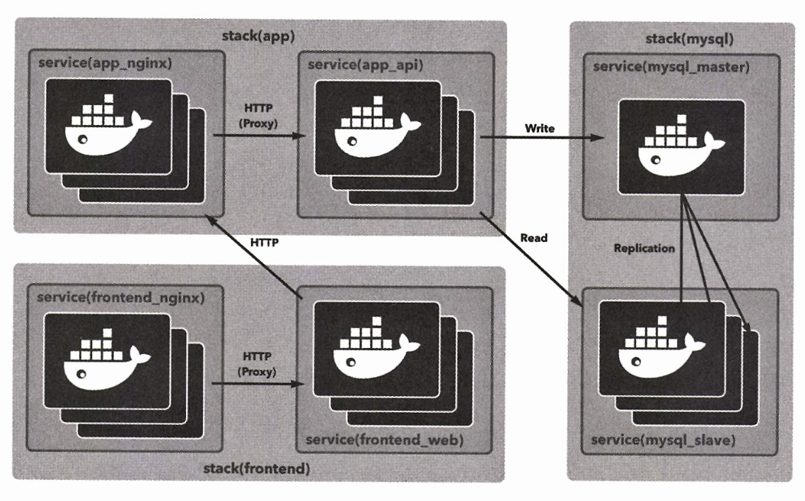
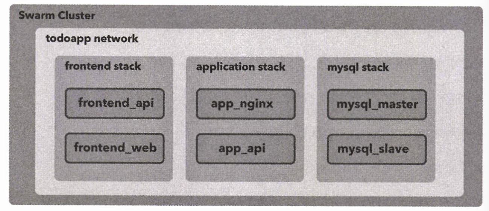
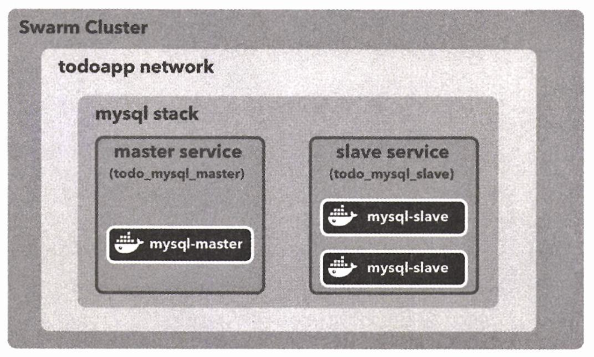

# CHAPTER 4. 스웜을 이용한 실전 애플리케이션 개발


## 01. 웹 애플리케이션 구성

- TODO 등록, 수정, 삭제
- 등록된 TODO 목록 출력
- 브라우저에서 사용할 수 있는 웹 앱
- 브라우저 외에서도 사용할 수 있는 JSON API endpoint 제공


### 아키텍처

오케스트레이션 시스템 → 도커 스웜

목표: 컨테이너 중심의 애플리케이션 개발에 대한 기초적인 기술 습득

<br/><br/><br/>

**아키텍처 구성 요소**

| image | usage                       | service name               | stack name           |
|-------|-----------------------------|----------------------------|----------------------|
| MySQL | data store                  | mysql_master, mysql_slave  | MySQL                |
| API   | 데이터스토어를 다룰 API Server   | app_api                    | Application          |
| Web   | 뷰 생성을 담당하는 Web Server   | fronted_web                | Frontend             |
| Nginx | Proxy Server                | app_nginx, frontend_nginx  | Application Frontend |

<br/>

**✔️ MySQL**

Master-Slave 구성하여 데이터 스토어로 사용

마스터 컨테이너에는 레플리카 하나만 제작

<small>실제 운영 환경에서는 마스터가 SPOF 가 되지 않게 가용성 확보를 위한 추가적인 조치를 진행</small>

<br/>

**✔️ API**

TODO 앱에 특화된 마이크로서비스로 볼 수 있는 RESTful API

<br/>

**✔️ Web UI**

Node.js를 사용하여, 브라우저에 나타낼 웹 페이지를 렌더링하는 역할

<br/>

**✔️ Nginx**

앱 프론트엔드 서버 및 API 앞단에 리버스 프록시 역할

Caching, Routing, Access Logging 등의 역할도 수행

#### 배치 전략

스웜 환경은 3장에서 만든 것 드대로 사용

```bash
> docker container exec -it manager node ls
```

<br/>

### 스택 구성

<br/><br/>

overlay 네트워크 생성

```Bash
❯ docker container exec -it manager docker network create --driver=overlay --attachable todoapp
k5qfdm4rxaiqpr4hddz8735h7
```

<br/>

## 02. MySQL 서비스 구축


```Bash
❯ git clone https://github.com/gihyodocker/tododb
```

### MySQL 설정
- `etc/mysql/mysql.conf.d/mysqld.conf`
- Master-Slave 를 구성하기 위해선 MySQL 설정 파일인 `mysqld.conf`를 수정해야 함


실습 자료의 `mysqld.conf` 를 확인하면 아래와 같음

```Bash[mysqld]
character-set-server = utf8mb4
collation-server = utf8mb4_general_ci
pid-file	= /var/run/mysqld/mysqld.pid
socket		= /var/run/mysqld/mysqld.sock
datadir		= /var/lib/mysql
#log-error	= /var/log/mysql/error.log
# By default we only accept connections from localhost
#bind-address	= 127.0.0.1
# Disabling symbolic-links is recommended to prevent assorted security risks
symbolic-links=0
relay-log=mysqld-relay-bin 
relay-log-index=mysqld-relay-bin 

log-bin=/var/log/mysql/mysql-bin.log  # ①

# ②
```

<br/>

**✔️ ①: log-bin**

Replication을 사용하려면 바이너리 로그가 필요

`log-bin`을 통해 바이너리 로그를 출력할 경로를 설정

`log-bin`은 Master와 Slave 모두 사용

<br/>

**✔️ ②: server-id**

`server-id` 값은 서버를 식별하기 위한 유일한 값으로, 서로 중복 되어선 안됨

마스터와 슬레이브로 구성된 스택 안에서 중복이 없도록 아래와 같이 설정해야함

```Bash
server-id = 1
```

다중 MySQL 컨테이너를 띄우기 때문에, server-id 를 shell script 를 이용해 동적으로 작성

_add-server-id.sh_ :

```Bash
#!/bin/bash -e
OCTETS=(`hostname -i | tr -s '.' ' '`)

MYSQL_SERVER_ID=`expr ${OCTETS[2]} \* 256 + ${OCTETS[3]}`
echo "server-id=$MYSQL_SERVER_ID" >> /etc/mysql/mysql.conf.d/mysqld.cnf
```

위 스크립트는 컨테이너가 실행될 때 동적으로 `mysqld.conf` 하위에 `server-id = n`을 입력

<br/>

### Replication 설정

**prepare.sh 분석하기 🔍**

<table>
<tr>
<th>STEP</th>
<th>DESC</th>
</tr>
<tr><th>①</th><td>

**✔️ 환경 변수로 마스터와 슬레이브 지정**

```Bash
if [ ! -z "$MYSQL_MASTER" ]; then
  echo "this container is master"
  exit 0
fi

echo "prepare as slave"
```

- `MYSQL_MASTER` 값에 따라 Master 혹은 Slave 동작 여부가 결정됨
- `prepare.sh` 파일은 대부분 Slave 설정

</td></tr>
<tr><th>②</th><td>

**✔️ Slave와 Master 간의 통신 확인**

```Bash
if [ -z "$MYSQL_MASTER_HOST" ]; then
  echo "mysql_master_host is not specified" 1>&2
  exit 1
fi

while :
do
  if mysql -h $MYSQL_MASTER_HOST -u root -p$MYSQL_ROOT_PASSWORD -e "quit" > /dev/null 2>&1 ; then
    echo "MySQL master is ready!"
    break
  else
    echo "MySQL master is not ready"
  fi
  sleep 3
done
```

- 슬레이브가 마스터에 MySQL 명령을 실행하려면 마스터의 호스트 명을 알아야 하기 때문에 `MYSQL_MASTER_HOST` 변수 전달
- Slave에서 Master에 명령을 실행하려면 호스트명을 `-h` 옵션으로 주면 됨
- 3초 마다 Master와 통신을 시도하면서 통신이 가능한지 확인

</td></tr>
<tr><th>③</th><td>

**✔️ Master에 Replica 사용자 및 권한 추가**

```Bash
IP=`hostname -i`
IFS='.'
set -- $IP
SOURCE_IP="$1.$2.%.%"
mysql -h $MYSQL_MASTER_HOST -u root -p$MYSQL_ROOT_PASSWORD -e "CREATE USER IF NOT EXISTS '$MYSQL_REPL_USER'@'$SOURCE_IP' IDENTIFIED BY '$MYSQL_REPL_PASSWORD';"
mysql -h $MYSQL_MASTER_HOST -u root -p$MYSQL_ROOT_PASSWORD -e "GRANT REPLICATION SLAVE ON *.* TO '$MYSQL_REPL_USER'@'$SOURCE_IP';"
```

- Replication을 사용하려면 마스터에 레플리카 사용자 및 사용자 권한을 추가해야 함

```SQL
mysql> CREATE USER IF NOT EXISTS 'replication_user_name'@'slave_IP_address' IDENTIFIED BY 'replication_user_password';
mysql> GRANT REPLICATION SLAVE ON *.* TO 'replication_user_name'@'slave_IP_address';
```

- `GRANT REPLICATION SLAVE` 명령어에서 Slave의 IP 주소 값 (slave_IP_address)을 입력해야 하는데,
- Master에서는 Slave의 호스트명이나 IP를 알 수 없기 때문에 `hostname -i` 명령을 이용해 이 값을 받아옴
- IP 주소를 받아와 이 값을 x.x.%.% 포맷으로 `SOURCE_IP` 변수에 대입
    - 가령, IP가 `10.0.0.23` 이라면 `10.0.%.%` 가 변수에 저장됨
    - `10.0.0.0/16` 서브넷에 속하는 컨테이너에서 마스터에 접근할 수 있음
- `MYSQL_MASTER_HOST`, `MYSQL_REPL_USER`, `MYSQL_REPL_PASSWORD` 값으로 사용자 등록 및 권한 설정

</td></tr>
<tr><th>④</th><td>

**✔️ Master binlog의 위치 설정**

```Bash
MASTER_STATUS_FILE=/tmp/master-status
mysql -h $MYSQL_MASTER_HOST -u root -p$MYSQL_ROOT_PASSWORD -e "SHOW MASTER STATUS\G" > $MASTER_STATUS_FILE
BINLOG_FILE=`cat $MASTER_STATUS_FILE | grep File | xargs | cut -d' ' -f2`
BINLOG_POSITION=`cat $MASTER_STATUS_FILE | grep Position | xargs | cut -d' ' -f2`
echo "BINLOG_FILE=$BINLOG_FILE"
echo "BINLOG_POSITION=$BINLOG_POSITION"
```

- 애플리케이션 실행을 위해, Slave 가 Master의 host 및 binlog 파일명, binlog 위치를 알아야 함

<pre>해당 값을 직접 확인하고 싶다면, 아래 명령어를 입력하여 확인할 수 있음

<code>
mysql> show master status;
+---------------+----------+--------------+------------------+-------------------+
| File          | Position | Binlog_Do_DB | Binlog_Ignore_DB | Executed_Gtid_Set |
+---------------+----------+--------------+------------------+-------------------+
| binlog.000002 |     2086 |              |                  |                   |
+---------------+----------+--------------+------------------+-------------------+
1 row in set (0.00 sec)

</code>
</pre>
</td></tr>
<tr><th>⑤</th><td>

**✔️ Replication 시작**

```Bash
mysql -u root -p$MYSQL_ROOT_PASSWORD -e "CHANGE MASTER TO MASTER_HOST='$MYSQL_MASTER_HOST', MASTER_USER='$MYSQL_REPL_USER', MASTER_PASSWORD='$MYSQL_REPL_PASSWORD', MASTER_LOG_FILE='$BINLOG_FILE', MASTER_LOG_POS=$BINLOG_POSITION;"
mysql -u root -p$MYSQL_ROOT_PASSWORD -e "START SLAVE;"

echo "slave started"
```

이후 `CHANGE MASTER TO MASTER_HOST='master', MASTER_USER='repl', MASTER_PASSWORD='gngsn', MASTER_LOG_FILE='mysql-bin.000003', MASTER_LOG_POS=605;"`

명령어를 입력하고 `START SLAVE` 명령을 실행 후, Replication 실행

</td></tr></table>

<br/>

### MySQL (mysql_master/mysql_slave) Dockerfile

<table>
<tr><th>STEP</th><th>DESC</th></tr>
<tr><th>①</th><td>

**✔️ 패키지 업데이트 및 `wget` 설치**

```Bash
RUN apt-get update
RUN apt-get install -y wget
```

- 패키지 목록을 업데이트하고 `docker image build` 명령에서 사용하는 `entrykit`을 받아오기 위해 `wget`을 설치

</td></tr>
<tr><th>②</th><td>

**✔️ entrykit 설치**

```Bash
RUN wget https://github.com/progrium/entrykit/releases/download/v0.4.0/entrykit_0.4.0_linux_x86_64.tgz
RUN tar -xvzf entrykit_0.4.0_linux_x86_64.tgz
RUN rm entrykit_0.4.0_linux_x86_64.tgz
RUN mv entrykit /usr/local/bin/
RUN entrykit --symlink
```

- entrykit 설치: 컨테이너 실행 시 처리할 내용을 기술하기 위한 도구
- **주 프로세스보다 먼저 실행할 명령이 있는 경우 유용**

</td></tr>
<tr><th>③</th><td>

**✔️ 스크립트 및 각종 설정 파일 복사**

```Bash
COPY add-server-id.sh /usr/local/bin/
COPY etc/mysql/mysql.conf.d/mysqld.cnf /etc/mysql/mysql.conf.d/
COPY etc/mysql/conf.d/mysql.cnf /etc/mysql/conf.d/
COPY prepare.sh /docker-entrypoint-initdb.d
COPY init-data.sh /usr/local/bin/
COPY sql /sql
```

- MySQL 컨테이너를 구성하기 위한 파일과 스크립트를 `tododb`에서 컨테이너로 복사

</td></tr>
<tr><th>④</th><td>

**✔️ 스크립트, `mysqld` 실행**

```Bash
ENTRYPOINT [ \
  "prehook", \
    "add-server-id.sh", \
    "--", \
  "docker-entrypoint.sh" \
]
```

- 컨테이너에서 실행할 내용 기술
- fyi. `docker-entrypoint.sh`는 `mysql:5.7` 에 포함된 파일

- 위에서 살펴봤다시피, `add-server-id.sh` 파일 (`server-id` 값을 `mysqld.cnf` 에 추가하는 파일)은 DB 시작 전에 실행되어야 함
- 이를 위해, entrykit의 prehook 명령 사용

</td></tr>
</table>

<br/>

### 빌드 및 스웜 클러스터에서 사용하기

1. image build

```Bash
docker image build -t gngsn/tododb:latest .
```

<table>
<tr>
<td>

### ✔️ Error #1. `mysql:5.7: no match for platform`

```Bash
❯ docker image build -t gngsn/tododb:latest .
[+] Building 2.1s (6/6) FINISHED                                              docker:desktop-linux
 => [internal] load build definition from Dockerfile
...
--------------------
  15 |     
  16 | >>> FROM mysql:5.7
  17 |     
  18 |     COPY --from=0 /bin/entrykit /bin/entrykit
--------------------
ERROR: failed to solve: mysql:5.7: no match for platform in manifest sha256:880...3d: not found

```

#### Solution #1

add `--platform linux/arm64` flag

</td>
</tr>
<tr>
<td>

### ✔️ Error #2. `apt-get: command not found`

```Bash
❯ docker image build --platform linux/x86_64 -t gngsn/tododb:latest .
[+] Building 30.7s (6/18) 
...
 => => extracting sha256:b0e9b86ed64c8df8320596d475d3bbc4927e1e8bdc9ea97473c7e38024ae9c82                                                                                                                                                      0.0s
 => => extracting sha256:bfef93045c96cfc909e0b6b4d373e5cb88f5a1c92c22754bf1a353220e24f02c                                                                                                                                                      0.0s
 => [internal]  load build context                                                                                                                                                                                                              0.0s
 => => transferring context: 5.14kB                                                                                                                                                                                                            0.0s
 => ERROR [ 2/14] RUN apt-get update                                                                                                                                                                                                           0.4s
------
 > [ 2/14] RUN apt-get update:
0.116 /bin/sh: apt-get: command not found
------
Dockerfile:3
--------------------
   1 |     FROM mysql:5.7
   2 |     
   3 | >>> RUN apt-get update
   4 |     RUN apt-get install -y wget
   5 |     
--------------------
ERROR: failed to solve: process "/bin/sh -c apt-get update" did not complete successfully: exit code: 127
```

#### Debugging #2

add `--progress=plain` option: 빌드 내용들을 모두 출력해줌

<br/>

#### Reason #2

```Bash
 > [ 2/14] RUN apt-get -y update:
0.127 /bin/sh: apt-get: command not found
```

`apt-get` 명령어가 기존 이미지에 없음


#### Solution #2

Docker image 변경

`mysql:5.7` → `mysql:5.7-debian`

</td></tr><tr><td>

### ✔️ Error #3. `failed to create new OS thread (have 2 already; errno=22)`

dockerfile 빌드 중 오류 발생

```Bash
 > [ 8/14] RUN entrykit --symlink:
0.127 runtime: failed to create new OS thread (have 2 already; errno=22)
0.127 fatal error: newosproc
0.130 
0.130 runtime stack:
0.130 runtime.throw(0x84a820, 0x9)
```

<br/>

#### Reason

Arm version의 컨테이너에서 발생하는 문제

Apple M Series Chip 에서 발생하는 것으로 추정.

entrykit 을 설치해서 사용하는 방식으로는 지원되지 않는 점이 있는 것으로 보아,
entrykit 환경을 잘 지원하는 환경에서 명령어 설치를 위한 빌드 후,
원하는 환경에 복사해서 사용

- **해결 방법 참고**
  - [multi-stage build] (https://docs.docker.com/build/building/multi-stage/#use-multi-stage-builds)
  - [github issues](https://github.com/progrium/entrykit/issues/16#issuecomment-1231132628)

<br/>

#### Solution

- Dockerfile 수정

```Docker
FROM golang:1.17.1 as build

RUN apt-get update && \
    apt-get install unzip -y

RUN wget https://github.com/progrium/entrykit/archive/refs/heads/master.zip \
    && echo testing the dir \
    && ls -a\
    && unzip master.zip \
    && rm master.zip \
    && cd entrykit-master/ \
    && make build \
    && mv build/Linux/entrykit /bin/entrykit
```

위를 추가 후 아래와 같이 수정

```Bash
FROM mysql:8.0.33

COPY --from=build /bin/entrykit /bin/entrykit
RUN chmod +x /bin/entrykit && entrykit --symlink
```

</td></tr></table>

<br/>

**build 명령어 실행 :**

```Bash
❯ docker image build --platform linux/arm64 -t gngsn/tododb:latest .
```

- 레지스트리에 등록할 태그 명령어 실행

```Bash
❯ docker image tag gngsn/tododb:latest localhost:5000/gngsn/tododb:latest
```


```Bash
❯ docker image push localhost:5000/gngsn/tododb:latest
The push refers to repository [localhost:5000/gngsn/tododb]
1304545fd7b6: Preparing 
cd4663989e4f: Preparing
...
latest: digest: sha256:0106...621d size: 4493
```

<br/>

### 스웜에서 마스터 및 슬레이브 실행

스웜에서 MySQL Master & Slave 역할을 할 2개의 서비스 생성

- Master Service - Replica: 1
- Slave Service - Replica: 2

`/stack` directory에 todo-mysql.yml 파일을 만들고 해당 파일에 2개의 서비스를 각각 정의
앞에서 만든 overlay 네트워크 todoapp의 external 속성을 true로 정의해 각 서비스가 이 네트워크에 속하게 해야 함


```Bash
❯ docker container exec -it manager ls -al /stack
❯ docker container exec -it manager vi /stack/todo-mysql.yml
... 위 todo-mysql.yml 작성
❯ docker container exec -it manager docker stack deploy -c /stack/todo-mysql.yml todo_mysql
```

<table>
<tr>
<th>Error: <code>services.slave.deploy Additional property depends_on is not allowed</code></th>
</tr>
<tr><td>

오타나 Indentation 잘못된 경우 발생하는 경우 ...

`depends_on` 은 `slave.deploy.depends_on` 이 아니라 `slave.depends_on` 으로 설정

동일하게, `depends_on` 은 `slave.deploy.environment` 이 아니라 `slave.environment` 으로 설정

---

<code>{{services.slave.deploy}} Additional property depends_on is not allowed</code>

위와 같은 형식의 오류가 발생했다면, `{{ here }}` 에 위치한 property 에 오타나 포함 관계를 실수한 경우와 같이 오류가 있다는 의미

</td></tr><tr><td>

**TOBE:** 

```yaml
services:
  ...
  
  slave:
    image: registry:5000/gngsn/tododb:latest
    deploy:
      replicas: 2
      placement:
        constraints: [node.role != manager]
    depends_on:
      - master
    environment:
      MYSQL_MASTER_HOST: gngsn
      MYSQL_ROOT_PASSWORD: gngsn
      MYSQL_DATABASE: tododb
      MYSQL_USER: gngsn
      MYSQL_PASSWORD: gngsn
      MYSQL_REPL_USER: repl
      MYSQL_REPL_PASSWORD: gngsn
    networks:
      - todoapp
```

</td></tr>
</table>

```Bash
❯ docker container exec -it manager docker stack deploy -c /stack/todo-mysql.yml todo_mysql
Creating service todo_mysql_slave
Creating service todo_mysql_master
```

<br/>

#### 스웜으로 배포하기

todo-mysql.yml 에 정의된 서비스를 todo_mysql Stack으로 manager container에 배포

스택을 사용해서 여러 서비스를 배포하면 서비스명 앞에 스택명이 붙어서 Master는 todo_mysql_master, Slave는 todo_mysql_slave라는 이름이 됨

<br/>

```Bash
❯ docker container exec -it manager docker service ls
ID             NAME                MODE         REPLICAS   IMAGE                                      PORTS
k0yii1idlt71   todo_mysql_master   replicated   1/1        registry:5000/gngsn/tododb-master:latest   
un1yx2mdtcq6   todo_mysql_slave    replicated   2/2        registry:5000/gngsn/tododb-slave:latest   
```

<br/><br/>

<br/>

### MySQL 컨테이너 확인 및 초기 데이터 투입

초기 데이터를 넣기 전, 먼저 마스터 컨테이너가 Swarm 노드 중 어느 것에 배치됐는지 확 인해야 하는데,
다음과 같이 `docker service ps` 명령을 사용

```Bash
❯ docker container exec -it manager docker service ps todo_mysql_master --no-trunc --filter "desired-state=running"
ID                          NAME                  IMAGE                                                                                                              NODE           DESIRED STATE   CURRENT STATE           ERROR     PORTS
mojbtc46odudt4ho74v7dtm8a   todo_mysql_master.1   registry:5000/gngsn/tododb-master:latest@sha256:614c61b14ef19fb43d4c36bb0916171e2a352e6b2557bc1e15ee26af52c6e9c3   d5d52eeba974   Running         Running 2 minutes ago
```

노드의 ID와 태스크의 ID만 알면 다음과 같이 docker container exec 명령을 중첩 실행해 원하는 컨테이너에 데이터 삽입 가능


<table>
<tr>
<th rowspan="4">Master DB Data Init</th>
</tr><tr>
<td>

```Bash
❯ docker container exec -it manager docker service ps todo_mysql_master --no-trunc --filter "desired-state=running" --format "docker container exec -it {{.Node}} docker container exec -it {{.Name}}.{{.ID}} bash"
docker container exec -it d5d52eeba974 docker container exec -it todo_mysql_master.1.mojbtc46odudt4ho74v7dtm8a bash
```

```Bash
❯ docker container exec -it d5d52eeba974 docker container exec -it todo_mysql_master.1.mojbtc46odudt4ho74v7dtm8a init-data.sh
```


</td></tr><tr><td>

```Bash
❯ docker container exec -it d5d52eeba974 docker container exec -it todo_mysql_master.1.mojbtc46odudt4ho74v7dtm8a mysql -u gngsn -pgngsn tododb
...
mysql> SELECT * FROM todo;
+----+----------------------------------+----------------------------------------------------------------------------------------------------------+----------+---------------------+---------------------+
| id | title                            | content                                                                                                  | status   | created             | updated             |
+----+----------------------------------+----------------------------------------------------------------------------------------------------------+----------+---------------------+---------------------+
|  1 | MySQL Docker 이미지 생성         | MySQL Master, Slave를 환경 변수로 설정할 수 있는 MySQL 이미지 생성                                       | DONE     | 2023-11-05 11:34:07 | 2023-11-05 11:34:07 |
|  2 | MySQL Stack 생성                 | MySQL Master, Slave를 환경 변수로 설정할 수 있는 MySQL 이미지 생성                                       | DONE     | 2023-11-05 11:34:07 | 2023-11-05 11:34:07 |
|  3 | API 구현                         | Go 언어로 TODO 확인 및 업데이트 처리를 위한 API를 구현                                                   | PROGRESS | 2023-11-05 11:34:07 | 2023-11-05 11:34:07 |
|  4 | Nginx의 Docker 이미지 생성       | 백엔드에 HTTP 요청을 보내는 Nginx의 이미지를 생성                                                        | PROGRESS | 2023-11-05 11:34:07 | 2023-11-05 11:34:07 |
|  5 | API Stack 구축                   | Nginx와 API로 구성된 스택을 Swarm 클러스터에 구축                                                        | PROGRESS | 2023-11-05 11:34:07 | 2023-11-05 11:34:07 |
|  6 | Web 구현                         | Nuxt.js를 사용하여 API와 연동된 TODO의 상태를 표시하는 웹 애플리케이션을 구현                            | PROGRESS | 2023-11-05 11:34:07 | 2023-11-05 11:34:07 |
|  7 | Web Stack 구축                   | Nginx와 Web으로 구성된 스택을 Swarm 클러스터에 구축                                                      | PROGRESS | 2023-11-05 11:34:07 | 2023-11-05 11:34:07 |
|  8 | Ingress 구축                     | Swarm 클러스터에 외부에서 접근하기 위한 Ingress를 구축                                                   | TODO     | 2023-11-05 11:34:07 | 2023-11-05 11:34:07 |
+----+----------------------------------+----------------------------------------------------------------------------------------------------------+----------+---------------------+---------------------+
8 rows in set (0.00 sec)
```

</td></tr>

<tr>
<th rowspan="4">Slave DB Data Init</th>
</tr>
<tr>
<td>

```Bash
❯ docker container exec -it manager docker service ps todo_mysql_slave --no-trunc --filter "desired-state=running" --format "docker container exec -it {{.Node}} docker container exec -it {{.Name}}.{{.ID}} bash"
docker container exec -it 6c30c78dc985 docker container exec -it todo_mysql_slave.1.2mqwnco92qqwgm2b9x1iqzamk bash
docker container exec -it 3320c84927ee docker container exec -it todo_mysql_slave.2.t4ajy6v60fwo04s8pbcrmp5yc bash
```

</td></tr><tr><td>

```Bash
❯ docker container exec -it 6c30c78dc985 docker container exec -it todo_mysql_slave.1.2mqwnco92qqwgm2b9x1iqzamk init-data.sh
```

</td></tr><tr><td>

```Bash
❯ docker container exec -it 6c30c78dc985 docker container exec -it todo_mysql_slave.1.2mqwnco92qqwgm2b9x1iqzamk mysql -u gngsn -pgngsn tododb
...

mysql> SELECT * FROM todo;
+----+----------------------------------+----------------------------------------------------------------------------------------------------------+----------+---------------------+---------------------+
| id | title                            | content                                                                                                  | status   | created             | updated             |
+----+----------------------------------+----------------------------------------------------------------------------------------------------------+----------+---------------------+---------------------+
|  1 | MySQL Docker 이미지 생성         | MySQL Master, Slave를 환경 변수로 설정할 수 있는 MySQL 이미지 생성                                       | DONE     | 2023-11-05 11:34:07 | 2023-11-05 11:34:07 |
|  2 | MySQL Stack 생성                 | MySQL Master, Slave를 환경 변수로 설정할 수 있는 MySQL 이미지 생성                                       | DONE     | 2023-11-05 11:34:07 | 2023-11-05 11:34:07 |
|  3 | API 구현                         | Go 언어로 TODO 확인 및 업데이트 처리를 위한 API를 구현                                                   | PROGRESS | 2023-11-05 11:34:07 | 2023-11-05 11:34:07 |
|  4 | Nginx의 Docker 이미지 생성       | 백엔드에 HTTP 요청을 보내는 Nginx의 이미지를 생성                                                        | PROGRESS | 2023-11-05 11:34:07 | 2023-11-05 11:34:07 |
|  5 | API Stack 구축                   | Nginx와 API로 구성된 스택을 Swarm 클러스터에 구축                                                        | PROGRESS | 2023-11-05 11:34:07 | 2023-11-05 11:34:07 |
|  6 | Web 구현                         | Nuxt.js를 사용하여 API와 연동된 TODO의 상태를 표시하는 웹 애플리케이션을 구현                            | PROGRESS | 2023-11-05 11:34:07 | 2023-11-05 11:34:07 |
|  7 | Web Stack 구축                   | Nginx와 Web으로 구성된 스택을 Swarm 클러스터에 구축                                                      | PROGRESS | 2023-11-05 11:34:07 | 2023-11-05 11:34:07 |
|  8 | Ingress 구축                     | Swarm 클러스터에 외부에서 접근하기 위한 Ingress를 구축                                                   | TODO     | 2023-11-05 11:34:07 | 2023-11-05 11:34:07 |
+----+----------------------------------+----------------------------------------------------------------------------------------------------------+----------+---------------------+---------------------+
8 rows in set (0.00 sec)
```

</td></tr>
</table>

<br/>

## 03. API 서비스 구축

```Bash
❯ git clone https://github.com/gihyodocker/todoapi
```

```Bash
(todoapi) $ tree -a -I '.git|.gitignore'
.
├── dockerignore  # 컨테이너에 넣지 않을 파일 및 디렉터리 정의 
├── cmd
⎪  └── main.go    # 애플리케이션 시작
├── db.go         # MySQL 접속
├── Dockerfile    # 애플리케이션을 빌드하고 이미지를 생성하는 Dockerfile
├── env.go        # main.go에서 사용하는 환경 변수 생성
└── handler.go    # HTTP 요청을 받으면 비즈니스 로직을 수행하고 용답을 돌려줌
```

`env.go`의 정의 환경변수를 살펴보면 아래와 같음

- CreateEnv 함수는 **필요한 환경 변수값을 가져와 구조체에 저장해 반환**해 다루기 편리하도록 함
- os.GetEnv 함수는 환경 변수 값을 구하는 함수로, **인자로 지정된 환경 변수의 값을 반환**
- TODO_BIND: API가 Listening 포트로 사용할 포트 값을 저장하는 환경 변수
- TODO_MASTER_URL, TODO SIAVE_URL 은 MySQL Master 및 Slave에 대한 각각의 접속 정보

<br/>

### MySQL 접속 및 테이블 매핑

_db.go_

- CreateDbMap 함수: `[DB사용자 명]:[DB패스워드]@tcp([DB호스트]:[DB포트))/[DB명]` 형식으로 정의된 접속 정보를 받아 MySQL에 접속

```Go
func CreateDbMap(dbURL string) (*gorp.DbMap, error) {

	ds, err := createDatasource(dbURL)
	if err != nil {
		return nil, err
	}

	db := &gorp.DbMap{
		Db: ds,
		Dialect: gorp.MySQLDialect{
			Engine:   "InnoDB",
			Encoding: "utf8mb4",
		},
	}

	db.AddTableWithName(Todo{}, "todo").SetKeys(true, "ID")
	return db, nil
}
```

+ `db.go` 에는 테이블 매핑을 위한 구조체도 정의되어 있음

<br/>

### 핸들러 구현

- `cmd/main.go` 파일의 ⑥은 엔드포인트 `/todo` 에 `NewTodoHandler` 로 생성한 핸들러를 설정한 후 `TodoHandler` 의 `ServeHITTP` 함수가 이 요청을 받도록 한 것

<table>
<tr>
  <th>serveGET (read TODO)</th><th>servePOST (create TODO)</th><th>servePUT (modify TODO)</th>
</tr>
<tr><td>
<pre><code>
$ curl -s -XGET http://localhost:8080/todo?status=TODO | jq .
</code></pre>

- todo 테이블에서 SELECT 쿼리를 실행하고 조건이 일치하는 JSON 포맷으로 된 레코드의 배열을 응답으로 반환

</td>
<td>
<pre><code>
$ curl -s -XPOST -d '{
  "title": "4장 집필하기"
  "content": "내용 검토 중"
}' http://localhost:8080/todo
</code></pre>

- 새로운 TODO 추가

</td>
<td>
<pre><code>
$ curl -s -XPUT -d '{
  "id": 1
  "title": "4장 집필하기"
  "content": "도커를 이용한 실전적 웹 애플리케이션 개발을 내용으로"
  "status": "PROGRESS"
}' http://localhost:8080/todo
</code></pre>

- 이미 추가된 TODO 수정
- 존재하지 않으면 404 반환

</td></tr></table>

<br/>

### API를 위한 Dockerfile

Image 빌드 후 registry container 에 등록 (push)

`WORKDIR`: RUN이나 CMD 인스트럭션을 실행할 폴더 지정

1. Build Dockerfile

```Bash
❯ docker image build -t gngsn/todoapi:latest .
[+] Building 0.8s (9/9) FINISHED                                                                              docker:desktop-linux
 => [internal] load .dockerignore                                                                                             0.0s
 => => transferring context: 105B                                                                                             0.0s
 ...
 => => writing image sha256:8998887e2a97db3199fe20177c55e8f9015357a12873e4918263c63d02c7a614                                  0.0s
 => => naming to docker.io/gngsn/todoapi:latest  
```

2. Tag

```Bash
❯ docker image tag gngsn/todoapi:latest localhost:5000/gngsn/todoapi:latest
```

3. Push

```Bash
❯ docker image push localhost:5000/gngsn/todoapi:latest 
The push refers to repository [localhost:5000/gngsn/todoapi]
25e0859015af: Pushed 
a547df8c58a5: Pushed 
...
latest: digest: sha256:61d9d16d547072ffbd319509d1a673ab70baf91e23b7e61a901d583e8133fcbe size: 2424
```

<br/>

### Swarm에서 todoapi 서비스 실행하기

stack 디렉터리에 위치한 `todo-app.yml` 파일에 api 서비스를 정의

레플리카 수는 2로 하고, 애플리케이션이 개발할 포트 및 MySQL 접속 정보를 환경 변수로 정의

<br/>

### 스웜에서 todoapi 서비스 실행하기

```Bash
❯ docker container exec -it manager vi /stack/todo-app.yml
```

_todo-app.yml_

```yaml
version: "3"

services:
  api:
    image: registry:5000/gngsn/todoapi:latest
    deploy:
      replicas: 2
    environment:
      TODO_BIND: ":8080"
      TODO_MASTER_URL: "gngsn:gngsn@tcp(todo_mysql_master:3306)/tododb?parseTime=true"
      TODO_SLAVE_URL: "gngsn:gngsn@tcp(todo_mysql_slave:3306)/tododb?parseTime=true"
    networks:
      - todoapp

networks:
  todoapp:
    external: true
```


```Bash
❯ docker container exec -it manager docker stack deploy -c /stack/todo-app.yml todo_app
Creating service todo_app_api

❯ docker container exec -it manager docker service ls
ID             NAME                MODE         REPLICAS   IMAGE                                      PORTS
4cu8h87lohhe   todo_app_api        replicated   2/2        registry:5000/gngsn/todoapi:latest         
k0yii1idlt71   todo_mysql_master   replicated   1/1        registry:5000/gngsn/tododb-master:latest   
un1yx2mdtcq6   todo_mysql_slave    replicated   2/2        registry:5000/gngsn/tododb-slave:latest    
```

```Bash
❯ docker container exec -it manager docker service logs -f todo_app_api
todo_app_api.1.m89a58k4h93z@a75c6b534f97    | 2023/11/01 13:27:25 Listen HTTP Server
todo_app_api.2.nt776bosf4ek@6c30c78dc985    | 2023/11/01 13:27:36 Listen HTTP Server
```

<br/>

## 04. Nginx 구축

```Bash
.
├── Dockerfile 
└── etc
   └── nginx    
      ├── conf.d
      ⎪   ├── log.conf    # 로그 출력 포맷을 정의하는 파일 (json 형식, 새로운 로그 포맷 정의만 함)
      ⎪   ├── public.conf.tmpl    # 라우팅 HTTP 요청에 대한 라우팅 설정
      ⎪   └── upstream.conf.tmpl    # 백엔드 서버 지정
      └── nginx.conf.tmpl
```

<br/>

### 04-01. nginx.conf 파일 구성

- `nginx:1.13` 기반 이미지 사용

_이미지 디렉터리 구조_

```Bash
(/etc/nginx) $ tree .
├── conf.d 
⎪   └── default.conf
├── ...
└── nginx.conf    
```

- Nginx 주 설정 파일: `/etc/nginx/nginx.conf`

```Bash
user  nginx;
worker_processes 1;  # ①

error_log  /var/log/nginx/error.log warn;
pid        /var/run/nginx.pid;

events {
    worker_connections 1024;  # ②
}

http {
    include       /etc/nginx/mime.types;
    default_type  application/octet-stream;

    log_format  main  '$remote_addr - $remote_user [$time_local] "$request" '
                      '$status $body_bytes_sent "$http_referer" '
                      '"$http_user_agent" "$http_x_forwarded_for"';

    access_log  /var/log/nginx/access.log  main;

    sendfile        on;
    #tcp_nopush     on;

    keepalive_timeout 65;  # ③

    gzip on  # ④

    include /etc/nginx/conf.d/*.conf;
}
```

- ① Nginx에서 사용할 워커 프로세스 수 
- ② 워커 프로세스가 만들 수 있는 최대 연결수 
- ③ 클라이언트와의 접속 유지 시간(초)
- ④ 응답 내용을 gzip 으로 압축할지 여부

--- 

- 성능과 관련된 값은 설정 파일에 고정값으로 설정하는 것보다는 환경변수로 설정하는 편이 튜닝 상 간편하기도 하고 이식성도 향상
- 그러나 Nginx의 설정 파일 자체에는 환경변수를 참조하는 기능이 없기 때문에 환경변수를 설정 값으로 사용하려면 약간의 수고가 필요


#### ✔️ entrykit temlpate 기능

환경변수를적극활용하자
도커 사용 시, 상황에 따라 동작을 변화시키는 부분은 모두 환경변수로 만들어 두고 여기에 기본 값을 정해 
기본 동작을 설정하는 버릇을 들이는게 좋다. `entrykit` 처럼 이런 작업을 도와주는 도구도 충실히 갖춰져 있다.


<br/>

### 04-02. Nginx 컨테이너의 Dockerfile

```Bash
❯ git clone https://github.com/gihyodocker/todonginx
```

dockerfile 빌드 중 오류 발생 

```Bash
 => [ 7/11] RUN mv entrykit /usr/local/bin/                                                                                   0.3s
 => ERROR [ 8/11] RUN entrykit --symlink                                                                                      0.3s
------
 > [ 8/11] RUN entrykit --symlink:
0.270 runtime: failed to create new OS thread (have 2 already; errno=22)
0.270 fatal error: newosproc
```

Apple M Series Chip 에서 발생하는 것으로 추정.

entrykit 을 설치해서 사용하는 방식으로는 지원되지 않는 점이 있는 것으로 보아,
entrykit 환경을 잘 지원하는 환경에서 명령어 설치를 위한 빌드 후, 
원하는 환경에 복사해서 사용

- **해결 방법 참고** 
  - [multi-stage build] (https://docs.docker.com/build/building/multi-stage/#use-multi-stage-builds)
  - [github issues](https://github.com/progrium/entrykit/issues/16#issuecomment-1231132628)

<br/>

```Docker
# pulls entrykit from master and builds
FROM golang:1.17.1

RUN apt-get update && \
    apt-get install unzip -y

RUN wget https://github.com/progrium/entrykit/archive/refs/heads/master.zip \
    && echo testing the dir \
    && ls -a\
    && unzip master.zip \
    && rm master.zip \
    && cd entrykit-master/ \
    && make build \
    && mv build/Linux/entrykit /bin/entrykit

FROM nginx

COPY --from=0 /bin/entrykit /bin/entrykit

RUN chmod +x /bin/entrykit \
    && entrykit --symlink

RUN rm /etc/nginx/conf.d/*
COPY etc/nginx/nginx.conf.tmpl /etc/nginx/
COPY etc/nginx/conf.d/ /etc/nginx/conf.d/

ENTRYPOINT [ \
  "render", \
      "/etc/nginx/nginx.conf", \
      "--", \
  "render", \
      "/etc/nginx/conf.d/upstream.conf", \
      "--", \
  "render", \
      "/etc/nginx/conf.d/public.conf", \
      "--" \
]

CMD nginx -g "daemon off;"
```

이미지 빌드

```Bash
❯ docker image build -t gngsn/nginx:latest .
[+] Building 39.0s (17/17) FINISHED                                                                           docker:desktop-linux
 => [internal] load build definition from Dockerfile                                                                          0.0s
 => => transferring dockerfile: 925B                                                                                          0.0s
... 
 => => writing image sha256:70d9ac160f7f63e28a4baf22ad5b31de822d30673017d1fd49cf4357691c7fc6                                  0.0s
 => => naming to docker.io/gngsn/nginx:latest                                                                                 0.0s
```

registry 등록 

```Bash
❯ docker image tag gngsn/nginx:latest localhost:5000/gngsn/nginx:latest
❯ docker image push localhost:5000/gngsn/nginx:latest
The push refers to repository [localhost:5000/gngsn/nginx]
...
```

<br/>

### 04-02. Nginx 컨테이너의 Dockerfile


_todo-app.yml_ 수정

```yaml
version: "3"

services:
  nginx:
    image: registry:5000/gngsn/nginx:latest
    deploy:
      replicas: 2
      placement:
        constraints: [node.role != manager]
    depends_on:
      - api
    environment:
      WORKER_PROCESSES: 2 
      WORKER_CONNECTIONS: 1024
      KEEPALIVE_TIMEOUT: 65
      GZIP: "on"
      BACKEND_HOST: todo_app_api:8080
      BACKEND_MAX_FAILS: 3
      BACKEND_FAIL_TIMEOUT: 10s
      SERVER_PORT: 80
      SERVER_NAME: todo_app_nginx
      LOG_STDOUT: "true"
    networks:
      - todoapp

  api:
    image: registry:5000/gngsn/todoapi:latest
    deploy:
      replicas: 2
    environment:
      TODO_BIND: ":8080"
      TODO_MASTER_URL: "gngsn:gngsn@tcp(todo_mysql_master:3306)/tododb?parseTime=true"
      TODO_SLAVE_URL: "gngsn:gngsn@tcp(todo_mysql_slave:3306)/tododb?parseTime=true"
    networks:
      - todoapp

networks:
  todoapp:
    external: true
```

- Nginx 도커이미지는 컨테이너를 실행할 때 entrykit에 주어진 환경변수 값으로 설정 파일을 만들게 했으므로 Nginx에서 백엔드로 요청을 전달하는 프록시 설정 또한 환경변수로 정의하면 된다.

- todo_app의 스택을 위와 같이 수정 후 아래 명령어로 업데이트 

```Bash
❯ docker container exec -it manager docker stack deploy -c /stack/todo-app.yml todo_app
Creating service todo_app_nginx
Updating service todo_app_api (id: 4cu8h87lohhelpprpbrk0tz13)
```

- 서비스 확인 

```Bash
❯ docker container exec -it manager docker service ls
ID             NAME                MODE         REPLICAS   IMAGE                                      PORTS
4cu8h87lohhe   todo_app_api        replicated   2/2        registry:5000/gngsn/todoapi:latest         
xoe1dr1yv82r   todo_app_nginx      replicated   2/2        registry:5000/gngsn/nginx:latest           
k0yii1idlt71   todo_mysql_master   replicated   1/1        registry:5000/gngsn/tododb-master:latest   
un1yx2mdtcq6   todo_mysql_slave    replicated   2/2        registry:5000/gngsn/tododb-slave:latest    
```

<br/>

## 05. 웹 서비스 구축

```Bash
git clone https://github.com/gihyodocker/todoweb
```

### TODO API 호출 및 페이지 HTML 렌더링

```Bash
❯ npm install
❯ npm run build
❯ npm run start
```

```Bash
❯ docker image build -t gngsn/todoweb:latest .
❯ docker image tag gngsn/todoweb:latest localhost:5000/gngsn/todoweb:latest 
❯ docker image push localhost:5000/gngsn/todoweb:latest
The push refers to repository [localhost:5000/gngsn/todoweb]
...
```

<br/>

### 05-01. 정적 파일을 다루는 방법

- 웹 애플리케이션 앞단에 Nginx 배치
- 배포한 Nginx 수정 필요
- TODO 애플리케이션의 웹 부분은 Node.js를 사용해 생성한 동적 콘텐츠를 응답으로 제공
- 이외에도 브라우저에서 웹페이지를 표시하는데 필요한 자바스크립트나 CSS 파일같은 정적 파일 (애셋) 을 제공하는 역할도 담당
- 하지만, 웹 애플리케이션처럼 Nginx에서 리버스 프록시 구성을 취하는 경우, 정적 콘텐츠까지 Node.js 가 제공하면 비효율적
- 정적 파일은 웹 애플리케이션을 거치지 않고 Nginx에서 바로 응답을 처리
  - Nuxt.js에서는 `/_nuxt/` 경로 아래 애셋 파일 위치

<br/>

- `etc/nginx/conf.d/public.conf.tmpl`을 `etc/nginx/conf.d/nuxt.conf.tmpl`로 수정
- `todonginx/Dockerfile` 을 수정해서 `Dockerfile-nuxt` 생성

**재배포**

```Bash
❯ docker image build -f Dockerfile-nuxt -t gngsn/nginx-nuxt:latest .
❯ docker image tag gngsn/nginx-nuxt:latest localhost:5000/gngsn/nginx-nuxt:latest
❯ docker image push localhost:5000/gngsn/nginx-nuxt:latest
The push refers to repository [localhost:5000/gngsn/nginx-nuxt]
...
```

<br/>

### 05-02. Nginx를 통한 접근 허용

- todoapi와 마찬가지로 todoweb 역시 Nginx 를 통해 접근할 수 있음
- stack 디렉터리에 다음과 같이 `todo-frontend.yml` 파일 생성
- Nginx는 todoapi와 마찬가지로 `registry:5000/ch04/nginx-nuxt:latest` 이미지를 사용하지만, BACKEND_HOST등의 환경 변수 값을 수정해 동작을 달리함

_`todo-frontend.yml` 파일 생성 후 아래 실행_

```Bash
❯ docker container exec -it manager vi /stack/todo-frontend.yml
❯ docker container exec -it manager docker stack deploy -c /stack/todo-frontend.yml todo_frontend
Creating service todo_frontend_web
Creating service todo_frontend_nginx
```


<br/>

### 05-03. 인그레스로 서비스 노출

`todo-ingress.yml` 작성 후 배포

```Bash
❯ docker container exec -it manager vi /stack/todo-ingress.yml
❯ docker container exec -it manager docker stack deploy -c /stack/todo-ingress.yml todo_ingress
Creating service todo_frontend_haproxy
```


