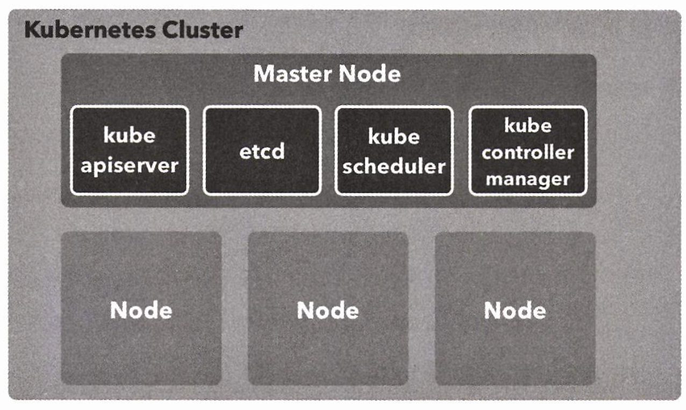

# CHAPTER 5. 쿠버네티스 입문

**목표**


<br/>

## 01. 쿠버네티스란?

### 쿠버네티스의 역할

Docker Compose, Swarm, Stack 을 이용한 애플리케이션의 기초를 익힘

- Docker: 컨테이너를 관리하는 데몬인 `dockerd`와 명령행 도구로 구성
- Swarm: 여러 대의 호스트를 묶어 기초적인 컨테이너 오케스트에리션 기능을 제공하는 도커 관련 기술
- Kubernetes: Compose/Stack/Swarm 보다 더 높은 수준의 기능을 갖춘 컨테이너 오케스트레이션 시스템이자 도커를 비롯해 여러 가지 컨테이너 런타임을 다룰 수 있음

<br/>

## 02. 로컬 PC에서 Kubernetes 실행

_[Minikube](https://github.com/kubernetes/minikube): minikube implements a local Kubernetes cluster on macOS, Linux, and Windows._

<br/>

#### 쿠버네티스 연동 설정

1. kubernetes 환경 구축

Docker Desktop > Enable Kubernetes

2. **kubectl** 설치

- `kubectl`: 쿠버네티스를 다루기 위한 명령행 도구
  - Local/Managed 환경에서 모두 사용 가능

<br/>

#### kubectl 설치 - macOS

macOS에서 Homebrew 패키지 관리자를 사용하는 경우, Homebrew로 kubectl을 설치할 수 있다.

설치 명령을 실행한다.

```Bash
❯ brew install kubectl
```

또는

```Bash
❯ brew install kubernetes-cli
```

설치한 버전이 최신 버전인지 확인한다.

```Bash
❯ kubectl version --output=json
{
  "clientVersion": {
    "major": "1",
    "minor": "27",
    "gitVersion": "v1.27.2",
    "gitCommit": "7f6f68fdabc4df88cfea2dcf9a19b2b830f1e647",
    "gitTreeState": "clean",
    "buildDate": "2023-05-17T14:20:07Z",
    "goVersion": "go1.20.4",
    "compiler": "gc",
    "platform": "darwin/arm64"
  },
  "kustomizeVersion": "v5.0.1",
  "serverVersion": {
    "major": "1",
    "minor": "27",
    "gitVersion": "v1.27.2",
    "gitCommit": "7f6f68fdabc4df88cfea2dcf9a19b2b830f1e647",
    "gitTreeState": "clean",
    "buildDate": "2023-05-17T14:13:28Z",
    "goVersion": "go1.20.4",
    "compiler": "gc",
    "platform": "linux/arm64"
  }
}
```


<br/>

#### kubectl 설치 - macOS

<table><tr><td>
<b>Minkube</b>
windows/macOS 용 도커에 쿠버네티스 연동 기능이 추가되기 전까지는 로컬 환경에 쿠버네티스 환경을 구축하기 위해 Minkube를 많이 사용했다.
쿠버네티스 연동 기능이 추가 되면서 쿠버네티스가 여러 환경에서 안정적으로 동작하게 된 만큼 Minikube 는 앞으로 점점 덜 사용하게 될 것이다.
windows/macOS 용 도커 연동 기능은 이미 실행중인 `dockerd` 를 대상으로 쿠버네티스 환경을 구축하지만, Minkube는 로컬에 `dockerd`를 새로 띄워 이를 대상으로 쿠버네티스 환경을 구축하는 방식이다.
로컬에서 dockerd를 2개 다루기 때문에 windows/macOS 용 도커 보다 좀 더 까다로운 면이 있다.
물론 Minkube 에도 이점은 있다.
윈도우 용 도커가 Hyper-V, macOS용 도커가 `Hypervisor.framework`에서 동작하는데 반해,
Minikube는 이런 하이퍼바이저 뿐만아니라 VirtualBox나 VMWare에서도 실행이 가능하므로 지원 플랫폼의 다양성 면에서 이점이 있다.
Minikube는 애드온(확장 기능)도 충실히 갖추고 있다. 예를 들면 조금 전 설명했던 대시보드는 Minikube에는 기본으로
포함 돼 있어 별도로 설치할 필요가 없다. `nginx-ingress-controler`도 애드온을 활성화하는 것만으로 사용할 수 있다
</td></tr></table>

<br/>

## 03. 쿠버네티스의 주요 개념 

| 리소스                      | 용도                                         |
|--------------------------|--------------------------------------------|
| Node                     | 컨테이너가 배치되는 서버                              |
| Namespace                | 쿠버네티스 클러스터 안의 가상 클러스터                      |
| Pod                      | 컨테이너의 집합 중 가장 작은 단위, 컨테이너의 실행 방법 정의        |
| Replica Set              | 같은 스펙을 갖는 파드를 여러 개 생성하고 관리하는 역할            |
| Deployment               | 레플리카 세트의 리비전을 관리                           |
| Service                  | 파드의 집합에 접근하기 위한 경로 정의                      |
| Ingress                  | 서비스를 쿠버네티스 클러스터 외부로 노출                     |
| Config Map               | 설정 정보를 정의하고 파드에 전달                         |
| Persistence Volume       | 파드가 사용할 스토리지의 크기 및 종류 정의                   |
| Persistence Volume Claim | Persistence Volume 을 동적으로 확보               |
| Storage Class            | Persistence Volume 이 확보하는 스토리지의 종류를 정의     |
| Stateful Set             | 같은 스펙으로 모두 동일한 파드를 여러 개 생성하고 관리            |
| Job                      | 상주 실행을 목적으로 하지 않는 파드를 여러 개 생성하고 정상적인 종료 보장 |
| Cron Job                 | 크론 문법으로 스케줄링되는 Job                         |
| Secret                   | 인증 정보 같은 기밀 데이터 정의                         |
| Role                     | 네임스페이스 안에서 조작 가능한 쿠버네티스 리소스의 규칙 정의         |
| Role Binding             | 쿠버네티스 리소스 사용자와 Role 을 연결 지음                |
| Cluster Role             | 클러스터 전체적으로 조작 가능한 쿠버네티스 리소스의 규칙 정의         |
| Cluster Role Binding     | 쿠버네티스 리소스 사용자와 클러스터 Role 을 연결 지음           |
| Service Account          | 파드가 쿠버네티스 리소스를 조작할 때 사용하는 계정               |


<br/>

## 04. 쿠버네티스 클러스터와 노드

- Kubernetes Cluster: Kubernetes 의 여러 리소스를 관리하기 위한 집합체
- Node: Kubernetes 리소스 중에서 가장 큰 개념
  - 쿠버네티스 클러스터의 관리 대상으로 등록된 도커 (컨테이너의) 호스트
  - 컨테이너가 배치되는 대상
  - Kubernetes 는 노드의 리소스 사용 현황 및 배치 전략을 근거로 컨테이너를 적절히 배치
  - 즉, 클러스터에 배치된 노드의 수, 노드의 사양 등에 따라 배치할 수 있는 컨테이너 수가 결정
  - 클러스터의 처리 능력은 노드에 의해 결정
- Master Node: Kubernetes Cluster 전체를 관리하는 서버이며, 최소 하나 이상 필요

<br/><br/>


- ❯ `kubectl get nodes`
- 현재 클러스터에 소속된 노드의 목록 확인

```Bash
❯ kubectl get nodes
```

클라우드에서의 Kubernetes 라면, 아래에 해당

- GCP → GCE Instance
- AWS → EC2 Instance

<br/>

- Master를 구성하는 컴포넌트 

| Component               | Role                                                    |
|-------------------------|---------------------------------------------------------|
| kube-apiserver          | Kubernetes API를 노출하는 컴포넌트 kubectl로부터 리소스를 조작하라는 지시를 받음  |
| etcd                    | 고가용성을 갖춘 분산 key-value 스토어, 쿠버네티스 클러스터의 백킹 스토어로 사용됨      |
| kube-scheduler          | 노드를 모니터링하고 컨테이너를 배치할 적절한 노드를 선택                         |
| kube-controller-manager | 리소스를 제어하는 컨트롤러를 실행                                      |

<br/>

## 05. Namespace

- Namespace: 클러스터 안의 가상 클러스터
  - Kubernetes Cluster 안에 가상 클러스터를 또 만들 수 있음
  - 클러스터 구축 시 `default`, `docker`, `kube-public`, `kube-system`, 네 개의 Namespace 가 이미 생성되어 있음

- ❯ `kubectl get namespace`
- 현재 클러스터 내에 존재하는 네임스페이스 목록 확인
  - 네임스페이스마다 권한을 설정할 수 있어 더욱 견고하고 세세하게 권한을 제어할 수 있음


