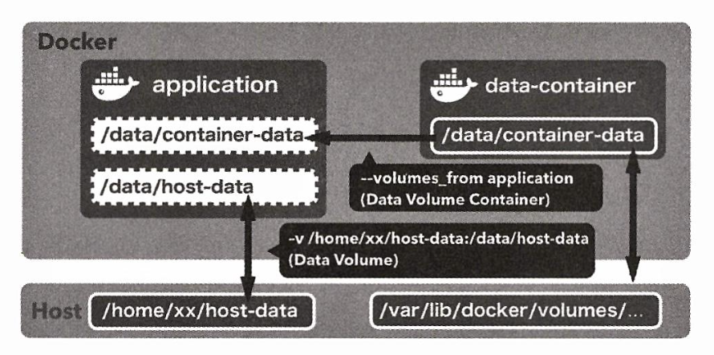

# Chapter3 컨테이너 실전 구축 및 배포

생성일: 2023년 10월 18일 오후 4:15
태그: 3장

---

# 3-1 애플리케이션과 시스템 내 단일 컨테이너의 적정 비중

- 컨테이너를 하나가 한가지 역할 문제 영역(도메인)에 만 집중하도록 하자
- 컨테이너 1 = 프로세스1를 고수하지 말자.

---

# 3-2 컨테이너의 이식성

- 도커는 호스트 운영체제에와 커널 리소르를 공유한다
- 위의 이유로 인하여 다른 운영체제에서 빌드한 파일이 실행불가하는 경우가 있음
- 위 이슈들은 점차 개선중

---

# 3-3 도커 친화적인 애플리케이션

## 환경 변수 활용

- 환경 변수로 재사용성과 유연성을 증가 시킬수 있다.
- 이식성을 중시하는 도커에서는 더욱이 외부에서 동작을 제어할 수 있도록 해야한다
- 옵션
    - 실행 시 인자
    - 설정 파일
    - 애플리케이션 동작을 환경 변수로 제어
    - 설정 파일에 환경 변수를 포함

### 실행 시 인자

- 도커에서 CMD나 ENTRYPOINT 같은 인스트럭션을 사용하여 컨테이너를 실행할 때 명령을 정의해 둘 수 있음
- 인자가 너무 많아지면 관리하기 어려워지는 `단점` 이 있다

### 설정 파일 사용

- 메이븐 그레이들을 이용하는 자바 애플리케이션등(jvm)에서 환경 별로 설정파일을 두어 실행하는 방식
- 도커에서는 외부에서 환경 파일을 전달해서 빌드 시킬 수 있음
- 호스트에 의존성이 생기는 `단점` 이 존재함

### 애플리케이션 동작을 환경 변수로 제어

- JENKINS SLAVE SSH 값을 전달한것처럼 외부에서 환경변수로 실행환경을 제어
- 환경 변수의 장점으로는 매번 이미지를 재 빌드 안해도됨( 한번에 다 빌드해두고 환경변수에 따라 환경별로 실행)
- 쿠버네티스나 aws ecs도 기능을 제공중

### 설정 파일에 환경 변수를 포함

- 아래처럼 스프링같은 어플리케이션은 환경변수를 넣을 수 있다.

```
db.driverClass=${DB_DRIVER_CLASS:com.mysql.jdbc.Driver) 
db.jdbcUr1=${DB_JDBC_URL)
db.user=${DB_USER}
db.password=${DB_PASSWORD} 
db.initialSize=${DB_INITIAL_SIZE:10} 
db.maxActive=${DB_MAX_ACTIVE:50} 
db.maxIdle=${DB_MAX_IDLE:20} 
db.minIdle=${DB_MIN_IDLE:10}
```

---

# 3-4 퍼시스턴스 데이터를 다루는 방법

- 도커 컨테이너 실행중 수정된 파일이 호스트 파일 시스템에 마운트 되지 않는다면 컨테이너가 파기될 때 같이 삭제됨
- 컨테이너를 사용하여 상태를 갖는 애플리케이션을 유지하려면 기존에 파일 및 디렉터리를 새버전 에서도 이어 받아야함 이런 경우에 사용되는게 `데이터 볼륨` 이다

## 데이터 볼륨

```bash
$ docker container run [options] -v 호스트_디렉터리:컨테이너_디렉터리 리포지토리명[:태그] 명령 명령인자

$ docker container run v- ${PWD}: /workspace gihyodocker/imagemagick:latest convert - s i z e 100×100 c : #000000 /workspace/gihyo.jpg
```

## 데이터 볼륨 컨테이너

- 데이터를 저장할 컨테이너를 하나 둠
- 다른 컨테이너는 위의 컨테이너를 바라보게함
- 실제 어플리케이션 컨테이너는 호스트의 파일 시스템을 알 필요가 없어지고 캡슐화가 가능함



**데이터 볼륨에 mysql 데이터 저장하기**

```bash
FROM busybox

VOLUME /var/lib/mysql

CMD ["bin/true"]

```

---

# 3-5 컨테이너 배치 전략

- 여러 호스트에 여러 컨테이너를 동작시킬 때
- 관리하기 위한 도구

## 도커 스웜

- 여러 도커 호스트를 클러스터로 묶어주는 컨테이너 오케스트레이션 도구중 하나

**기능**

- 컴포즈
    - 여러 컨테이너로 구성된 도커 어플리케이션 관리(주로 단일 호스트)
    - docker-compose
- 스웜
    - 클러스터 구축 및 관리
    - docker swarm
- 서비스
    - 스웜에서 클러스터 안의 서비스(컨테이너 하나 이상의 집합)을 관리
    - docker service
- 스택
    - 스웜에서 여러 개의 서비스를 합한 전체 어플리케이션 관리
    - docker stack

```yaml
version: "3"
services:
  registry:
    container_name: registry
    image: registry:2.6
    ports:
      - 6000:5000
    volumes:
      - "./registry-data:/var/lib/registry"

  manager:
    container_name: manager
    image: docker:18.05.0-ce-dind
    privileged: true
    tty: true
    ports:
      - 8000:80
      - 9000:9000
    depends_on:
      - registry
    expose:
      - 3375
    command: "--insecure-registry registry:5000"
    volumes:
      - "./stack:/stack"

  worker01:
    container_name: worker01
    image: docker:18.05.0-ce-dind
    privileged: true
    tty: true
    depends_on:
      - manager
      - registry
    expose:
      - 7946
      - 7946/udp
      - 4789/udp
    command: "--insecure-registry registry:5000"

  worker02:
    container_name: worker02
    image: docker:18.05.0-ce-dind
    privileged: true
    tty: true
    depends_on:
      - manager
      - registry
    expose:
      - 7946
      - 7946/udp
      - 4789/udp
    command: "--insecure-registry registry:5000"

  worker03:
    container_name: worker03
    image: docker:18.05.0-ce-dind
    privileged: true
    tty: true
    depends_on:
      - manager
      - registry
    expose:
      - 7946
      - 7946/udp
      - 4789/udp
    command: "--insecure-registry registry:5000"
```

실행

```bash
$ docker-compose up -d

# 토큰발급
$ docker container exec -it manager docker swarm init

# 서비스 등록 worker 전부 반복
$ docker container exec -it worker03 docker swarm join \   
--token SWMTKN-1-150tc61x1nsx6b3qcpufnd8mtcnp97ocncsnles2wltl9b579v-0pvd9pgpn7hhpt8e5e4z8xwmr manager:2377
```

상태 확인

```bash
$ docker container exec -it manager docker node ls
ID                            HOSTNAME            STATUS              AVAILABILITY        MANAGER STATUS      ENGINE VERSION
lpuwfexdi6d6ncwt9l2jm8jc7     9f72dd2310d0        Ready               Active                                  18.05.0-ce
kdlo1nrjtas75mcsgva1zbnnu     093083eb4d2c        Ready               Active                                  18.05.0-ce
xu47u0exez97r3u4yq724jgys     c9c908b97c97        Ready               Active                                  18.05.0-ce
qp2uu3xkj11cqiofohgi6pvce *   e580548a26e8        Ready               Active              Leader              18.05.0-ce
```

**이미지 저장 및 푸시**

```bash
$ docker image tag example/echo:latest localhost:6000/example/echo:latest
$ docker image push localhost:6000/example/echo:latest
```

**이미지 다운**

```bash
$ docker container exec -it worker01 docker image pull registry:5000/example/echo:latest
```

## 서비스

```bash
$ docker container exec -it manager \
> docker service create --replicas 1 --publish 8080:8080 --name echo registry:5000/example/echo:latest

# 서비스 확인
$ docker container exec -it manager docker service ls

# 스케일아웃
$ docker container exec -it manager docker service scale echo=6

# 실행확인
$ docker container exec -it manager docker service ps echo | grep Running

# 서비스 제거하기
$ docker container exec -it manager docker service rm echo
```

## 스택

- 스택은 하나 이사의 서비스를 그룹으로 묶은 단위
- 서비스는 애플리케이션을 하나밖에 못다루지만 여러서비스가 협조해 동작하는 형태로는 구성이 가능
- 스택이 다루는 애플리케이션의 입도는 컴포즈와 동일 스웜에서 동작하는 스케일 인 아웃의 제약조건 부여가 가능한 컴포즈
- 스택을 사용해 배포한 서비스는 overlay 네트워크에 속함
- overlay
    - 여러 도커 호스트에 걸쳐 배포된 컨테이너 그룹을 같은 네트워크에 배치하기위한 기술
    - 오버레이를 활용해야 다른 호스트에 있는 컨테이너끼리 통신이 가능


**오버레이 구축**

```bash
$ docker container exec -it manager docker network create --driver=overlay --attachable ch03
```

**스택구성**

```yaml
version: "3"
services:
  nginx:
    image: gihyodocker/nginx-proxy:latest
    deploy:
      replicas: 3
      placement:
        constraints: [node.role != manager]
    environment:
      BACKEND_HOST: echo_api:8080
    depends_on:
      - api
    networks:
      - ch03

  api:
    image: registry:5000/example/echo:latest
    deploy:
      replicas: 3
      placement:
        constraints: [node.role != manager]
    networks:
      - ch03

networks:
  ch03:
    external: true
```

**스택배포**

```bash

# 배포 명령어
$ docker container exec -it manager docker stack deploy -c /stack/ch03-webapi.yml echo

# 스택 배포 확인하기
$ docker container exec -it manager docker stack services echo
```

컨테이너 배치 시각화 프로그램

```yaml
version: "3"
services:
  app:
    image: dockersamples/visualizer
    ports:
      - "9000:8080"
    volumes:
      - /var/run/docker.sock:/var/run/docker.sock
    deploy:
      mode: global
      placement:
        constraints: [node.role == manager]
```

```bash
# 실행
$ docker container exec -it manager docker stack deploy -c /stack/visualizer.yml visualizer
```