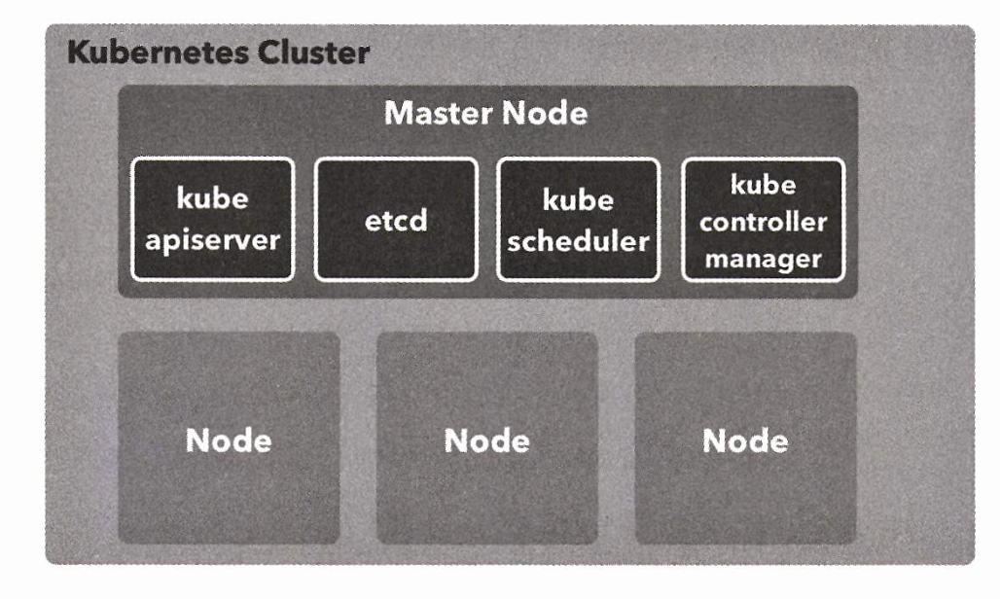

# Chapter5 쿠버네티스 입문

생성일: 2023년 11월 15일 오후 4:18
태그: 5장

---

# 5-1 쿠버네티스란 무엇인가

- 컨테이너 운영을 자동화 하기 위한 도구
- 구글의 주도로 개발됨
- 많은 수의 컨테이너를 연동시키기위해 다양한 API 및 명령 도구가 제공됨
- 기타 다양한 기능들 제공

## 도커의 부상과 쿠버네티스의 탄생

**도커의 문제점**

- 배포 및 컨테이너 배치 전략
- 스케일 인 스케일 아웃 서비스 디커버리
- 운영 편의성

> 이런 문제점을 해결 하기 위해 다양한 기술들이 발표되었고 아파치 메소스 및 aws ecs등이 발표되었다.
2017년에는 도커가 공식적으로 쿠버네티스를 지원하겠다고함
> 

---

# 5-2 로컬 쿠버 설치 및 실행

Docer Desktop 에서 설치

**대시보드 설치**

```bash
# Cert-Manager 설치 (선행조건) 공식문서 확인
$ kubectl apply -f https://github.com/jetstack/cert-manager/releases/download/v1.5.5/cert-manager.yaml

# pod 확인
$ kubectl get pods --namespace cert-manager
NAME                                       READY   STATUS    RESTARTS   AGE
cert-manager-54495fc7f4-9p48t              1/1     Running   0          4m40s
cert-manager-cainjector-69c4dfbcd5-2w646   1/1     Running   0          4m40s
cert-manager-webhook-7fbd7d4b64-6xgr6      1/1     Running   0          4m40s

# dashboard 설치
$ kubectl apply -f https://raw.githubusercontent.com/kubernetes/dashboard/v3.0.0-alpha0/charts/kubernetes-dashboard.yaml
```

---

# 5-3 쿠버네티스의 주요 개념

| 리소스 | 용도 |
| --- | --- |
| 노드 | 컨테이너가 배치되는 서버 |
| 네임스페이스 | 쿠버네티스 클러스터 안이 가상 클러스터 |
| 파드 | 컨테이너의 집합 중 가장 작은 단위로, 컨테이너의 실행 방법을 정의한다 |
| 레플리카세트 | 같은 스펙을 갖는 파드를 여러 개 생성하고 관맇는 역할을 한다 |
| 디플로이먼트 | 레플리카 세트의 리버전을 관리한다 |
| 서비스 | 파드의 집합에 접근하기 위한 경로를 정의한다. |
| 인그레스 | 서비스를 쿠버네티스 클러스터 외부로 노출시킨다. |
| 컨피그맵 | 설정 정보를 정의하고 파드에 전달한다 |
| 퍼시스턴트볼륨 | 파드가 사용할 스토리지의 크기 및 종류를 정의 |
| 퍼시스턴트볼륨클레임 | 퍼시스턴트 봄륨을 동적으로 확보 |
| 스토리지 클래스 | 퍼시스턴트 볼륨이 확보하는 스토리지의 종류를 정의 |
| 스테이트 풀 세트 | 같은 스펙으로 모두 동일한 파드를 여러 개 생성하고 관리한다. |
| 잡 | 상주 실행을 목접으로 하지 않는 파드를 여러 개 생성하고 정상적인 종료를 보장한다 |
| 크론잡 | 크론 문법으로 스케줄리오디는 잡 |

---

# 5-4 쿠버네티스 클러스터와 노드

- 쿠버네티스 클러스터는 쿠버네티스의 여러 리소스를 관리하기 위한 집합체
- 쿠버네티스 리소스 중에서 가장 큰 개념은 노드(node)
- 노드는 쿠버네티스 클러스터의 관리 대상으로 등록된 도커 호스트로 컨테이너가 배치되는 대상



- GCP
    - GCE
- AWS
    - EC2
    - FARGATE

---

# 5-5 네임스페이스

- 쿠버네티스 클러스터 안에 가상 클러스터를 또 만들 수 있음
- 이를 네임스페이스라고 부름
- 초기 클러스터 구축시 default, docker, kube-public, kube-system 의 4개가 구축됨

```bash
$ kubectl get namespace

NAME                   STATUS   AGE
cert-manager           Active   24m
default                Active   37m
kube-node-lease        Active   37m
kube-public            Active   37m
kube-system            Active   37m
kubernetes-dashboard   Active   26m
```

---

# 5-6 파드

- 파드는 컨테이너가 모인 집합체의 단위 최소 하나 이상의 컨테이너
- 쿠버네티스에서는 결합이 강한 컨테이너를 파드로 묶어 일괄 배포함
- 컨테이너가 하나인 경우에도 파드로 배포함


**조건**

- 파드는 한 노드에 배치 되어야한다.
- ex) nginx 와 application 을 묶어서 하나의 파드로 배포한다.

## 파드 생성 및 배포하기

```yaml
apiVersion: v1
kind: Pod
metadata:
  name: simple-echo
spec:
  containers:
  - name: nginx
    image: gihyodocker/nginx:latest
    env:
    - name: BACKEND_HOST
      value: localhost:8080
    ports:
    - containerPort: 80
  - name: echo
    image: gihyodocker/echo:latest
    ports:
    - containerPort:8080
```

- kind 는 파일에서 정의하는 쿠버네티스 리소스의 유형을 지정하는 속성
- 메타데이타는 리소스에 부여되는 메타데이터 → name 속성 값이 리소스 이름이됨
- spec는 리소스를 정의하기 위한 속성
- image는 도커허브 또는 로컬 빌드 이미지를 지정할 수도 있음

```bash
# pod 실행
$ kubectl apply -f simple-pod.yaml
pod/simple-echo created
```

## 파드 다루기

```bash
# pod 확인
$ kubectl get pod

# nginx 접근
$ kubectl exec -it simple-echo sh -c nginx

# 로그 확인
$ kubectl logs -f simple-echo -c echo

# 삭제
$ kubectl delete pod simple-echo

```

---

# 레플리카 세트

- 여러 파드를 만들 때 사용하는게 레플리카세트

```yaml
apiVersion: apps/v1
kind: ReplicaSet
metadata:
  name: echo
  labels:
    app: echo

spec:
  replicas: 3
  selector:
    matchLabels:
      app: echo
  template: # template 아래는 파드 리소스 정의와 같음
     metadata:
      labels:
        app: echo
    spec:
      containers:
      - name: nginx
        image: gihyodocker/nginx:latest
        env:
        - name: BACKEND_HOST
          value: localhost:8080
        ports:
        - containerPort: 80
      - name: echo
        image: gihyodocker/echo:latest
        ports:
        - containerPort: 8080
```

```bash
# 실행
$ kubectl apply -f simple-replicaset.yaml
```

---

# 5-8 디플로이먼트

- 레플리카 세트 상위는 디플로이먼트가 있다.
- 애플리케이션 배포의 기본 단위가 되는 리소스


```yaml
apiVersion: apps/v1
kind: Deployment
metadata:
  name: echo
  labels:
    app: echo

spec:
  replicas: 3
  selector:
    matchLabels:
      app: echo
  template:
    metadata:
      labels:
        app: echo
    spec:
      containers:
      - name: nginx
        image: gihyodocker/nginx:latest
        env:
        - name: BACKEND_HOST
          value: localhost:8080
        ports:
        - containerPort: 80
      - name: echo
        image: gihyodocker/echo:latest
        ports:
        - containerPort: 8080
```

```bash
# 실행
$ kubectl apply -f simple-deployment.yaml --record

# 확인
$ kubectl get pod,replicaset,deployment --selector app=echo

```

---

# 서비스

- 서비스는 쿠버네티스 클러스터 안에서 파드의 집합(주로 레플리카세트) 에 대한 경로나 서비스 디스커버리를 제공하는 리소스
- 서비스의 대상이 되는 파드는 서비스에서 정의하는 레비르 셀렉터로 정해짐

```yaml
apiVersion: apps/v1
kind: ReplicaSet
metadata:
  name: echo-spring
  labels:
    app: echo
    release: spring

spec:
  replicas: 1
  selector:
    matchLabels:
      app: echo
      release: spring
  template:
    metadata:
      labels:
        app: echo
        release: spring
    spec:
      containers:
      - name: nginx
        image: gihyodocker/nginx:latest
        env:
        - name: BACKEND_HOST
          value: localhost:8080
        ports:
        - containerPort: 80
      - name: echo
        image: gihyodocker/echo:latest
        ports:
        - containerPort: 8080

---
apiVersion: apps/v1
kind: ReplicaSet
metadata:
  name: echo-summer
  labels:
    app: echo
    release: summer

spec:
  replicas: 1
  selector:
    matchLabels:
      app: echo
      release: summer
  template:
    metadata:
      labels:
        app: echo
        release: summer
    spec:
      containers:
      - name: nginx
        image: gihyodocker/nginx:latest
        env:
        - name: BACKEND_HOST
          value: localhost:8080
        ports:
        - containerPort: 80
      - name: echo
        image: gihyodocker/echo:latest
        ports:
        - containerPort: 8080
```

```bash
# 실행
$ kubectl apply -f simple-replicaset-with-label.yaml
```

**서비스 생성**

```yaml
apiVersion: v1
kind: Service
metadata:
  name: echo
spec:
  selector:
    app: echo
    release: summer
  ports:
    - name: http
      port: 80
```

```bash
# 실행
$ kubectl apply -f simple-service.yaml

# 확인
$ kubectl get svc echo

# 트래픽이 summer 파드에만 가는지 확인하기
$ kubectl run -i --rm --tty debug --image=gihyodocker/fundamental:0.1.0 --restart=Never -- bash -il
```

---