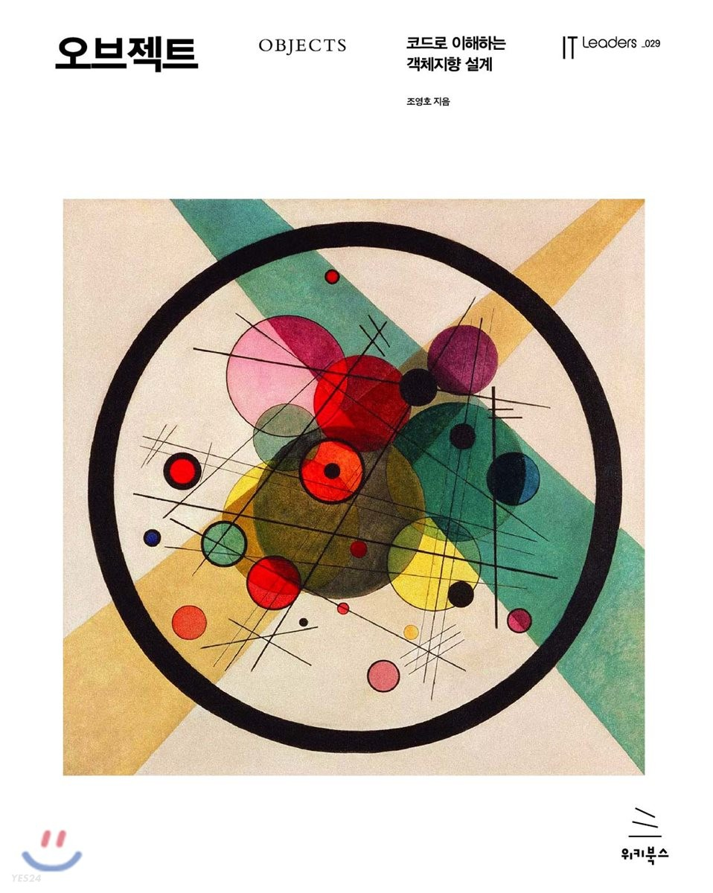

## 오브젝트

<small>Objects - 코드로 이해하는 객체지향 설계, 조영호</small>

 

 

### Study Period

_2023-04-12 ~ 2023-07-19 (15주)_

 

### Participants

| Nickname                                                                     | Completed | 
|------------------------------------------------------------------------------|-----------|
| [@pursue503](https://github.com/2mz1/theory/tree/main/objects/pursue503)     | ✔️        |
| [@gngsn](https://github.com/2mz1/theory/tree/main/objects/gngsn)             | ✔️        |
| [@Mingsicogi](https://github.com/2mz1/theory/tree/main/objects/bbangdi.ming) | ✔️        |

<small><i>📖 - processing, ✔️- completed, ❌- stopped</i></small>