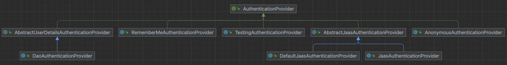

## 인상깊은 문구
- 객체지향 패러다임의 관점에서 핵심은 역할(role), 책임 (responsibility), 협력(collaboration)이다
- 객체를 자율적으로 만드는 가장 기본적인 방법은 내부 구현을 캡슐화하는 것이다
- 책임이란 객체에 의해 정의되는 응집도 있는 행위의 집합
- 책임은 객체지향 설계의 핵심
- 책임을 찾고 책임 을 수행할 적절한 객체를 찾아 책임을 할당하는 방식으로 협력을 설계하는 방법을 책임 주도 설계 (Responsibility-Driven Design, RDD)
- 책임을 할당할 때 고려해야 하는 두 가지 요소 
  - 메시지가 객체를 결정 
  - 행동이 상태를 결정
- 협력 -> 객체의 행동 결정 -> 행동 -> 상태 결정
                         ㄴ 객체의 책임
- 협력을 구체적인 객체가 아니라 추상적인 역할의 관점에서 설계하면 협력이 유연하고 재사용 가능해진다는 것
- 추상화를 이용한 설계의 장점
  - 추상화 계층만을 이용하면 중요한 정책을 상위 수준에서 단순화할 수 있다는 것이다. 
  - 설계가 좀 더 유연해진다는것이다.

- AuthenticationProvider(spring security)
- authenticate 라는 메시지를 AuthenticationProvider 에 정의
- AbstractUserDetailAuthenticationProvider 는 authenticate 메시지를 받으면 내부에서 authenticate 메시지를 처리할 수 있는지 확인하고, 처리할 수 있다면 authenticate 메시지를 처리
  - **retrieveUser 메시지를 추상화**함
    - AbstractUserDetailAuthenticationProvider 를 extends한 DaoAuthenticationProvider 에서 retrieveUser 메시지를 구현
      - retrieveUser 메시지를 구현하는 과정에서 UserDetailsService와 **협력**함
  - additionalAuthenticationChecks 를 통해 추가적인 인증 처리를 확장할 수 있게 함(**추상화**. 유연한 확장 -> 2차인증 처리등에 사용될 수 있음.)
- 

## 다른 생각
