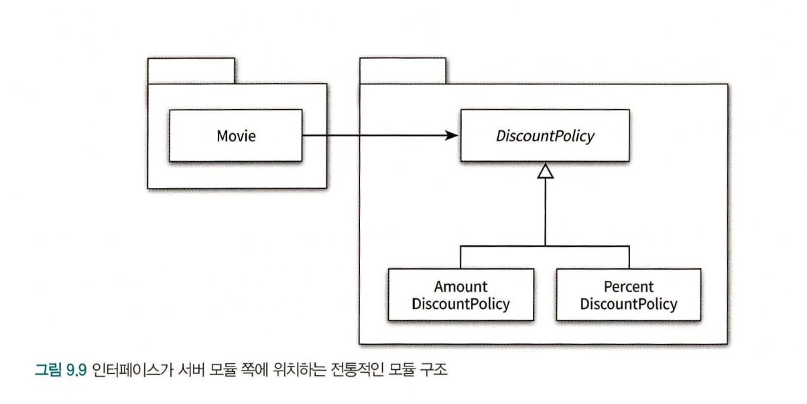
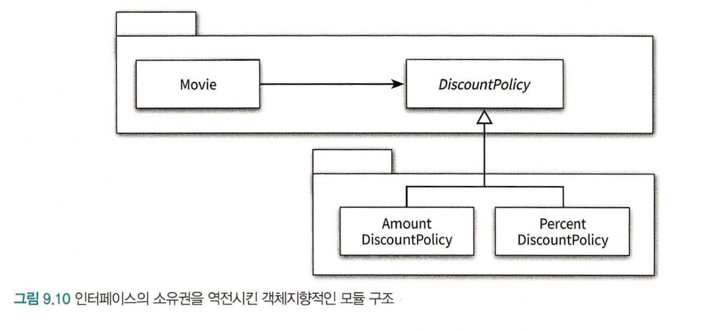

## 인상적인 부분
- 개방-폐쇄 원칙의 핵심은 추상화에 의존하는 것
- 변경에 의한 파급효과를 최대한 피하기 위해서는 변하는것과 변하지 않는것이 무엇인지를 파악하고 이를 추상화의 목적으로 삼아야함
- 객체에 대한 생성과 사용 분리해야 함
    - Factory 메소드를 통해 생성을 책임질 수 있게 할 수 있음
- pure fabrication : 적절한 대안이 없을 때 사람들이 창조한 무언가를 만들어 낸다는 관용적 표현임
- 사용하는 객체가 아닌 외부의 독립적인 객체가 인스턴스를 생성하고 이를 전달해서 의존성을 해결하는 방법을 의존성 주입이라고 함
    - 외부에서 의존성의 대상을 해결한 후 이를 사용하는 객체쪽으로 주입하기 때문
- 의존성을 숨기면 내부 구현의 이해를 강요할 수 있음. 따라서 캡슐화를 위반 -> 의존성은 퍼블릭 인터페이스에 노출해야함
- 명시적인 의존성에 초점. 이 방법이 유연성을 향상시키는 가장 효과적인 방법.
- 상위 수준의 모듈은 하위 수준의 모듈에 의존해서는 안된다. 둘 모두 추상화에 의존해야한다.
- 추상화는 구체적인 사항에 의존하면 안되고, 구체적인 사항은 추상화에 의존해야한다.
- 훌륭한 객체지향 설계를 위해서서는 의존성을 역전 시켜야한다
- 유연한 설계
    - 미래에 변경이 일어날지도 모른다는 막연한 불안감은 불필요하게 복잡한 설계를 만든다.
    - 불필요한 유연성은 불필요한 복잡성을 낳는다. 유연성은 코드를 읽는 사람들이 복잡함을 수용할 때만 가치가 있다.
- 역할, 책임, 협력!!

DataSource interface 가 적절한 예시!

