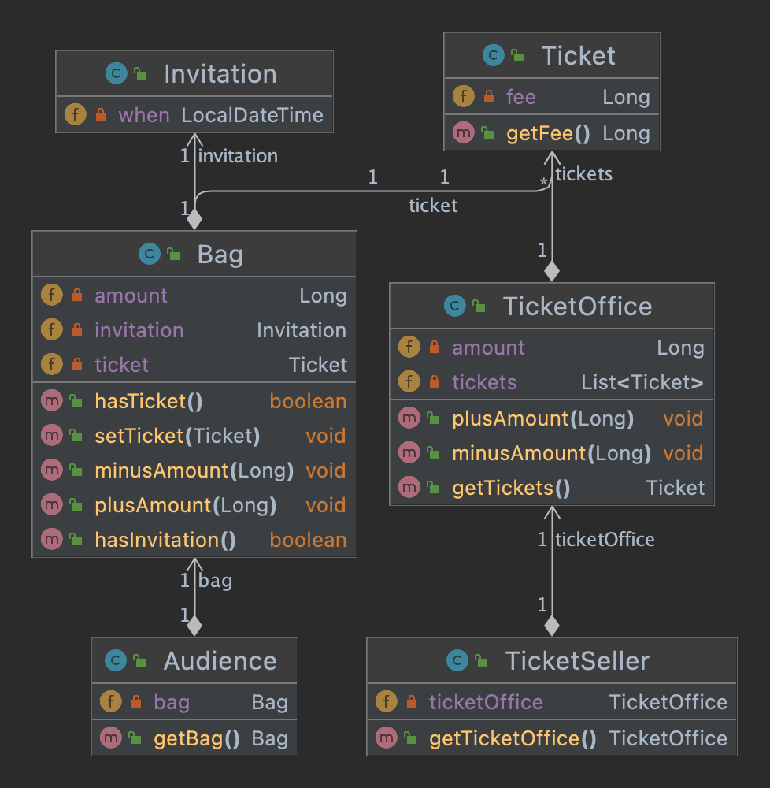

# CHAPTER 01. 객체, 설계

### 이론 vs. 설계

**이론이 먼저일까, 실무가 먼저일까?**

- 소프트웨어 설계와 유지보수에 중점을 두려면 이론이 아닌 **실무**에 초점을 맞추는 것이 효과적
- 설계 분야에서는 이론(개념 및 용어 등)을 중심에 두는 것보다 실무, 즉 '코드'가 가장 유용
- 따라서, 본 책(Objects)은 실무를 우선 실행

## 01. 티켓 판매 애플리케이션 구현하기

#### Specification

<pre>
<b>📌 소극장 티켓 판매 애플리케이션</b>

고려사항:
- 추첨을 통해 일부 관람객에게 무료 관람권 증정
- 이벤트 당첨 관람객  : 무료 입장   
- 이벤트 미당첨 관람객 : 티켓 구매 필수 
</pre>

**이벤트 당첨자에게 발송되는 초대장:** 

[Invitation.java](./demo/src/com/gngsn/chapter1/v1/Invitation.java)

**공연을 관람하기 위한 티켓:**

[Ticket.java](./demo/src/com/gngsn/chapter1/v1/Ticket.java)

<small>이벤트 당첨자의 초대장은 티켓으로 교환된다.</small>

**관람객이 가지고 올 수 있는 소지품 - 초대장, 현금, 티켓:**

[Bag.java](./demo/src/com/gngsn/chapter1/v1/Bag.java)

**소지품을 보관하기 위한 관람객의 가방:**

[Audience.java](./demo/src/com/gngsn/chapter1/v1/Audience.java)

**관람객이 소극장에 입장하기 위한 매표소 - 티켓 교환 or 구매:**

[Audience.java](./demo/src/com/gngsn/chapter1/v1/TicketOffice.java)


**매표소에서 초대장을 티켓으로 교환 or 판매하는 판매원**

[TicketSeller.java](./demo/src/com/gngsn/chapter1/v1/TicketSeller.java)

Class Diagram:



**소극장**

[Theater.java](./demo/src/com/gngsn/chapter1/v1/Theater.java)


## 무엇이 문제인가

<pre>
<b>소프트웨어 모듈의 세가지 목적</b>
첫 번째. 실행 중 제대로 동작
두 번째. 변경을 위해 존재: 간단한 작업만으로도 변경 가능해야 함 
세 번째. 코드를 읽는 사람과의 의사소통

- ≪클린 소프트웨어: 애자일 원칙과 패턴, 그리고 실천 방법≫
</pre> 

위의 코드(version1)은 동작은 제대로 하지만, 나머지 두 개 -변경 용이성, 코드를 읽는 사람과의 의사소통- 을 만족하지 못한다.


### 예상을 빗나가는 코드

**문제점1.** 예상과 빗나가는 코드

이해 가능한 코드: 우리가 예상하는 방식으로 동작하는 코드 
- 예상: 관람객이 초대장이나 돈을 지불하여 티켓을 얻음
- 코드: Theather의 enter method는 '소극장'이 관람객의 가방을 확인
- 예상과 다른 방식이기 때문에 코드를 읽는 사람이 제대로 의사소통하지 못함

```java
public void enter(Audience audience) {
    if (audience.getBag().hasInvitation()) {
        Ticket ticket = ticketSeller.getTicketOffice().getTickets();
        audience.getBag().setTicket(ticket);
    } else {
        Ticket ticket = ticketSeller.getTicketOffice().getTickets();
        audience.getBag().minusAmount(ticket.getFee());
        ticketSeller.getTicketOffice().plusAmount(ticket.getFee());
        audience.getBag().setTicket(ticket);
    }
}
```

**문제점 2.** Theater가 불필요한 정보를 알아야 함

Theater가 알아야 하는 사실

- audience가 bag을 가지고 있음
- audience의 bag에는 현금과 티켓이 있음
- ticketSeller가 ticketOffice에서 일을 함
- ticketOffice에는 돈과 티켓이 보관되어 있음


### 변경에 취약한 코드

**문제점 3.** 변경에 취약한 코드

- Audience와 TicketSeller를 변경할 경우 Theater도 함께 변경해야 한다는 사실
- 수많은 발생 가능한 변경 사항
  - 고객이 현금말고 카드를 사용하면? 판매원이 판매소 밖에서 티켓을 판매한다면?

=> Dependency, 객체의 의존성 문제

**📌 의존성**

- 의존성은 변경과 관련돼 있고, 변경에 대한 영향을 암시
- "의존성"은 어떤 객체가 변경될 때 그 객체에게 의존하는 다른 객체도 함께 변경될 수 있다는 사실이 내포됨
- 객체 사이의 의존성을 완전히 없애는 것만이 정답은 아님
- 객체 지향 설계는 서로 의존하면서 협력하는 객체들의 공동체를 구축하는 것

**📌 결합도**

- 객체 사이의 의존성이 강한 경우: 결합도가 높다.
- 객체들이 합리적인 수준으로 의존할 경우: 결합도가 낮다.
- 결합도가 높을수록 서로 변경 시 영향도가 크기 때문에 변경이 어려움  

**✔️ 목표: 애플리케이션의 기능을 구현하는 데 필요한 최소한의 의존성만 유지하고 불필요한 의존성 제거 => 결합도를 낮춰 변경이 용이한 설계를 만드는 것**

