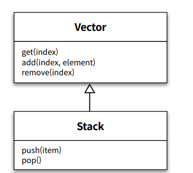

# Chapter10 상속과 코드 재사용


**객체지향의 장점**

- 코드를 재사용하기가 용이해진다.
- 객체지향에서는 코드를 재사용하기 위해 `새로운` 코드를 추가 한다.
- 클래스를 재사용하기 위해 새로운 클래스를 추가하는 가장 대표적인 기법인 `상속` 에 대해 알아본다.
- 새로운 클래스의 인스턴스 안에 기존 클래스의 인스턴스를 포함 시키는 방법은 `합성` 이라고 함


# 1. 상속과 중복 코드

## DRY 원칙 (Don’t Repeat Yourself)

- 중복 코드는 변경을 방해함 `(중복 코드를 제거해야 하는 가장 큰 이유`
- 중복 코드가 가지는 가장 큰 문제는 코드를 수정하는 `노력` 을 몇 배로 증가시킴
- 중복 코드를 찾고 중복 코드를 일관되게 수정해야함
- 모든 중복 코드를 개별적으로 테스트해서 동일한 결과를 내놔야함

**중복 코드를 판단하는 기준**

- 변경
- 요구사항이 변경됐을 때 두 코드를 함께 수정해야 한다면 이 코드느 ㄴ중복
- 함께 수정할 필요가 없다면 중복이 아님
- 중복 코드를 결정하는 기준은 코드으 ㅣ모양이 아님

## 중복과 변경

### **중복 코드 살펴보기 (이해를 위한 코드 추가)**

- 한달에 한 번씩 가입자별로 전화 요금을 계산함
- 통화시간 / 단위 시간
- 10초당 5원에서 100초 통화 100 / 10 * 5 = 50

```java
public class Call {
    private LocalDateTime from;
    private LocalDateTime to;

    public Call(LocalDateTime from, LocalDateTime to) {
        this.from = from;
        this.to = to;
    }
    public Duration getDuration() {
        return Duration.between(from, to);
    }

}
```

**Call의 목록을 관리하는 정보 번문가 Phone**

- 단위 요금을 저장하는 amount
- 단위 시간을 저장하는 seconds
- 10초당 5원씩 부과되는 요금제
    - amount: 5
    - seconds: 10

```java
public class Phone {
    private Money amount;
    private Duration seconds;
    private List<Call> calls = new ArrayList<>();

    public Phone(Money amount, Duration seconds, List<Call> calls) {
        this.amount = amount;
        this.seconds = seconds;
        this.calls = calls;
    }

    public Money getAmount() {
        return amount;
    }

    public Duration getSeconds() {
        return seconds;
    }

    public List<Call> getCalls() {
        return calls;
    }

		public Money calculateFee() {
        Money result = Money.ZERO;

        for(Call call : calls) {
            result = result.plus(amount.times(call.getDuration().getSeconds() / seconds.getSeconds()));
        }
        
        return result;
    }

}
```

```java
Phone phone = new Phone(Money.wons(5), Duration.ofSeconds(10));
        phone.call(new Call(LocalDateTime.of(2018, 1, 1, 12, 10, 0),
                LocalDateTime.of(2018, 1, 1, 12, 11, 0)));
        phone.call(new Call(LocalDateTime.of(2018, 1, 2, 12, 10, 0),
                LocalDateTime.of(2018, 1, 2, 12, 11, 0)));
        phone.calculateFee(); //=> Money.wons(60)
```

요구사항은 항상 변한다. `심야 할인 요금제` 라는 새로운 요금 방식을 추가해야 한다는 요구사항이 추가된다면?

- Phone: 일반 요금제
- 가장 쉬운 방법 Phone 를 복사 하고 수정함

```java
public class NightlyDiscountPhone {
    private static final int LATE_NIGHT_HOUR = 22;

    private Money nightlyAmount;
    private Money regularAmount;
    private Duration seconds;
    private List<Call> calls = new ArrayList<>();

    public NightlyDiscountPhone(Money nightlyAmount, Money regularAmount, Duration seconds) {
        this.nightlyAmount = nightlyAmount;
        this.regularAmount = regularAmount;
        this.seconds = seconds;
    }

    public Money calculateFee() {
        Money result = Money.ZERO;

        for (Call call : calls) {
            if (call.getFrom().getHour() >= LATE_NIGHT_HOUR) {
                result = result.plus(
                        nightlyAmount.times(call.getDuration().getSeconds() / seconds.getSeconds()));
            } else {
                result = result.plus(
                        regularAmount.times(call.getDuration().getSeconds() / seconds.getSeconds()));
            }
        }

        return result;
    }
}
```

- 요구사항을 아주 짧은 시간 안에 구현할 수 있게 해줬음
- 하지만 구현 시간을 절약한 `대가` 로 지불해야 하는 `비용` 이 크다.
- Phone와 NightlyDiscountPhone 사이에는 `중복 코드` 가 존재하기 때문에 언제 터질지 모르는 `시한폭탄`

### **중복 코드 수정하기**

중복 코드가 코드 수정에 미치는 영향을 살펴보기 위해 새로운 요구사항 추가

- 통화 요금에 부과할 세금을 계산하는 기능
- 부과되는 세율은 가입자의 핸드폰마다 다름

```java
public class Phone {
    private Money amount;
    private Duration seconds;
    private List<Call> calls = new ArrayList<>();
    
    private double taxRate;

    public Phone(Money amount, Duration seconds, List<Call> calls, double taxRate) {
        this.amount = amount;
        this.seconds = seconds;
        this.calls = calls;
        this.taxRate = taxRate;
    }

    public Money getAmount() {
        return amount;
    }

    public Duration getSeconds() {
        return seconds;
    }

    public List<Call> getCalls() {
        return calls;
    }

    public Money calculateFee() {
        Money result = Money.ZERO;

        for(Call call : calls) {
            result = result.plus(amount.times(call.getDuration().getSeconds() / seconds.getSeconds()));
        }

        return result.plus(results.times(taxRate));
    }

}

////

public class NightlyDiscountPhone {
    private static final int LATE_NIGHT_HOUR = 22;

    private Money nightlyAmount;
    private Money regularAmount;
    private Duration seconds;
    private List<Call> calls = new ArrayList<>();
    private double taxRate;
    
    public NightlyDiscountPhone(Money nightlyAmount, Money regularAmount, Duration seconds, List<Call> calls, double taxRate) {
        this.nightlyAmount = nightlyAmount;
        this.regularAmount = regularAmount;
        this.seconds = seconds;
        this.calls = calls;
        this.taxRate = taxRate;
    }

    public Money calculateFee() {
        Money result = Money.ZERO;

        for (Call call : calls) {
            if (call.getFrom().getHour() >= LATE_NIGHT_HOUR) {
                result = result.plus(
                        nightlyAmount.times(call.getDuration().getSeconds() / seconds.getSeconds()));
            } else {
                result = result.plus(
                        regularAmount.times(call.getDuration().getSeconds() / seconds.getSeconds()));
            }
        }

        return result.plus(result.times(taxRate));
    }
}
```

- 항상 두개의 클래스가 같이 수정되야함
- 하나만 수정하고 `배포` 된다면 `버그` 발생
- 민첩하게 변경하기 위해서는 중복 코드를 추가하는 대신 제거해야함

### 타입 코드 사용하기

- 중복 코드의 제거 하는 한 가지 방법은 클래스를 하나로 합치는 것이다.
- 타입 코드를 사용하는 클래스는 낮은 응집도와 높은 결합도라는 문제에 시달리게 됨

```java
public class Phone {
    private static final int LATE_NIGHT_HOUR = 22;

    enum PhoneType {REGULAR, NIGHTLY}

    private PhoneType type;
    private Money amount;
    private Money regularAmount;
    private Money nightlyAmount;
    private Duration seconds;
    private List<Call> calls = new ArrayList<>();

    public Phone(Money amount, Duration seconds) {
        this(PhoneType.REGULAR, amount, Money.ZERO, Money.ZERO, seconds);
    }

    public Phone(Money nightlyAmount, Money regularAmount, Duration seconds) {
        this(PhoneType.NIGHTLY, Money.ZERO, nightlyAmount, regularAmount, seconds);
    }

    public Phone(PhoneType type, Money amount, Money nightlyAmount,
                 Money regularAmount, Duration seconds) {
        this.type = type;
        this.amount = amount;
        this.regularAmount = regularAmount;
        this.nightlyAmount = nightlyAmount;
        this.seconds = seconds;
    }

    public Money calculateFee() {
        Money result = Money.ZERO;
        for (Call call : calls) {
            if (type == PhoneType.REGULAR) {
                result = result.plus(
                        amount.times(call.getDuration().getSeconds() / seconds.getSeconds()));
            } else {
                if (call.getFrom().getHour() >= LATE_NIGHT_HOUR) {
                    result = result.plus(
                            nightlyAmount.times(call.getDuration().getSeconds() / seconds.getSeconds()));
                } else {
                    result = result.plus(
                            regularAmount.times(call.getDuration().getSeconds() / seconds.getSeconds()));
                }
            }
        }

        return result;
    }

}
```

## 상속을 이용해서 중복 코드 제거하기

```java
public class NightlyDiscountPhone extends Phone {
    private static final int LATE_NIGHT_HOUR = 22;
    private Money nightlyAmount;
    public NightlyDiscountPhone(Money nightlyAmount, Money regularAmount, Duration seconds) {
        super(regularAmount, seconds);
        this.nightlyAmount = nightlyAmount;
    }
    @Override
    public Money calculateFee() {
        // 부모 클래스의 calculateFee 호출
        Money result = super.calculateFee();
        Money nightlyFee = Money.ZERO;
        for(Call call : getCalls()) {
            if (call.getFrom().getHour() >= LATE_NIGHT_HOUR) {
                nightlyFee = nightlyFee.plus(
                        getAmount().minus(nightlyAmount).times(
                                call.getDuration().getSeconds() / getSeconds().getSeconds()));
            }
        }
        return result.minus(nightlyFee);
    }
}
```

- 코드를 복사하지 말고 상속을 이용해 코드를 재사용
- 부모 클래스를 호출 한후 10시 이후의 요금을 계싼함

**단점**

- 메소드를 파악하는데 개발자의 `가정` (FLOW) 를 이해하기 전에는 코드를 이해하기 어려움
- 상속을 염두에 두고 설계되지않은 클래스를 상속을 이용해 재사용하는 것은 생각처럼 쉽지 않음

## 강하게 결합된 Phone과 NightlyDiscountPhone

**위의 상속 관계에서 세율(taxRate) 가 추가된다면** 

- Phone에 taxReate를 추가해야함
- NightlyDiscountPhone에 생성자에서도 추가하고 부모 클래스로 전달 해야함
    - Phone과 동일하게 taxRate를 이용해 세금 부하를 해야함
- `코드 중복을 제거하기 위해 상속을 사용 하지만` `세금 계산 로직 추가를 위해 새로운 중복 코드를 만들어야 함`

> 자식 클래스의 메서드 안에서 super 참조를 이용해 부모 클래스의 메서드를 직접 호출할 경우 두 클래스는 강하게 결합됨. `super 호출을 제거할 수 있는 방법을 찾아 결합도를 제거하라`
> 


# 2. 취약한 기반 클래스 문제

- 부모 클래스의 작은 변경에도 자식 클래스는 컴파일 오류와 실행 에러라는 고통에 시달려야함
- 부모 클래스의 변경에 의해 자식 클래스가 영향을 받는 현상을 `취약한 기반 클래스 문제` 라고함
- 상속을 사용한다면 피팔 수 없는 객체지향 프로그래밍의 근본적인 취약성

## 불필요한 인터페이스 상속 문제

자바 초기 버전에 상속을 잘못 사용한 대표적인 사례

- java.util.properties와 java.util.Stack

**Stack**



- LIFO 자료 구족
- Vector을 상속받고 있음
- Vector 는 임의의 위치에 요소를 추출하고 삽입할 수 있는 리스트 자료 구조의 구현체 java.util.List의 초기 버전
- Stack은 맨 마지막 위치에서만 요소를 추가하거나 제거할 수 있는 push, pop 오퍼레이션을 제공
- stack에서 vector를 상속 받기 때문에 get, add, remove 가 사용가능하게 되면서 Stack 의 규칙을 위반함

> 상속받은 부모 클래스의 메서드가 자식 클래스의 내부 구조에 대한 규칙을 깨트릴 수 있다.
> 

## 메서드 오버라이딩의 오작용 문제

**InstrumentedHashSet (이펙티브 자바)**

- HashSet을 상속받음
- HashSet의 내부에 저장된 요소의 수를 셀 수 있는 기능을 추가한 클래스

```java
public class InstrumentedHashSet<E> extends HashSet<E> {
    private int addCount = 0;
    @Override
    public boolean add(E e) {
        addCount++;
        return super.add(e);
    }

    @Override
    public boolean addAll(Collection<? extends E> c) {
        addCount += c.size();
        return super.addAll(c);
    }

}

// 실행
InstrumentedHashSet<String> languages = new InstrumentedHashSet<>();
languages.addAll(Arrays.asList("Java", "Ruby", "Scala"));
```

- 코드가 실행되면 addCount 값이 3일거라 예상됨
- 하지만 실제 값은 `6` 임
- 부모 클래스인 HashSet의 addAll 메서드 안에서 add 메서드를 호추하기 때문
- InstrumentedHashSet 에서 addAll로 addCount 에 3을 더하고 그 후 super.addAll 메서드가 호출되고 `HashSet에서 add를 호출하면서 3이 더해짐`

> 자식 클래스가 부모 클래스의 메서드를 오버라이딩할 경우 
부모 클래스가 자신의 메서드를 사용하는 방법에 자식 클래스가 결합될 수 있다.
> 

> 조슈아 블로치는 클래스가 상속되기를 원한다면
`상속을 위해 클래스를 설계하고 문서화해야 하며, 그렇지 않은 경우에는 상속을 금지시켜야 한다고 주장`
> 

> 클래스를 상속하면 결합도로 인해 자식 클래스와 부모 클래스의 구현을 
영원히 변경하지 않거나, 자식 클래스와 부모 클래스를 동시에 변경하거나 둘 중 하나를 선택할 수밖에 없다
> 


# 3. Phone 다시 살펴보기

**NightlyDiscountPhone와 Phone 을 다시 살펴보자**

## 추상화에 의존하자

- 자식 클래스가 부모클래스의 구현이 아닌 추상화에 의존하도록 만들자
- 부모 클래스와 자식 클래스 모두 추상화에 의존하도록 수정해야 한다.
- **상속을 도입할 때 따르는 두가지 원칙(저자)**
    - 두 메서드가 유사하게 보인다면 차이점을 메서드로 추출하라. 메서드 추출을 통해 두 메서드를 동일한 형태로 보이도록 만들 수 있다.
    - 부모 클래스의 코드를 하위로 내리지 말고 자식 클래스의 코드를 상위로 올려라. 부모 클래스의 구체적인 메서드를 자식 클래스로 내리는 것보다 자식 클래스의 추상적인 메서드를 부모 클래스로 올리는 것이 재사용성과 응집도 측면에서 더 뛰어난 결과를 얻을 수 있다.

## 차이를 메서드로 추출하라

- 변하는 것으로부터 변하지 않는 것을 분리하라
- 변하는 부분을 찾고 이를 캡슐화하라

```java
public class Phone {
    private Money amount;
    private Duration seconds;
    private List<Call> calls = new ArrayList<>();

    private double taxRate;

    public Phone(Money amount, Duration seconds, List<Call> calls, double taxRate) {
        this.amount = amount;
        this.seconds = seconds;
        this.calls = calls;
        this.taxRate = taxRate;
    }

    public Money getAmount() {
        return amount;
    }

    public Duration getSeconds() {
        return seconds;
    }

    public List<Call> getCalls() {
        return calls;
    }

    public Money calculateFee() {
        Money result = Money.ZERO;
        for(Call call : calls) {
            result = result.plus(calculateCallFee(call));
        }
        return result;
    }

    private Money calculateCallFee(Call call) {
        return amount.times(call.getDuration().getSeconds() / seconds.getSeconds());
    }

}
```

```java
public class NightlyDiscountPhone {
    private static final int LATE_NIGHT_HOUR = 22;

    private Money nightlyAmount;
    private Money regularAmount;
    private Duration seconds;
    private List<Call> calls = new ArrayList<>();
    private double taxRate;

    public NightlyDiscountPhone(Money nightlyAmount, Money regularAmount, Duration seconds, List<Call> calls, double taxRate) {
        this.nightlyAmount = nightlyAmount;
        this.regularAmount = regularAmount;
        this.seconds = seconds;
        this.calls = calls;
        this.taxRate = taxRate;
    }

    public Money calculateFee() {
        Money result = Money.ZERO;

        for(Call call : calls) {
            result = result.plus(calculateCallFee(call));
        }

        return result;
    }
    private Money calculateCallFee(Call call) {
        if (call.getFrom().getHour() >= LATE_NIGHT_HOUR) {
            return nightlyAmount.times(call.getDuration().getSeconds() / seconds.getSeconds());
        } else {
            return regularAmount.times(call.getDuration().getSeconds() / seconds.getSeconds());
        }
    }
}
```

두 클래스의 calculateFee 메서드는 완전히 동일해졌고 
추출한 calculateCallFee 메서드 안에 서로 다른 부분을 격리 시켜둠 
이제 같은 코드를 `부모 클래스` 로 올리자

## 중복 코드를 부모 클래스로 올려라

```java
public abstract class AbstractPhone {
    private List<Call> calls = new ArrayList<>();
    public Money calculateFee() {
        Money result = Money.ZERO;
        for(Call call : calls) {
            result = result.plus(calculateCallFee(call));
        }
        return result;
    }

    abstract protected Money calculateCallFee(Call call);
}

public class NightlyDiscountPhone extends AbstractPhone {
    private static final int LATE_NIGHT_HOUR = 22;

    private Money nightlyAmount;
    private Money regularAmount;
    private Duration seconds;
    private List<Call> calls = new ArrayList<>();
    private double taxRate;

    public NightlyDiscountPhone(Money nightlyAmount, Money regularAmount, Duration seconds, List<Call> calls, double taxRate) {
        this.nightlyAmount = nightlyAmount;
        this.regularAmount = regularAmount;
        this.seconds = seconds;
        this.calls = calls;
        this.taxRate = taxRate;
    }

    @Override
    protected Money calculateCallFee(Call call) {
        if (call.getFrom().getHour() >= LATE_NIGHT_HOUR) {
            return nightlyAmount.times(call.getDuration().getSeconds() / seconds.getSeconds());
        } else {
            return regularAmount.times(call.getDuration().getSeconds() / seconds.getSeconds());
        }
    }
}

public class Phone extends AbstractPhone {
    private Money amount;
    private Duration seconds;
    private List<Call> calls = new ArrayList<>();

    private double taxRate;

    public Phone(Money amount, Duration seconds, List<Call> calls, double taxRate) {
        this.amount = amount;
        this.seconds = seconds;
        this.calls = calls;
        this.taxRate = taxRate;
    }

    public Money getAmount() {
        return amount;
    }

    public Duration getSeconds() {
        return seconds;
    }

    public List<Call> getCalls() {
        return calls;
    }

    @Override
    protected Money calculateCallFee(Call call) {
        return amount.times(call.getDuration().getSeconds() / seconds.getSeconds());
    }

}
```

`추상화가 핵심이다`

## 의도를 드러내는 이름 선택하기

- AbstractPhone → Phone
- Phone → RegularPhone
- 


## 정리

- 클래스라는 도구는 메서드 뿐만 아니라 인스턴스 변수도 함께 포함함
- 클래스 사이의 상속은 자식 클래스가 부모 클래스가 구현한 `행동` 뿐만이 아닌 `인스턴스 변수` 도 결합됨
- 인스턴스 변수의 추가는 종종 상속 계층 전반에 걸친 변경을 유발함
- 인스턴스 초기화 로직을 추가하는 것이 `동일안 중복 코드를 발생 시키는 것보다` `현명`
- 객체 생성 로직에 대한 변경을 막기보다는 `핵심 로직의 중복을 막아라`


# 4. 차이의 의한 프로그래밍

기존 코드와 다른 부분만을 추가함으로써 애플리케이션의 기능을 확장하는 방법을

`차이에 의한 프로그래밍`

**차이에 의한 프로그래밍의 목표**

- 중복 코드 제거
- 코드 재사용

- 프로그래밍 세계에서 중복 코드는 악의 근원
- 중복 코드를 제거해서 하나의 모듈로 모아야함
- 객체지향 세계에서 중복 코드를 제거하고 코드를 재사용할 수 잇는 유명한 방법은 상속이다.
- 상속의 오용과 남용은 애플리케이션을 이해하고 확장하기 어렵게 만든다 정말로 필요한 경우에만 상속을 사용하라
- 상속은 코드 재사용과 관련된 대부분의 경우에 우아한 해결 방법이 아니다
- 상속의 단점을 피하면서도 코드를 재사용할 수 있는 더 좋은 방법은 바로 `합성` 이다.