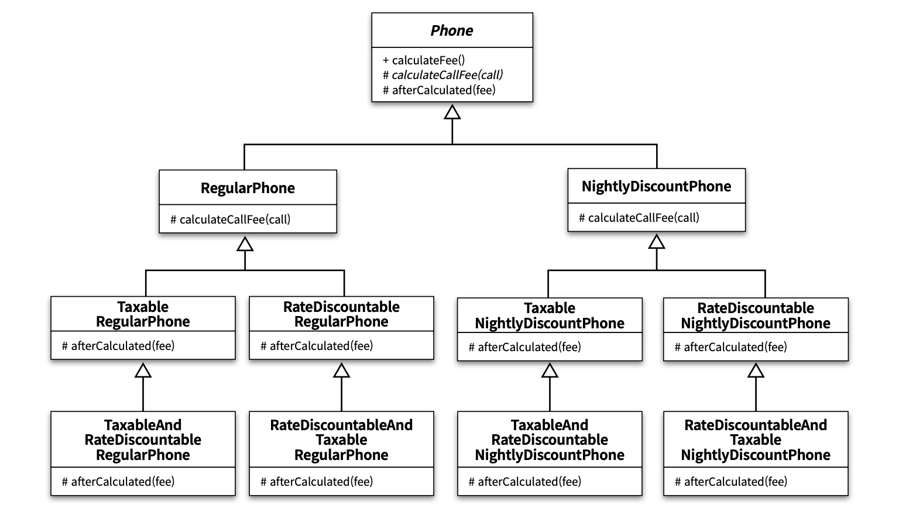

# README.md

생성일: 2023년 6월 16일 오후 4:04
생성자: 조재현
태그: 11장

**상속**

- 부모 클래스와 자식 클래스를 연결해서 부모 클래스의 코드를 재사용
- 의존성은 컴파일 타임에 해결됨
- `is-a` 관계

**합성**

- 전체를 표현하는 객체가 부분을 표현하는 객체를 포함해서 부분 객체의 코드를 재사용
- 의존성은 런타임에 해결됨
- `has-a` 관계


# 1. 상속을 합성으로 변경하기

상속을 남용 했을 경우 문제점

- 불필요한 인터페이스 상속 문제
- 메서드 오버라이딩의 오작용 문제
- 부모 클래스와 자식 클래스의 동시 수정 문제

```java
public class Properties {
    private Hashtable<String, String> properties = new Hashtable<>();

    public String setProperty(String key, String value) {
        return properties.put(key, value);
    }

    public String getProperty(String key) {
        return properties.get(key);
    }
}
```

- 합성으로 변경한 properties는 hashtable 의 내부 구현에 관해 알지 못하게됨


# 2. 상속으로 인한 조합의 폭발적인 증가

**작은 기능들을 조합해서 더 큰 기능을 수행하는 객체를 만들어야 할 때**

- 하나의 기능을 추가하거나 수정하기 위해 불필요하게 많은 수의 클래스를 추가하거나 수정해야 한다.
- 단일 상속만 지원하는 언어에서는 상속으로 인해 오히려 중복코드의 양이 늘어날수있다.

**상속을 남용할 경우**

- 하나의 기능 추가를 위해 수많은 클래스를 추가하게됨
    - `클래스 폭발(class explosion)`
    - `조합의 폭발(combinational explosion)`
- 하나라도 추가를 하지않으면 누락이 될 확률이 높음
- `해결법: 상속을 포기하자`

**상속의 안좋은 예**




# 3. 합성 관계로 변경하기

- 구현 상속
- 인터페이스 상속

`인터페이스 상속을 더 이용하자`