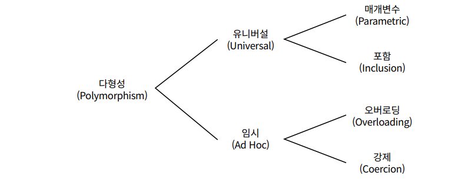

# Chapter12 다형성

**상속의 목적**

- 코드 재사용이 아님
- 타입 계층을 구조화하기 위해 사용해야 함

**상속을 사용하기 전 (스스로에게 질문)**

- 상속의 목적이 단순히 코드를 재사용하기 위함인가?
    - 사용 금지
- 위가 아니라면 클라이언트 관점에서 인스턴스들을 동일하게 행동하는 그룹으로 묶기 위해서인가?

**이번장 목적**

- 타입 계층의 개념
- 다형적인 타입 계층을 구현하는 방법과 올바른 타입 계층을 구성하기 위해 고려해야하는 원칙


# 1. 다형성

**객체 지향에서 사용하는 다형성**

- 유니버셜 다형성
    - 매개변수 다형성
    - 포함 다형성
- 임시 다형성
    - 오버로딩 다형성
    - 강제 다형성



**오버로딩 다형성**

```java
public class Money {
 public Money plus(Money amount) { ... }
 public Money plus(BigDecimal amount) { ... }
 public Money plus(long amount) { ... }
}
```

**강제 다형성**

```java
int a = 10;
double b = 10.0;

int c = a + (int) b;
```

**매개변수 다형성**

- 클래스의 인스턴스 변수나 메서드의 매개변수 타입을 임의의 타입으로 선언한 후 사용하는 시점에 구체적인 타입으로 지정하는 방식
- ex) List<T>

**포함 다형성**

- 메시지가 동일하더라도 수신한 객체의 타입에 따라 실제로 수행되는 행동이 달라지는 능력
- 서브타입(subtype) 다형성 이라고도 부름
- 객체지향에서 가장 널리 알려진 형태의 다형성
- 상속의 진정한 목저 → `코드 재사용이 아니라 다형성을 위한 서브타입 계층 구축`


# 2. 상속의 양면성

**이번장에서 살펴볼 개념**

- 업캐스팅
- 동적 메서드 탐색
- 동적 바인딩
- self 참조
- super 참조

## 상속을 사용한 강의 평가

다음과 같은 형식으로 전체 수강생들 성적 통계 출력 프로그래밍 제작

`Pass:3 Fail:2, A:1 B:1 C:1 D:0 F:2`

```java
public class Lecture {
    private int pass;
    private String title;
    private List<Integer> scores = new ArrayList<>();

    public Lecture(int pass, String title, List<Integer> scores) {
        this.pass = pass;
        this.title = title;
        this.scores = scores;
    }

    public double average() {
        return scores.stream()
                .mapToInt(Integer::intValue)
                .average()
                .orElse(0);
    }

    public List<Integer> getScores() {
        return Collections.unmodifiableList(scores);
    }

    public String evaluate() {
        return String.format("Pass:%d Fail:%d", passCount(), failCount());
    }

    private long passCount() {
        return scores.stream()
                .filter(score -> score >= pass)
                .count();
    }

    private long failCount() {
        return scores.size() - passCount();
    }

    public static void main(String[] args) {
        Lecture lecture = new Lecture(70, "객체지향 프로그래밍", List.of(81, 95, 75, 50, 45));
        String evaluation = lecture.evaluate();
        System.out.println(evaluation);
    }

}

public class GradeLecture extends Lecture {

    private List<Grade> grades;

    public GradeLecture(int pass, String title, List<Integer> scores, List<Grade> grades) {
        super(pass, title, scores);
        this.grades = grades;
    }

    @Override
    public String evaluate() {
        return super.evaluate() + "," + gradesStatistics();
    }

    public double average(String gradeName) {
        return grades.stream()
                .filter(each -> each.isName(gradeName))
                .findFirst()
                .map(this::gradeAverage)
                .orElse(0d);
    }

    private double gradeAverage(Grade grade) {
        return getScores().stream()
                .filter(grade::include)
                .mapToInt(Integer::intValue)
                .average()
                .orElse(0);
    }

    private String gradesStatistics() {
        return grades.stream()
                .map(grade -> format(grade))
                .collect(Collectors.joining(" "));
    }

    private String format(Grade grade) {
        return String.format("%s:%d", grade.getName(), gradeCount(grade));
    }

    private long gradeCount(Grade grade) {
        return getScores().stream()
                .filter(grade::include)
                .count();
    }

    public static void main(String[] args) {
        Lecture lecture = new GradeLecture(70,
                "객체지향 프로그래밍",
                Arrays.asList(81, 95, 75, 50, 45),
                Arrays.asList(new Grade("A",100, 95),
                        new Grade("B",94, 80),
                        new Grade("C",79, 70),
                        new Grade("D",69, 50),
                        new Grade("F",49, 0))
        );
        System.out.println(lecture.evaluate());
    }

}

public class Grade {
    private String name;
    private int upper, lower;

    public Grade(String name, int upper, int lower) {
        this.name = name;
        this.upper = upper;
        this.lower = lower;
    }

    public String getName() {
        return name;
    }

    public boolean isName(String name) {
        return this.name.equals(name);
    }

    public boolean include(int score) {
        return score >= lower && score <= upper;
    }

}
```

- 자식 클래스 안에 상속받은 메서드와 동일한 시그니처의 메서드를 재정의해서 부모 클래스의 구현을 새로운 구현으로 대체하는 것을 `메서드 오버라이딩`
- 메서드와 이름은 동일하지만 시그니처는 다른 메서드를 자식 클래스에 추가하는 것을 `메서드 오버로딩`

## 데이터 관점의 상속


## 행동 관점의 상속


# 3. 업캐스팅과 동적 바인딩

## 같은 메시지, 다른 메서드

```java
import java.util.Arrays;

public class Professor {
    private String name;
    private Lecture lecture;

    public Professor(String name, Lecture lecture) {
        this.name = name;
        this.lecture = lecture;
    }

    public String compileStatistics() {
        return String.format("[%s] %s - Avg: %.1f", name, lecture.evaluate(), lecture.average());
    }

    public static void main(String[] args) {
        Professor professor = new Professor("다익스트라",
                new Lecture(70,
                        "알고리즘",
                        Arrays.asList(81, 95, 75, 50, 45)));
        //결과 => "[다익스트라] Pass:3 Fail:2 - Avg: 69.2"
        String statistics = professor.compileStatistics();
        System.out.println(statistics);

        Professor professor2 = new Professor("다익스트라",
                new GradeLecture(70,
                        "알고리즘",
                        Arrays.asList(81, 95, 75, 50, 45),
                        Arrays.asList(new Grade("A",100, 95),
                                new Grade("B",94, 80),
                                new Grade("C",79, 70),
                                new Grade("D",69, 50),
                                new Grade("F",49, 0))
                       ));
//결과 => "[다익스트라] Pass:3 Fail:2, A:1 B:1 C:1 D:1 F:1 - Avg: 69.2"
        String statistics2 = professor.compileStatistics();
        System.out.println(statistics2);

    }

}
```

**업캐스팅과 동적 바인딩 매커니즘**

- 부모 클래스(Lecture) 타입으로 선언된 변수에 자식 클래스(GradeLecture)의 인스턴스를 할당하는 것이 가능하다 이를 `업캐스팅` 이라고 부름
- 선언된 변수의 타입이 아니라 메시지를 수신하는 객체의 타입에 따라 실행되는 메서드가 결정됨
이것은 객체지향 시스템이 메시지를 처리할 적절한 메서드를 컴파일 시점이 아니라 실행 시점에 결정하기 때문 이를 `동적 바인딩` 이라고 함

## 업 캐스팅, 다운 캐스팅


## 동적 바인딩

- 전통적인 언어에서 함수를 실행하는 방법은 함수를 호출하는 것
    - 호출될 함수를 컴파일 타임에 결정함
    - 코드 상에서 bar 함수를 호출하면 실제로 실행되는 코드는 바로 그 bar 함수
    - 이처럼 컴파일타임에 호출할 함수를 결정하는 방식을
        - 정적 바인딩
        - 초기 바인딩
        - 컴파일타임 바인딩
- 객체지향에서는 메서드를 실행하는 방법은 메시지를 전송하는 것
    - 실행될 메서드가 런타임에 결정됨
    - foo.bar() 라는 코드를 읽는 것만으로 실행되는 bar가 어떤 클래스의 어떤 메서드인지 판단하기 어려움
    - foo가 가리키는 객체가 실제로 어떤 클래스의 인스턴스인지 알아야 하고, bar 메서드가 해당 클래스의 상속 계층의 어디에 위치 하는지도 알아야함
    - 이러한 방식은
        - 동적 바인딩
        - 지연 바인딩


# 4. 동적 메서드 탐색과 다형성

**객체지향 시스템은 다음 규칙에 따라 실행할 메서드를 선택함**

- 메시지를 수신한 객체는 먼저 자신을 생성한 클래스에 적합한 메서드가 존재하는지 검사한다.
존재하면 메서드를 실행하고 탐색을 종료함
- 메서드를 찾지 못했다면 부코 클래스에서 메서드 탐색을 계쏙한다. 이 과정은 적합한 메서드를 찾을 때까지 상속 계층을 따라 올라가며 계속됨
- 상속 계층의 가장 최상위 클래스에 이르렀지만 메서드를 발견하지 못한 경우 예외를 발생시키며 탐색을 중단한다.

`객체가 메시지를 수신하면 컴파일러는 self 참조라는 임시 변수를 자동으로 생성한 후 메시지를 수신한 객체를 가리키도록 설정함`

> 정적 타입 언어에 속하는 C++, 자바, C#에서는 self 참조를 this라고 부른다. 동적 타입 언어에 속하는 스몰토크,
루비에서는 self 참조를 나타내는 키워드로 self를 사용한다. 파이썬에서는 self 참조의 이름을 임의로 정할 수 있지만
대부분의 개발자들은 전통을 존중해서 self라는 이름을 사용한다.
> 


- 메서드 탐색은 항상 자식 클래스에서 부모 클래스로 진행되기 때문에
자식 클래스에 선언된 메서드가 부모 클래스의 메서드보다 더 높은 우선순위를 가짐
- 자동적인 메시지 위임
    - 자식 클래스는 자신이 이해할 수 없는 메시지를 전송 받은 경우 상속 계층을 따라 부모 클래스에게 처리를 위임
- 동적인 문맥
    - 메시지를 수신했을 때 실제로 어떤 메시지를 실행할지를 결정하는 것은 
    `컴파일 시점` 이 아닌 `실행(런타임)` 시점에 이뤄지며 메서드를 탐색 하는 경로는 self 참조를 이용해 결정됨

## 자동적인 메시지 위임

**동적 메서드 탐색에서**

- 상속은 메시지를 부모 클래스에게 전달하기 위한 경로를 정의하는 것으로 볼수도 있음
- 여기서 핵심은 `적절한 메서드를 찾을 때까지 상속 계층을 따라 부모 클래스로 처리가 위임된다`
- 상속을 이용할 경우 프로그래머가 메시지 위임과 관련된 코드를 명시적으로 작성할 필요가 없다
- 상속 계층을 정의하는 것은 `메서드 탐색 경로`를 정의 하는것과 동일하다.

`주의 아래는 메서드 오버로딩` → `메서드 오버라이딩(x)`

```java
public class A {
	public void getInt() {
		return 10;
	}
}

public class B extends A {
  public int getInt(int a) {
		return a;
	}
}
```

## 동적인 문매

```java
public class Lecture {
 public String stats() {
	 return String.format("Title: %s, Evaluation Method: %s", title, getEvaluationMethod());
 }

 public String getEvaluationMethod() {
	 return "Pass or Fail";
 }
}
```

- 위 코드는 현재 클래스의 메서드를 호출 하는 것이 아니라 `현재 객체` 에게 `메시지` 를 전송하는 것
- self참조가 가리키는 자기 자신에게 메시지를 전송하는 것을 self 전송이라고 부른다.
- self 전송은 self 참조가 가리키는 바로 그 객체에서부터 메시지 탐색을 다시 시작함


```java
public class GradeLecture extends Lecture {
 @Override
 public String getEvaluationMethod() {
 return "Grade";
 }
}
```

- state()를 호출
- GradeLecture 가 처리할 수 없어 부모인 Lecture 를 탐색
- Lecture 가 state 를 호출
- state 안에  getEvaluationMethod 를 찾는데 이 때 `self` 는 바로 GradeLecture
- 다시 메시지 탐색은 GradeLecture 부터 시작
- 매우 이해하기 어려운 코드가 만들어짐


## self 대 super

- self 참조의 가장 큰 특징은 `동적`
    - self 참조는 메시지를 수신한 객체의 클래스에 따라 메서드 탐색을 위한 문맥을 실행 시점에 결정
- self 와 대비해서 언급하는 `super 참조(super reference)`
    - 자식 클래스에서 부모 클래스의 구현을 재사용 해야하는 경우
    - 자식 클래스에서 부모 클래스의 인스턴스 변수나 메서드에 접근하기 위해 사용할 수 있는super 참조를 제공
    - super 참조를 이용해 `메시지를 전송` → `호출이 아닌 전송`
    

```java
public class FormattedGradeLecture extends GradeLecture {

    public FormattedGradeLecture(int pass, String title, List<Integer> scores, List<Grade> grades) {
        super(pass, title, scores, grades);
    }

    public String formatAverage() {
        return String.format("Avg: %1.1f", super.average());
    }
}
```


- gradeLecture 에는 average 가 `정의` 되어 있지 않음
- 만약 `호출` 이었다면 에러가 발생
- 그래서 `호출` 이 아닌 `메시지 전송` 이라고 함
- super 의 확실한 의도는 `지금 이 클래스의 부모 클래스에서부터 메서드 탐색을 시작하세요`
- 이를 `super 전송(super send)` 라고 함


# 5. 상속 대 위임

## 위임과 self 참조


- GradeLecture 인스턴스 입장에서 self 는 `GradeLecture`
- GradeLecture 인스턴스에 포함된 Lecture 에서 self는? → `GradeLecture`
- self 참조는 항상 메시지를 수신한 객체를 가치키기 떄문


> 중요한 것은 클래스 기반의 상속과 객체 기반의 위임 사이에 기본 개념과 메커니즘을 공유한다는 점이다
>