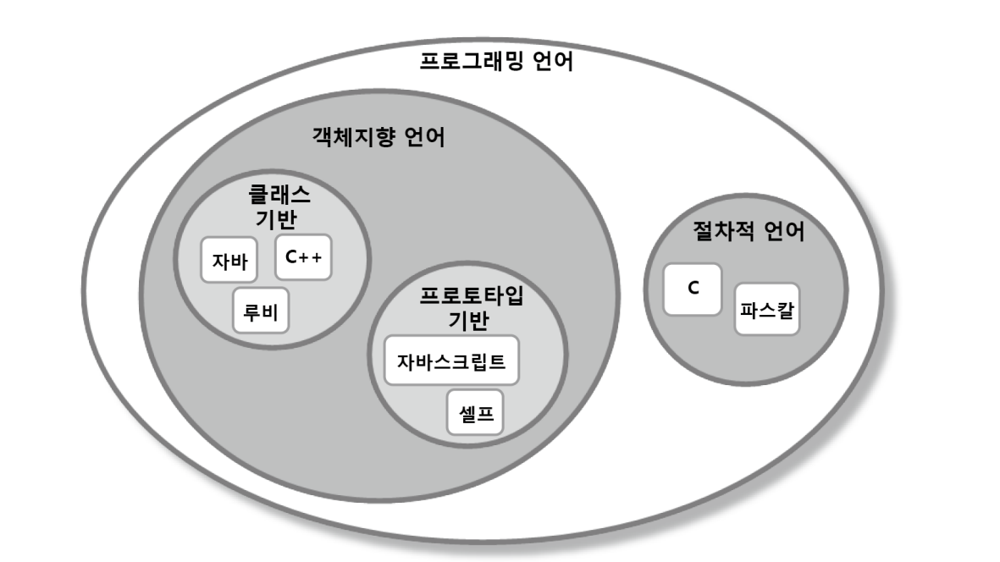

# Chapter13 서브클래싱과 서브타이핑

생성일: 2023년 7월 7일 오후 3:10
태그: 13장
생성자: 조재현

**들어가기전에**

**상속의 용도**

1. 타입 계층을 구현화 하는것
    1. 부모 클래스는 일반적인 개념을 구현하고 자식클래스는 `특수한 개념` 을 구현함
    2. 부모 클래스는 자식클래스의 일반화이고, 자식 클래스는 부모 클래스의 `특수화`
2. 코드 재사용
    1. 상속은 간단한 선언만으로 부모 클래스의 코드를 재사용할 수 있다
    2. 재사용을 위해 상속을 사용할 경우 부모 클래스와 자식 클래스가 강하게 결합됨

`동일한 메시지에 대해 서로 다르게 행동할 수 있는 다형적인 객체를 구현하기 위해서 객체의 행동을 기반으로 타입 계층을 구성하는데 상속을 사용해야함`

**서브 클래싱, 서브타이핑**

- **서브클래싱(subclassing)**
    - `다른 클래스의 코드를 재사용`할 목적으로 상속을 사용하는 경우를 가리킴
    - 자식 클래스와 부모 클래스의 `행동이 호환` 되지 않기 때문에 자식 클래스가 부모클래스를 대체할 수 없음
    - 서브 클래싱을 `구현 상속(implementation inheritance)` 또는 `클래스 상속(class inheritance)` 라고 부르기도 함
- **서브타이핑(subtyping)**
    - `타입 계층을 구성` 하기 위해 상속을 사용하는 경우를 가리킴
    - 영화 예매 시스템에서 구현한 DiscountPolicy 상속 계층이 서브 타이핑에 해당
    - 서브 타이핑에서는 자식 클래스가와 부모클래스의 `행동이 호환` 되기 때문에 자식 클래스가 부모 클래스를 대체 할 수 있음
    - 이때 부모 클래스는 자식 클래스의 슈퍼 타입이 되고 자식 클래스는 부모 클래스의 서브 타입이 된다.
    - 서브 타이핑을 `인터페이스 상속(interface inheritance)` 라고 부르기도 함

SOLID

- SRP(Single responsibility principle)
    - 한 클래스는 하나의 책임만 가져야 한다.
- OCP(Open-Close principle)
    - 소프트웨어 요소는 확장에는 열려 있으나 변경에는 닫혀 있어야 한다.
- LSP(Liskov subsititution principle)
    - 프로그램 객체는 프로그램의 정확성을 깨뜨리지 않으면서 하위 타입의 인스턴스로 바꿀 수 있어야 한다.
- ISP(Interface segregation principle)
    - 특정 클라이언트를 위한 인터페이스 여러 개가 범용 인터페이스 하나보다 낫다
- DIP(Dependency inversion principle)
    - 프로그래머는 추상화에 의존해야지 구체화에 의존하면 안된다.


**코드 버전 정보 명시**

- bird
    - v1 → Penguin은 날수없는데 bird의 fly를 구현하는 잘못된 사용법
    - v2 → FlyingBird 를 구현해 타입계층을 만듦
    - v3 → 인터페이스로 사용했을 경우
    - v4 → Bird 와  Penguin의 `합성`


# 1. 타입

## 개념 관점의 타입

- 우리가 인지하는 세상의 사물의 종류
- ex) 자바, 루비, 자바스크립트, C를 프로그래밍 언어라고 분리 → 프로그래밍 언어라는 타입
- 어떤 대상이 타입으로 분류될 때 그 대상을 타입의 인스턴스라고 부름

**타입의 구성**

- 심볼(symbol)
    - 타입의 이름을 붙인 것 `프로그래밍 언어` 가 타입의 심볼에 해당
- 내연(intension)
    - 타입의 정의
    - 타입이 속하는 객체들이 가지는 공통적인 속성이나 행동
- 외연(extension)
    - 타입에 속하는 객체들의 집합
    - `프로그래밍 언어` 타입의 경우 루비, 자바 스크립트, C가 속한 집합이 외연을 구성

## 프로그래밍 언어 관점의 타입

- 프로그래밍 언어의 관점에서 타입은 비트 묶음에 의미를 부여하기 위해 정의된 제약과 규칙

### 타입에 수행될 수 있는 유효한 오퍼레이션의 집합을 정의한다.

> 자바에서 ‘+’ 연산자는 원시형 숫자 타입이나 문자열 타입의 객체에는 사용할 수 있지만 다른 클래스의 인스턴스에 대해서는
사용할 수 없다. 하지만 C++와 C#에서는 연산자 오버로딩을 통해 ‘+’ 연산자를 사용하는 것이 가능하다. 여기서 중요한 것은
모든 객체지향 언어들은 객체의 타입에 따라 적용 가능한 연산자의 종류를 제한함으로써 
`프로그래머의 실수를 막아준다는 것 이다`
> 

### 타입의 수행되는 오퍼레이션에 대해 미리 약속된 문맥을 제공

> 예를 들어 자바에서 a + b라는 연산이 있을 때 a와 b의 타입이 int라면 두 수를 더할 것이다. 
하지만 a와 b의 타입이 String 이라면 두 문자열을 하나의 문자열로 합칠 것이다. 
따라서 a와 b에 부여된 타입이 ‘+’ 연산자의 문맥을 정의한다. 
비슷한 예로 자바와 C#의 new 연산자는 타입에 정의된 크기만큼 저장 공간을 할당하고 
생성된 객체를 초기화하기 위해 타입의 생성자를 자동으로 호출한다. 
이 경우 객체를 생성하는 방법에 대한 문맥을 결정하는 것은 바로 객체의 타입이다.
> 

## 객체지향 패러다임 관점의 타입

- 오퍼레이션은 객체가 수신할 수 있는 메시지를 의미 ( 퍼블릭 인터페이스 )
    - 객체의 퍼블릭 인터페이스가 객체의 타입을 결정한다
- 객체에게 중요한것은 속성이 아니라 행동
- 퍼블릭 인터페이스가 다르면 서로 다른 타입, 어떤 객체들의 내부 상태는 다르지만 동일한 퍼블릭 인터페이스를 공유하면 동일한 타입
- `객체가 외부에 제공하는 행동` 에 초점 을 맞춰야함


# 2. 타입 계층

## 타입 사이의 포함관계

타입 안에 포함된 객체들을 좀 더 상세한 기준으로 묶어 새로운 타입을 정의하면

새로운 타입은 자연스럽게 기존 타입의 부분집합이됨

- 프로그래밍 언어
    - 객체지향 언어
        - 자바
        - 루비
        - 자바스크립트
    - 절차적 언어
        - C
    - 프로토타입 기반 언어
        - 자바스크립트
        




일반적인 타입을 위쪽에, 더 특수한 타입을 아래쪽에 배치하는 것이 관례

- 타입 계층을 구성하는 두 타입 관계에서 더 일반적인 타입을 슈퍼타입(supertype)
- 더 특수한 타입을 서브타입(subtype)
- 프로그래밍 언어 타입은 `객체지향 언어` 와 `절차지향 언어` 의 슈퍼 타입

집합을 의미하는 외연적 관점

- 일반적인 타입의 인스턴스 집합은 특수한 타입의 인스턴스 집합을 포함하는 `슈퍼셋`
- 특수한 타입의 인스턴스 집합은 일반적인 타입의 인스턴스 집합에 포함된 `서브셋`

**슈퍼타입**

- 집합이 다른 집합의 모든 멤버를 포함한다.
- 타입 정의가 다른 타입보다 좀 더 일반적이다.

**서브타입**

- 집합에 포함되는 인스턴스들이 더 큰 집합에 포함된다.
- 타입 정의가 다른 타입보다 좀 더 구체적이다.

## 객체지향 프로그래밍과 타입 계층

- **일반적인 타입**
    - 비교하려는 탕비에 속한 객체들의 퍼블릭 인터페이스보다 더 일반적인 퍼블릭 인터페이스를 가지는 객체들의 타입
- **특수한 타입**
    - 비교하려는 타입에 속한 객체들이 퍼블릭 인터페이스보다 더 특수한 퍼블릭 인터페이스를 가지는 객체들의 타입
- **슈퍼 타입**
    - 서브타입이 정의한 퍼블릭 인터페이스를 일반화시켜 상대적으로 범용적이고 넓은 의미로 정의한 것
- **서브타입**
    - 슈퍼타입이 정의한 퍼블릭 인터페이스를 특수화 시켜 상대적으로 구체적이고 좁은 의미로 정의 한 것이다.
    - 서브 타입은 슈퍼타입의 인스턴스로 간주될 수 있다.


# 3. 서브클래싱과 서브타이핑(중요)

## 언제 상속을 사용해야 하는가? (상속을 사용하기 위한 조건)

### 상속 관계가 is-a 관계를 모델링 하는가?

- 자식 클래스는 부모 클래스다 라고 말해도 이상하지 않다면 상속을 사용할 후보로 간주 가능
- `마틴 오더스키의 조언` 에 따르면 두 클래스가 어휘적으로 `is-a 관계` 를 모델링할 경우에만 상속을 사용
- 타입 S는 타입 T다 `(S is-a T)` → `객체지향 언어는 프로그래밍 언어다`

**스콧 마이어스의 이펙티브 c++( is-a 관계가 직관을 쉽게 배신할 수 있음)**

- 펭귄은 새다
- 새는 날 수 있다

```java
public class Bird {
	public void fly() {...}
}

public class Penguin extends Bird {
 ...
}
```

- 어휘적인 정의가 아니라 기대되는 행동에 따라 타입 계층을 구성해야 함
- 새의 정의에 날 수 있다는 행동이 포함되지 않는다면 펭귄은 새의 서브타입이 될 수있음
이 경우 `어휘적 관점` 및 `행동 관점` 이 일치하게 됨
- 슈퍼 타입과 서브 타입 관계에서는 is-a 보다 `행동 호환성` 이 더 중요하다.
- 어떤 두 대상을 언어적으로 is-a 라고 표현할 수 있더라도 일단은 상속을 사용할 예비 후보 정도로만 생각

### 클라이언트 입장에서 부모 클래스의 타입으로 자식 클래스를 사용해도 무방한가?

`해당 고민이 우선적으로 선행되야야 한다.`

- 상속 계층을 사용하는 클라이언트 입장에서 부모 클래스와 자식 클래스의 차이점을 몰라야함
- 자식 클래스와 부모 클래스 사이의 `행동 호환성` 이 보장되야함

### 행동 호환성

- 탕비의 이름 사이에 개념적으로 어떤 연관성이 있어도 `행동에 연관성` 이 없다면 is-a 관계를 사용하면 안됨
- 행동의 호환 여부를 판단하는 기준은 `클라이언트 관점` 이다.
    - 클라이언트가 두 타입이 `동일` 하게 `행동할 것`이라고 기대한다면 두 타입을 타입 계층으로 묶어도 됨
    - 클라이언트가 두 타입이 `동일` 하게 `행동하지 않을 것` 이라고 기대한다면 두 타입을 계층으로 묶어서는 안됨

```java
public void flyBird(Bird bird) {
	// 인자로 전달된 모든 bird는 날 수 있어야함
	bird.fly();
}
```

- 현재 Penguin은 Bird의 자식 클래스이기 때문에 컴파일러는 `업캐스팅` 을 허용함
- flyBird에 인자로 Penguin의 인스턴스가 전달되는 것을 막을 수 있는 방법이 없음.
- 하지만 Penguin은 날 수 없음 → 모든 bird가 날 수 있기를 기대하기 때문에 flyBird 메서드의 인자로 전달되어서는 안됨

**문제를 해결하기 위해 시도해 볼 수 있는 세 가지 방법**

1. **Penguin의 fly메서드를 비워두자**

```java
public class Penguin extends Bird {
	...
	@Override
	public void fly() {}
}
```

- Penguin의 fly는 아무 일도 하지 않는다.
- Penguin은 날 수 없게 된다.
- 하지만 모든 Bird가 날 수 있다는 클라이언트의 기대를 만족시키지 못함
- `올바른 설계가 아님`

1. **Penguin의 fly메서드를 오버라이딩한 후 예외를 던짐**

```java
public class Penguin extends Bird {

	...
	@Override
	public void fly() {
		thorw new UnsupportedOperationException();
	}
}
```

- flyBird 메서드는 fly 메시지를 전송한 결과로 UnsupportedOperationException 예외가 던져질 것이라고는 기대하지 않음
- 이 방법 또한 `클아이언트` 관점에서 Bird와 Pengin의 행동이 호환되지 않음

1. **flyBird 메서드를 수정해서 인자로 전달된 bird의 타입이 Penguin이 아닐 경우에만 fly를 실행하도록함**

```java
// client
public void flyBird(Bird bird) { 
	// 인자로 전달된 모든 bird가 Penguin의 인스턴스가 아닐 ㅕㄱㅇ우에만
	// fly() 메시지를 전송한다.
	if (!(bird instanceof Penguin)) {
		bird.fly();
	}
}
```

- 만약 Penguin 이외에 날 수 없는 또 다른 새가 상속 계층에 추가된다면?
- 매번 flyBird 메서드 안에서 instanceof를 이용한 새로운 타입 체크 코드가 추가됨
- new 연산자와 마찬가지로 구체적인 클래스에 대한 결합도를 높인다.

## 클라이언트의 기대에 따라 계층 분리하기

**문제 및 조건**

- flyBird 메서드는 파라미터로 전달되는 모든 새가 날 수 있다
- flyBird 메서드와 협력하는 모든 객체는 fly 메시지에 대해 `올바르게` 응답할 수 있어야 한다.
- 따라서 Penguin의 인스턴스는 flyBird 메서드에 전달돼서는 안 된다.

**그래서 어떻게?**

- 날 수 있는 새와 날 수 없는 새를 구분 하자
- 두개의 타입으로 상속 계층을 분리하면 서로 다른 요규사항을 가진 클라이언트를 만족시킬 수 있다.

```java
public class Bird { 
	...
}
public class FlyingBird extends Bird { 
	public void fly() { ... }
	...
}
public class Penguin extends Bird { 
	...
}
```

```java
public void flyBird(FlyingBird bird) { 
	bird.fly();
}
```

- flyBird 메서드는 FlyingBird 타입을 이용해 날 수 있는 새만 인자로 전달돼야 한다는 사실을 코드에 명시 가능
- 만약 날 수 없는 새와 협력하는 메서드가 존재한다면 파라미터 타입을 Bird로 선언하면 됨
- 모든 클래스들이 `행동 호환성` 을 만족 하고 있음


**해당 문제를 해결할 또 다른 방법**

- 클아이언트에 따라 인터페이스를 분리
- Bird가 날 수 있으면서 걸을 수도 있어야하고 Penguin은 오직 걸을 수만 있다면
- Bird는 Fly와 Walk 메서드를 구현, Penguin은 오직 Walk 메서드만 구현


**만약에?!**

- Penguin이 Bird의 코드를 재사용해야 한다면?
- Penguin이 하나의 인터페이스만 구현하고 있기 때문에 `문법상` 으로는 Bird를 상속받아도 문제가 안되지만
- Penguin의 퍼블릭 인터페이스에 fly 오퍼레이션이 추가되기 때문에 이 방법은 사용할 수는 없다.
- 목적이 `재사용` 인 상속은 `위험` 하므로 사용하면 안된다
- 좋은 방법은 `합성` 을 이용하는 거다


### 인터페이스 분리 원칙(Interface Segregation Principle, ISP)

- 클라이언트에 따라 인터페이스를 분리하면 각 클라이언트의 요구가 바뀌더라도 영향의 파급 효과를 효과적으로 제어할 수 있다.
- 그림 13.5 → Client1의 기대가 바뀌어서 Flyer의 인터페이스가 변경돼야 한다고 가정
    - Flyer에 의존하고 있는 Bird가 영향을 받는다
    - 변경의 영향은 → Bird로 끝
    - Client2는 Flyer나  Bird에 대해 전혀 알지 못하기 때문에 영향을 받지 않음
- 인터페이스를 클라이언트의 기대에 따라 분리함으로써 변경에 의해 영향을 제어하는 설계 원칙을
`인터페이스 분리 원칙(Interface Segregation Principle, ISP)` 라고 부름


`두 클래스 사이에 행동이 호환되지 않는다면 올바른 타입 계층이 아니기 때문에 상속을 사용하면 안된다.`

## 서브클래싱과 서브타이핑

- **서브클래싱(subclassing)**
    - `다른 클래스의 코드를 재사용`할 목적으로 상속을 사용하는 경우를 가리킴
    - 자식 클래스와 부모 클래스의 `행동이 호환` 되지 않기 때문에 자식 클래스가 부모클래스를 대체할 수 없음
    - 서브 클래싱을 `구현 상속(implementation inheritance)` 또는 `클래스 상속(class inheritance)` 라고 부르기도 함
- **서브타이핑(subtyping)**
    - `타입 계층을 구성` 하기 위해 상속을 사용하는 경우를 가리킴
    - 영화 예매 시스템에서 구현한 DiscountPolicy 상속 계층이 서브 타이핑에 해당
    - 서브 타이핑에서는 자식 클래스가와 부모클래스의 `행동이 호환` 되기 때문에 자식 클래스가 부모 클래스를 대체 할 수 있음
    - 이때 부모 클래스는 자식 클래스의 슈퍼 타입이 되고 자식 클래스는 부모 클래스의 서브 타입이 된다.
    - 서브 타이핑을 `인터페이스 상속(interface inheritance)` 라고 부르기도 함


# 4. 리스코프 치환 원칙

- 서브타입은 그것의 기반 타입에 대해 대체 가능해야 한다.
- 클라이언트가 `차이점을 인식` 하지 못한 채 기반 클래스의 인터페이스를 통해
서브 클래스를 사용할 수 있어야 함
- 자식 클래스가 부모 클래스와 `행동 호환성` 을 유지함으로써 부모 클래스를 대체할 수 있도록 구현된 상속 관계만을 서브타이핑이라고 불러야 함

**리스코프 치환 원칙을 위반하는 예시**

```java
public class Rectangle {
    private int x, y, width, height;

    public Rectangle(int x, int y, int width, int height) {
        this.x = x;
        this.y = y;
        this.width = width;
        this.height = height;
    }

    public int getWidth() {
        return width;
    }

    public void setWidth(int width) {
        this.width = width;
    }

    public int getHeight() {
        return height;
    }

    public void setHeight(int height) {
        this.height = height;
    }

    public int getArea() {
        return width * height;
    }

}

public class Square extends Rectangle {
    public Square(int x, int y, int size) {
        super(x, y, size, size);
    }

    @Override
    public void setWidth(int width) {
        super.setWidth(width);
        super.setHeight(width);
    }

    @Override
    public void setHeight(int height) {
        super.setHeight(height);
        super.setWidth(height);
    }
}

public class Client {

    public void resize(Rectangle rectangle, int width, int height) {
        rectangle.setWidth(width);
        rectangle.setHeight(height);
        assert rectangle.getWidth() == width && rectangle.getHeight() == height;
    }

    public static void main(String[] args) {
        // Client resize 의 Rectangle 에 Square 를 전달 하면?
        Square square = new Square(10, 10, 10);
        Client client = new Client();

        client.resize(square, 50, 100);
        
    }

}
```

- 직사각형은 너비와 높이가 다르다고 가성
- 정사각형은 너비와 높이가 항상 동일하다고 가정
- resize 메서드의 구현은 Rectangle이 세운 가정에 기반하기 때문에 직사각형의 너비와 높이를 `독립` 적으로 변경 가능하다고 가정
- resize 메서드의 인자로 Square를 전달하면 위의 가정이 무너짐
- resize 메서드의 관점에서 Rectangle 대신 Square를 사용할 수 없기 때문에 Square는 Rectangle이 아니다
- Square는 Rectangle의 구현을 `재사용` 하고  있을 뿐이다.
두 클래스는 리스코프 치환 원칙을 위반하기 때문에 `서브타이핑 관계`가 아닌 `서브 클래싱 관계` 다

## 클라이언트와 대체 가능성

> 리스코프 치환 원칙은 자식 클래스가 부모 클래스를 대체하기 위해서는 부모 클래스에 대한 클라이언트의 가정을 준수해야 한다는 것을 강조한다.
> 

- 리스코프 치환 원칙은 상속 관계에 있는 두 클래스 사이에 관계를 클라이언트와 떨어트려 놓고 판단하지 말라고 함
- 상속 관계는 클라이언트 관점에서 자식 클래스가 부모 클래스를 대체할 수 있을 때만 올바르다.
- `행동 호환성` 과 `리스코프 치환 원칙` 에서 한 가지만 기억 해야 하는것은
→ `대체 가능성` 을 결정하는 것은 `클라이언트`

## is-a 관계 다시 살펴보기

## **상속이 적합한지 판단 질문(마틴 오더스키)**

1. 상속 관계가 어휘적으로 is-a 관계를 모델링한 것인가?
2. 클라이언트 입장에서 부모 클래스 대신 자식 클래스를 사용 할 수 있는가?

## **is-a 판단법**

- `클라이언트` 관점에서 자식 클래스의 행도잉 부모 클래스의 행동고 호환되지 않고 대체 불가능 하다면 어휘적으로 is-a 하더라도 그 관계를 is-a 라고 할 수 없음
- is-a는 클라이언트 관점에서 is-a일 때만 참이다.
- is-a 관계로 표현된 문장을 볼 때 마다 문장 앞에 `클라이언트 입장에서` 라는 말이 빠져 있다 생각하자
    - (클라이언트 입장에서) 정사각형은 직사각형이다.
    - (클라이언트 입장에서) 펭귄은 새다
- is-a 관계는 객체지향에서 중요한 것은 `객체의 속성` 이 아니라 `객체의 행동` 이라는 점을 강조
- 클라이언트를 고려하지 않은 채 `개념` 과 `속성` 의 측면에서 상속 관계를 정할 경우 리스코프 치환 원칙을 위반하는 서브 클래싱에 이르게 될 확률이 높다.
- 슈퍼 타입과 서브타입이 클라이언트 입장에서 호환된다면 두 타입을 is-a로 연결해 문장을 만들어도 어색하지 않은 단어로 타입의 이름을 정하라
    - Bird → Lion (x)
- 꼭 `서브 타이핑` 을 위해 사용될 경우에만 is-a 다

## 리스코프 치환 원칙은 유연한 설계의 기반이다.

- 리스코프 치환 원칙은 어떤 자식 클래스와도 안정적으로 협력할 수 있는 상속 구조를 구현할 수있는 가이드 라인을 제공해줌
- 새로운 자식 클래스를 추가해도 `클라이언트` 입장에서 동일하게 `행동` 이 가능하면 상속 계층을 확장 가능
- 클라이언트 입장에서 `퍼블릭 인터페이스` 의 `행동 방식` 이 변경되지 않는다면 클라이언트의 코드를 변경하지 않고도 새로운 자식 클래스와 협력할 수 있게됨 (확장성)

**원칙들 적용**


- **의존성 역전 원칙**
    - 구체 클래스인 Movie와 OverlappedDiscountPolicy 모두 추상 클래스인 DiscountPolicy에 의존 한다.
    - 상위 수준의 모듈인 movie와 하위 수준의 모듈인 OverlappedDiscountPolicy는 모두 추상 클래스인 DiscountPolicy에 의존
    - DIP를 만족함
- **리스코프 치환 원칙**
    - DiscountPolicy와 협력하는 Movie의 관점에서 DiscountPolicy 대신 OverlappedDiscountPolicy와 협력하더라도 `아무런 문제` 가 없다.
    - LSP를 만족함
- **개방-폐쇄 원칙**
    - 중복 할인 정책이라는 새로운 기능을 추가하기 위해 DiscountPolicy의 자식 클래스인 OverlappedDiscountPolicy를 추가해도 Movie에는 영향을 끼치지 않음
    - 기능 확장을 하면서 기존 코드를 수정할 필요가 없다.
    - OCP를 만족함
- **리스코프 치환 원칙은 개방-폐쇄 원칙을 만족하는 설계를 위한 전제 조건이다.**
- **리스코프 치환 원칙 위반은 개방-폐쇄 원칙 위반이다.**

## 타입 계층과 리스코프 치환 원칙

- 스칼라의 트레이트, 동적 타입 언어의 덕 타이핑등을 사용해도 리스코프 치환 원칙을 준수하지 않으면 `서브 타이핑` 관계가 아님
- 상속이 아닌 다른 방법을 이용하더라도 클라이언트 관점에서 서로 다른 구성요소를 동일하게 다뤄야 한다타면
서브타이핑 관계의 제약을 고려해서 `리스코프 치환 원칙` 을 준수 해야함


# 5. 계약에 의한 설계와 서브타이핑 (중요)

- 클라이언트와 서버 사이의 협력을 의무와 이익으로 구성된 계약의 관점에서 표현하는 것을
`계약에 의한 설계(Design By Contract, DBC)` 라고 부름
- 계약의 의한 설계 요소
    - 클라이언트가 정상적으로 메서드를 실행하기 위해 만족시켜야 하는 조건 `사전조건(precondition)`
    - 메서드가 실행된 후에 서버가 클라이언트에게 보장해야 하는 `사후조건(postcondition)`
    - 메서드 실행 전과 실행 후에 인스턴스가 만족시켜야하는 `클래스 불변식(class invariant)`
- `부록 A 계약의 의한 설계 참고`

**서브 클래스**

- 어떤 클래스가 다른 클래스를 상속받으면, 그 클래스는 자식 클래스 또는 서브클래스가 된다.
- 코드 재사용을 위해 상속했다면, 클라이언트 관점에서 자식 클래스가 부모 클래스를 대체할 수 없다면 서브 타입이라 할 수 없음.

**DiscountPolicy , Movie 로 계약의 의한 설계 요소 확인하기**

```java
public class Movie { ...
	public Money calculateMovieFee(Screening screening) {
		return fee.minus(discountPolicy.calculateDiscountAmount(screening));
	} 
}

public abstract class DiscountPolicy {
	public Money calculateDiscountAmount(Screening screening) {
		for(DiscountCondition each : conditions) { 
			if (each.isSatisfiedBy(screening)) {
				return getDiscountAmount(screening); 
			}
		}
		return screening.getMovieFee(); 
	}
	
	abstract protected Money getDiscountAmount(Screening screening); 

}
```

- **사전조건**
    - DiscountPolicy의 caclulateDiscountAmount 메서드는 인자로 전달된
    Screening이 null인지 여부를 확인하지 않음
    - Screening에 null이 전달되면 NPE예외가 발생
    - calculateDiscountAmount 메서드는 클라이언트가 전달하는 screening의 값이 null 이 아니고,
    영화 시작 시간이 아직 지나지 않았다고 가정
    - 단정문(assertion) 을 사용해 사전 조건을 다음과 같이 표현 가능
    `assert screening ≠ null && screening.getStartTime().isAfter(LocalDateTime.now());`
- **사후조건**
    - Money의 calculateMoneyFee 메서드에서 DiscountPolicy의 값을 바로 fee에서 차감중
    - DiscountPolicy의 calculateDiscountAmount 메서드 반환값은 항상 null이 아니어야함
    - 추가로 반환되는 값은 청구되는 요금이기 때문에 최소 0보다 커야함
    - `assert amount != null && amount.isGreaterThanOrEqual(Money.ZERO);`

```java

public abstract class DiscountPolicy {
	public Money calculateDiscountAmount(Screening screening) {
		checkPrecondition(screening);
		Money amount = Money.ZERO;
		for(DiscountCondition each : conditions) { 
			if (each.isSatisfiedBy(screening)) {
				amount = getDiscountAmount(screening); 
				checkPostcondition(amount);
				return amount;
			}
		}

		amount = screening.getMovieFee();
		checkPostcondition(amount);
		return amount;
	}

	protected void checkPrecondition(Screening screening) { 
		assert screening != null && screening.getStartTime().isAfter(LocalDateTime.now());
	}

	protected void checkPostcondition(Money amount) {
		assert amount != null && amount.isGreaterThanOrEqual(Money.ZERO);
	}
	
	abstract protected Money getDiscountAmount(Screening screening); 

}
```

## 서브타입과 계약 (중요)

- 계약의 관점에서 상속이 초래하는 가장 큰 문제는 자식 클래스가 부모 클래스의 메서드를 오버라이딩할 수 있다는 것

**예시**

- DiscountPolicy를 상속받은 BrokenDiscountPolicy 클래스는 calculateDiscountAmount 메서드를 오버라이딩 함
- 새로운 사전 조건을 추가함
    - checkStrongerPrecondition → 종료 시간이 자정을 넘는 영화를 예매할 수 없다
    - DiscountPolicy보다 더 강화된 사전 조건을 정의한다.

```java
public class BrokenDiscountPolicy extends DiscountPolicy {
    public BrokenDiscountPolicy(DiscountCondition ... conditions) {
        super(conditions);
    }

    @Override
    public Money calculateDiscountAmount(Screening screening) {
        checkPrecondition(screening); // 기존의 사전 조건
        checkStrongerPrecondition(screening); // 더 강력한 사전 조건

        Money amount = screening.getMovieFee();
        checkPostcondition(amount); // 기존의 사후 조건
        return amount;
    }

    protected void checkStrongerPrecondition(Screening screening) {
        assert screening.getEndTime().toLocalTime().isBefore(LocalTime.MIDNIGHT);
    }

    @Override
    protected Money getDiscountAmount(Screening screening) {
        return Money.ZERO;
    }

}
```

- BrokenDIscountPolicy 클래스가 DiscountPolicy 클래스의 자식이기 때문에 컴파일러는 제약 없이 업캐스팅을 허용
- 문제 → Movie가 오직 DiscountPolicy 사전 조건만 알고 있음
- 협력에 실패 하게됨

### 계약 조건 예시(중요)

- **사전 조건**
    - 자식 클래스가 부모 클래스의 서브 타입이 되기 위해서는 다음 조건을 만족 시켜야 함
    `서브타입에 더 강력한 사전조건을 정의할 수 없다.`
    - 서브타입이 슈퍼타입과 같거나 `더 약한 사전 조건`은 정의할 수 있다.
- **사후 조건**
    - 서브타입에 슈퍼타입에 슈퍼타입과 같거나 `더 강한 사후 조건`을 정의할 수 있다.
        - Movie 는 DiscountPolicy에서 null이 아니거나 0원보다 커야 한다는 제약조건
        - 서브 타입이 사후 조건에 0원이 아닌 1000원보다 커야한다는 사후조건을 정의
        - Movie는 최소한 0원보다 큰 금액을 반환받기만 하면 협력이 정상적으로 수행됐다고 가정됨
    - 서브타입에 더 약한 사후 조건을 정의할 수 없다
        - Movie에게 0보다 작은 값을 리턴해준다거나