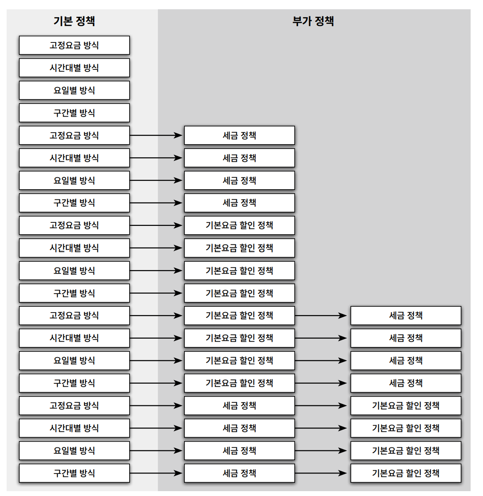

# Chapter14 일관성 있는 협력

생성일: 2023년 7월 15일 오후 6:20
태그: 14장
생성자: 조재현

**버전 정보**

- v1 → 일관성 없이 확장
- v2 → 일관성 있는 확장

---

---

# 1. 핸드폰 과금 시스템 변경하기

**11장 핸드폰 과금 시스템 요금정책 수정**

| 유형 | 형식 | 예 |
| --- | --- | --- |
| 고정요금 방식 | A초당 B원 | 10초당 18원 |
| 시간대별 방식 | A시부터 B시까지 C초당 D원
B시부터 C시까지 C초당 E원 | 00시부터 19시까지 10초당 18원
19시부터 24시까지 10초당 15원 |
| 요일별 방식 | 평일에는 A초당 B원
공휴일에는 A초당 C원 | 평일에는 10초당 38원
공휴일에는 10초당 19원 |
| 구간별 방식 | 초기 A분 동안 B초당 C원
A분 ~ D분까지 B초당 D원
D분 초과 시 B초당 E원 | 초기 1분동안 10초당 50원
초기 1분 이후 10초당 20원 |




**새롭운 기본 정책을 구현한 클래스들**

- 고정 요금 방식(FixedFeePolicy)
    - 일정 시간 동안 동일한 요금을 부과함
- 시간대별 방식(TimeofDayDiscountPolicy)
    - 0시부터 19시 까지는 10초당 18원
    - 19시부터 24시까지는 10초당 15원
- 요일병 방식(DayOfWeekDiscountPolicy)
- 구간별 방식(DurationDiscountPolicy)

### **고정 요금방식 구현**

```java
public class FixedFeePolicy extends BasicRatePolicy {

    private Money amount;
    private Duration seconds;

    public FixedFeePolicy(Money amount, Duration seconds) {
        this.amount = amount;
        this.seconds = seconds;
    }

    @Override
    protected Money calculateCallFee(Call call) {
        return amount.times(call.getDuration().getSeconds() / seconds.getSeconds());
    }
}
```

### **시간대별 요금 방식 구현**


**기간을 처리하는 전문가**

```java
public class DateTimeInterval {
    private LocalDateTime from;
    private LocalDateTime to;

    private DateTimeInterval(LocalDateTime from, LocalDateTime to) {
        this.from = from;
        this.to = to;
    }

    public static DateTimeInterval of(LocalDateTime from, LocalDateTime to) {
        return new DateTimeInterval(from, to);
    }

    public static DateTimeInterval toMidnight(LocalDateTime from) {
        return new DateTimeInterval(
                from,
                LocalDateTime.of(from.toLocalDate(), LocalTime.of(23, 59, 59, 999_999_999)));
    }

    public static DateTimeInterval fromMidnight(LocalDateTime to) {
        return new DateTimeInterval(
                LocalDateTime.of(to.toLocalDate(), LocalTime.of(0, 0)),
                to
        );
    }

    public static DateTimeInterval during(LocalDate date) {
        return new DateTimeInterval(
                LocalDateTime.of(date, LocalTime.of(0,0)),
                LocalDateTime.of(date, LocalTime.of(23, 59, 59, 999_999_999))
        );
    }

    public Duration duration() {
        return Duration.between(from, to);
    }

    public LocalDateTime getFrom() {
        return from;
    }

    public LocalDateTime getTo() {
        return to;
    }

    public List<DateTimeInterval> splitByDay() {
        if (days() > 0) {
            return splitByDay(days());
        }

        return Arrays.asList(this);
    }

    private long days() {
        return Duration.between(from.toLocalDate().atStartOfDay(), to.toLocalDate().atStartOfDay())
                .toDays();
    }
    private List<DateTimeInterval> splitByDay(long days) {
        List<DateTimeInterval> result = new ArrayList<>();
        addFirstDay(result);
        addMiddleDays(result, days);
        addLastDay(result);
        return result;
    }
    private void addFirstDay(List<DateTimeInterval> result) {
        result.add(DateTimeInterval.toMidnight(from));
    }
    private void addMiddleDays(List<DateTimeInterval> result, long days) {
        for(int loop=1; loop < days; loop++) {
            result.add(DateTimeInterval.during(from.toLocalDate().plusDays(loop)));
        }
    }

    private void addLastDay(List<DateTimeInterval> result) {
        result.add(DateTimeInterval.fromMidnight(to));
    }

}
```

**Call 객체 리팩터링**

```java
public class Call {
    private DateTimeInterval interval;

    public Call(LocalDateTime from, LocalDateTime to) {
        this.interval = DateTimeInterval.of(from, to);
    }
    public Duration getDuration() {
        return interval.duration();
    }
    public LocalDateTime getFrom() {
        return interval.getFrom();
    }
    public LocalDateTime getTo() {
        return interval.getTo();
    }
    public DateTimeInterval getInterval() {
        return interval;
    }
}
```

**시간대별 분할 작업 전문가**

```java
public class TimeOfDayDiscountPolicy extends BasicRatePolicy {

    private List<LocalTime> starts = new ArrayList<>();
    private List<LocalTime> ends = new ArrayList<>();
    private List<Duration> durations = new ArrayList<>();
    private List<Money> amounts = new ArrayList<>();

    @Override
    protected Money calculateCallFee(Call call) {
        Money result = Money.ZERO;

        for (DateTimeInterval interval : call.splitByDate()) {
            for (int loop = 0; loop < starts.size(); loop++) {
                result.plus(amounts.get(loop).times(
                        Duration.between(from(interval, starts.get(loop)), to(interval, ends.get(loop)))
                                .getSeconds() / durations.get(loop).getSeconds())
                );
            }
        }
        return result;
    }
    private LocalTime from(DateTimeInterval interval, LocalTime from) {
        return interval.getFrom().toLocalTime().isBefore(from) ?
                from :
                interval.getFrom().toLocalTime();
    }

    private LocalTime to(DateTimeInterval interval, LocalTime to) {
        return interval.getTo().toLocalTime().isAfter(to) ?
                to :
                interval.getTo().toLocalTime();
    }

}public class Call {
    private DateTimeInterval interval;

    public Call(LocalDateTime from, LocalDateTime to) {
        this.interval = DateTimeInterval.of(from, to);
    }
    public Duration getDuration() {
        return interval.duration();
    }
    public LocalDateTime getFrom() {
        return interval.getFrom();
    }
    public LocalDateTime getTo() {
        return interval.getTo();
    }
    public DateTimeInterval getInterval() {
        return interval;
    }

    public List<DateTimeInterval> splitByDate() {
        return interval.splitByDay();
    }

}
```

### 요일별 방식 구현하기

- 요일별로 요금 규칙을 다르게 설정가능
- 요일의 목록, 단위 시간, 단위 요금 세가지 요소

```java
public class DayOfWeekDiscountRule {
    private List<DayOfWeek> dayOfWeeks = new ArrayList<>();
    private Duration duration = Duration.ZERO;
    private Money amount = Money.ZERO;

    public DayOfWeekDiscountRule(List<DayOfWeek> dayOfWeeks, Duration duration, Money amount) {
        this.dayOfWeeks = dayOfWeeks;
        this.duration = duration;
        this.amount = amount;
    }

    public Money calculate(DateTimeInterval interval) {
        if (dayOfWeeks.contains(interval.getFrom().getDayOfWeek())) {
            return amount.times(interval.duration().getSeconds() / duration.getSeconds());
        }

        return Money.ZERO;
    }

}
```

```java
public class DayOfWeekDiscountPolicy extends BasicRatePolicy {

    private List<DayOfWeekDiscountRule> rules = new ArrayList<>();

    public DayOfWeekDiscountPolicy(List<DayOfWeekDiscountRule> rules) {
        this.rules = rules;
    }

    @Override
    protected Money calculateCallFee(Call call) {
        Money result = Money.ZERO;

        for (DateTimeInterval interval : call.getInterval().splitByDay()) {
            for (DayOfWeekDiscountRule rule : rules) {
                result.plus(rule.calculate(interval));
            }
        }
        return result;
    }
}
```

### 구간별 방식 구현하기

```java
public class DurationDiscountRule extends FixedFeePolicy {

    private Duration from;
    private Duration to;

    public DurationDiscountRule(Money amount, Duration seconds, Duration from, Duration to) {
        super(amount, seconds);
        this.from = from;
        this.to = to;
    }

    public Money calculate(Call call) {
        if (call.getDuration().compareTo(to) > 0) {
            return Money.ZERO;
        }

        if (call.getDuration().compareTo(from) < 0) {
            return Money.ZERO;
        }

        // 부모 클래스의 calculateFee(phone) 은 phone 클래스를 파라미터로 받는다.
        // calculateFee(phone)을 재사용 하기 위해
        //데이터를 전달할 용도로 임식 Phone을 만든다

        Phone phone = new Phone(null);
        phone.call(new Call(call.getFrom().plus(from),
                call.getDuration().compareTo(to) > 0 ? call.getFrom().plus(to) : call.getTo()));
        return super.calculateFee(phone);

    }

}
```

```java
public class DurationDiscountPolicy extends BasicRatePolicy {

    private List<DurationDiscountRule> rules = new ArrayList<>();

    public DurationDiscountPolicy(List<DurationDiscountRule> rules) {
        this.rules = rules;
    }

    @Override
    protected Money calculateCallFee(Call call) {
        Money result = Money.ZERO;
        for (DurationDiscountRule rule : rules) {
            result.plus(rule.calculate(call));
        }
        return result;
    }
}
```

- 지금까지 설계는 유사한 기능을 구현하는데 `일관성` 이 없음
- 비 일관성은 두가지 발목을 잡는다.
    - 새로운 구현을 추가하는 ㅅ아황
    - 기존의 구현을 이해해야 하는 상황
- 각 개발자가 `일관성` 을 유지 하지 않기 때문

---

# 2.설계에 일관성 부여하기

**일관성 있는 협력을 만들기 위한 기본 지침**

- 변하는 개념을 변하지 않는 개념으로부터 분리하라.
    - 할인 정책 ( 타입 계층 구현 )
        - 서브 타입 → 변하는 객체들 매번 새로운 `할인 정책`이 생김 ( 변함 )
    - 할인 조건 ( 타입 계층 구현 )
        - 서브 타입 → 변하는 객체들 매번 새로운 `할인 조건`이 생김 ( 변함 )
- 변하는 개념을 캡슐화 하라.
    - 훌륭한 추상화를 찾아 추상화에 의존하도록 하자.
    - 상속 대신 합성을 사용하여 캡슐화를 보장하는것도 훌륭한 방법
    - 리스코프 치환 원칙을 준수하는 타입 계층을 구현하는 데 상속을 이용

## 캡슐화 다시 살펴보기

- 많은 사람들이 캡슐화라 하면 `데이터 은닉(data hiding)` 을 떠올림
- 캡슐화는 데이터 은닉 이상이다
- GOF의 조언에 따르면 `캡슐화` 란 단순히 데이터를 감추는 것이 아님
- 소프트웨어 안에서 변할 수 있는 모든 `개념` 을 감추는 것
- `캡슐화란 변하는 어떤 것이든 감추는 것이다.`


- **데이터 캡슐화 `(개별 객체에 대한 변경 관리)`**
    - Movie 클래스의 인스턴스 변수 title 가시성은 private라서 외부에서 접근 불가
    - 이 속성에 접근할 수 있는 유일한 방법은 메서드를 이용하는 것뿐이다.
    - 내부에 관리하는 `데이터를 캡슐화` 함
- **메서드 캡슐화 `(개별객체에 대한 변경 관리)`**
    - DiscountPolicy 클래스에서 정의돼 있는 getDiscountAmount 메서드의 가시성은 protected
    - 클래스의 외부에서는 메서드에 직접 접근할 수 없고 클래스 내부와 서브클래스에서만 접근이 가능
    - 따라서 클래스 외부에 영향을 미치지 않고 메서드를 수정할 수 있다. 
    `(클래스의 내부 행동을 캡슐화)`
- **객체 캡슐화 `(협력에 참여하는 객체 관계에 대한 변경 관리)`**
    - Movie 클래스는 DiscountPolicy 타입의 가시성을 private 으로 두어 객체 사이의 관계를 캡슐화함
    - 객체 캡슐화 → 합성
- **서브타입 캡슐화 `(협력에 참여하는 객체 관계에 대한 변경 관리)`**
    - Movie는 DiscountPolicy에 대해서는 알고 있지만 서브타입에 대해서는 알지 못함
    - 서브타입의 종류를 캡슐화 하고 있음
    - 서브타입 캡슐화 → 다형성의 기반이됨

**서브타입 캡슐화와 객체 캡슐화를 적용하는 방법**

- 변하는 부분을 분리해서 타입 계층을 만듬
    - 변하지 않는 부분으로부터 변하는 부분을 부리
    - 변하는 부분들의 공통적인 행동을 추상 클래스나 인터페이스로 추상화함
    - 변하는 부분들이 추상클래스나 인터페이스를 상속 → 변하는 부분은 변하지 않는 부분의 서브타입이 됨
    - 정책들, 조건들 → xx정책, aa정책, aa조건, bb조건
- 변하지 않는 부분의 일부로 타입 계층을 합성함
    - 변하지 않는 부분은 변하는 부분의 구체적인 종류에 대해 알지 못하게 됨
    - Movie → DiscountPolicy를 합성 관계로 연결하고 생성자를 통해 의존성을 해결한 이유가 바로 그 이유
    - 변하는 부분의 타입계층을 변하지 않는 부분에 `합성` 함
    

---

# 3. 일관성 있는 기본 정책 구현하기

## 변경 분리하기

**변하는 부분과 변하지 않는 부분 알아보기**


- 기본 정책은 한 개 이상의 `규칙` 으로 구성된다
- 하나의 `규칙`은 `적용조건` 과 `단위요금` 의 조합이다.


- 변하지 않는 것 → 규칙 → 적용 조건과 단위요금으로 청구 요금을 계산
- 변하는 것 → 조건 → 적용 조건이 바뀜

 

## 변경 캡슐화 하기

- 협력을 일관성있게 만들기 위해 변경을 캡슐화 해서 파급효과를 줄여야함
- 가장 좋은 방법은 변하지 않는 부분을 분리하는 것
- 변하는 부분의 공통점을 추상화 하는 것
- 변하지 않는 부분이 오직 이 `추상화` 에만 의존 하도록 관계를 제한


---


# 정리

- 시스템이 일관성 있는 몇 개의 협력 패턴으로 구성된다면 시스템을 이해, 수정, 확장 하기 편해진다.
- 유사한 기능에 대해 유사한 협력 패턴을 적용하는 것은 `개념적 무결성` 이라고 한다.
- 지속적으로 개선하라
- 협력의 핵심은 변경을 분리하고 캡슐화 하는 것이다.
- 훌륭한 설계자가 되는 첫걸음은 변경의 방향을 파악할 수 있는 감각을 기르자.
-