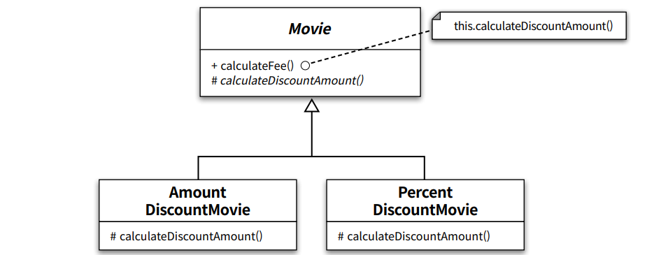

# Chapter15 디자인 패턴과 프레임워크

생성일: 2023년 7월 18일 오후 3:25
태그: 15장
생성자: 조재현

---

# 1. 디자인 패턴과 설계 재사용

- 패턴은 반복적으로 발생하는 문제와 해법의 쌍으로 정의된다.
- 패턴을 사용함으로써 이미 알려진 문제와 이에 대한 해법을 문서로 정리할 수 있으며, 이 지식을 다른 사람과 의사소통할 수 있다.
- 패턴은 추상적인 원칙과 실제 코드 작성 사이의 간극을 메워주며 실질적인 코드 작성을 돕는다.
- 패턴의 요점은 패턴이 `실무` 에서 탄생했다는 점이다.

## 패턴 분류

- 아키텍쳐 패턴
- 분석 패턴
- 디자인 패턴
- 이디엄

## 패턴과 책임-주도 설계

- 객체지향 설계에서 가장 중요한 일은 `올바른 책임` 을 객체에게 할당하고 객체간 유연한 협력 관계를 구축하는 일

## 캡슐화와 디자인 패턴

- 대부분 디자인 패턴은 협력을 일관성 있고 유연하게 만드는 것을 목적으로함
- 각 디자인 패턴은 특정한 변경을 캡슐화하기 위한 독자적인 방법을 정의하고있음

**TEMPLATE METHOD 패턴**

- 변하지 않는 부분 → MOVIE
- 변경하지 않는 부분은 부모, 변하는 부분은 자식으로 분리함으로 캡슐화
- 알고리즘을 캡슐화하기 위해 합성 관계가 아닌 상속관계를 이용하는 것을 TEMPLATE METHOD 패턴

## 패턴은 출발점이다.

- 패턴은 출발점이지 목적지가 아니다.
- 패턴이 현재 요구사항이나 적용 기술, 프레임워크에 적합하지 않다면 패턴을 그대로 따르지 말고 수정하라.
- 패턴을 사용하면서 부딪히게 되는 대부분의 문제는 패턴을 `맹목적` 으로 사용할 때 발생한다.

---

# 2. 프레임워크와 코드 재사용

## 코드 재사용 대 설계 재사용

- 재사용 관점에서 설계 재사용보다 더 좋은 방법은 코드 재사용
- 가장 이상적인 형태의 재사용은 설계 재사용과 코드 재사용을 적절한 수준으로 조합하는 것

## 상위 정책과 하위 정책으로 패키지 분리하기

- 프레임워크의 핵심은 추상 클래스나 인터페이스와 같은 추상화
- 추상클래스와 인터페이스는 일관성 있는 협력을 만드는 핵심 재료

