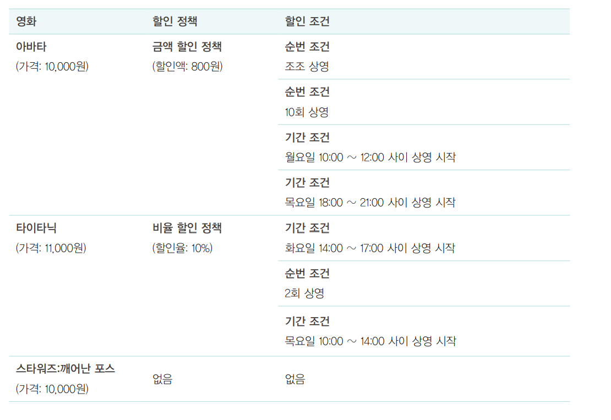
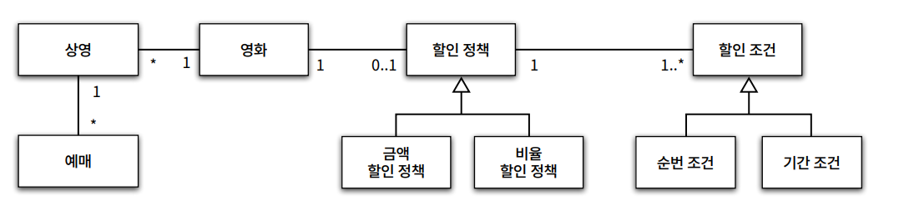
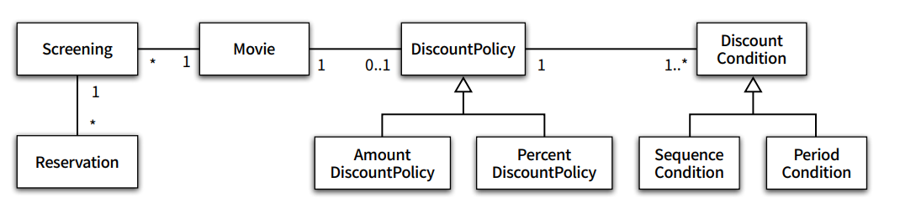

# Chapter2 객체지향 프로그래밍

---

# 영화 예매 시스템

온라인 영화 예매 시스템을 만들어 보자.

## 조건

영화와 상영용어를 구분

**영화**

- 영화에 대한 정보를 표현
- 제목
- 상영 시간
- 가격 정보

**상영**

- 상영 일자
- 시간
- 순번

**할인 조건(discount condition)**

- 순서 조건
    - 상영 순번을 이용해 할인 여부를 결정
        - 순서 조건 순번이 10인 경우 매일 10번째로 사영되는 영화를 예매한 사용자들 한테 할인
- 기간 조건
    - 영화 상영 시작 시간을 이용해 할인 여부 결정
        - 요일
        - 시작 시간
        - 종료 시간

**할인 정책**

- 금액 할인 정책
    - 예매 요금에서 일정 금앨을 할인
- 비율 할인 정책
    - 정가에서 일정 비율의 요금을 할인

**할인 예시**




# 객체지향 프로그래밍을 향해

## 협력 객체 클래스

> 객체 지향에 익숙하다면 대부분 어떤 `클래스(class)` 가 필요한지 고민한다.
이것은 객체지향의 본질과 멀다. 진정한 객체지향은 아래 두가지에 집중해야 한다.
>

- 어떤 클래스가 필요한지 고민하기 전에 어떤 `객체` 들이 필요한지 고민
    - 클래스는 공통적인 상태와 행동을 공유하는 객체들을 추상화한것
    - 윤곽을 잡기 위해서는 어떤 `객체` 들이 어떤 상태와 행동을 가지는지를 먼저 결정
    - 객체 중심 접근 방법은 설계를 단순 깔끔하게 함
- 객체를 독립적인 존재가 아니라 기능을 구현하기 위해 협력하는 공동체의 일원으로 보자
    - 객체는 홀로 존재하는것이 아님
    - 다른 객체에게 도움을 주거나 의존하면서 살아가는 존재
    - 객체를 협력하는 공동체의 일원으로 바라보면 설계를 유연하고 확장가능하게 만듬
    - 객체지향적으로 생각한다면 객체를 고립된 존재가 아닌 협력자로 보자






# 자율적인 객체

> 알아야 할 두가지 중요한 `사실`
>
1. 객체가 상태(state)와 행동(behavior)을 함께 가지는 복합적인 존재
2. 객체가 스스로 판단하고 행동하는 `자율적인 존재`

**객체지향의 특징**

- 객체 지향은 객체라는 단위 안에 데이터와 기능을 한 덩어리로 묶고 문제 영역의 아이디어를 적절하게 표현함 이처럼 데이터 및 기능을 객체 내부로 함께 묶는 것을 `캡슐화` 라고 함
- 대부분 객체지향은 외부에서의 접근을 통제하는 `접근 제어` 매커니즘도 제공함
- 접근 제어를 위해 public, protected, private과 같은 `접근 수정자` 를 제공함

**캡슐화와 접근 제어의 특징**

- 외부에서 접근 가능한 부분은 `퍼블릭 인터페이스(public interface)` 라고 부름
- 외부에서 접근 불가능하고 오직 내부에서만 접근 가능한 부분으로 이를 `구현(implementation)` 라고 부름


# 객체의 협력

객체의 내부 상태는 외부에서 접근하지 못해야 한다.

대신 외부에 공개하는 퍼블릭 인터페이스를 통해 내부 상태에 접근할 수 있도록 허용한다.

- 객체는 다른 객체의 인터페이스에 공개된 행동을 수행하도록 `요청(request)` 할 수 있따.
- 요청을 받은 객체는 자율적인 방법에 따라 요청을 처리한 후  `응답(response)` 한다.

- 객체가 상호 작용하는 방법은 `메시지를 전송(send a message)` 하는 것뿐
- 다른 객체에게 요청이 도착할 때 해당 객체가 `메시지를 수신(receive amessage)` 했다고 이야기 한다.
- 객체 스스로 수신된 메시지를 처리하는 자신만의 방법을 `메서드(method)` 라고한다.


# 할인 정책과 할인 조건

할인 정책은 금액 할인 정책과 비율 할인 정책으로 구분됨

두가지 할인 정책은 코드가 유사하고 할인요금을 계산하는 방식만 다름

두 클래스 사이의 중복코드를 제거하기 위해 공통 코드를 보관할 장소인 DiscountPolicy 추상 클래스를 생성

아래 코드에서 부모 클래스에서 기본적으로 알고리즘의 흐름을 구현하고

중간에 상속받은 자식 클래스에서 결과를 처리 하는 방식을

디자인 패턴 `TEMPLATE METHOD` 패턴 이라고 부른다.

```java
import java.util.ArrayList;
import java.util.Arrays;
import java.util.List;

public abstract class DiscountPolicy {
    private List<DiscountCondition> conditions = new ArrayList<>()

    public DiscountPolicy(DiscountCondition ... conditions) {
        this.conditions = Arrays.asList(conditions);
    }

    public Money calculateDiscountAmount(Screening screening) {
        for (DiscountCondition each : conditions) {
            if (each.isSatisfiedBy(screening)) {
                return getDiscountAmount(screening);
            }
        }
        return Money.ZERO;
    }

    abstract protected Money getDiscountAmount(Screening screening);
}
```


# 상속

상속은 객체지향에서 코드를 재사용 하기 위해 널리 사용되는 기법이다.

하지만 두 가지 관점에서 안 좋은 영향이 있다.

1. 캡슐화를 위반한다.
    1. 상속을 이용하기 위해서는 부모 클래스의 내부구조를 알아야 한다.
    2. 부모 클래스가 자식 클래스에세 노출됨으로 캡슐화가 약해진다.
    3. 캡슐화가 약해지면서 자식클래스가 부모 클래스에 강하게 결합된다.
    4. 부모 클래스를 변경 할 때 자식 클래스도 함께 변경될 확률이 높다.
2. 설계가 유연해 지지 않는다.
    1. 상속은 부모 클래스와 자식 클래스 사이의 관계를 컴파일 시점에 결정한다.
    2. 따라서 실행 시점에 객체의 종류를 변경하는게 불가능 해짐


# 합성

합성이란 인터페이스에 정의된 메시지를 통해서만 코드를 재사용 하는 방법

- 합성은 상속이 가지는 문제를 해결함
- 인터페이스의 정이된 메시지로만 재사용 하기 때문에 구현을 효과적으로 `캡슐화` 할 수 있음
- 의존하는 인스턴스를 교체하는 것도 쉽기 때문에 설계를 유연하게 만듬


# 상속과 합성

상속을 쓰지 말라는 것이 아닌 상황에 맞춰서 쓰자

- 코드를 재사용 하는 경우에는 상속보다 합성을 쓰는게 맞다
    - 메시지를 전달함으로써 메시지만 전하고 해당 메시지 전달 메소드를 재사용 하는 경우
- 다형성을 위해 인터페이스를 재사용 하는 것은 상속과 합성을 함께 조합해서 사용하자


`무조건 유연한 설계도, 무조건 읽기 쉬운 코드도 정답이 아니다. 이것이 객체지향 설 계가 어려우면서도 매력적인 이유다.`