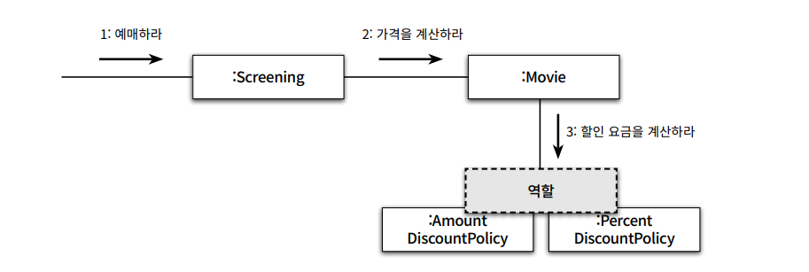

# Chapter3 역할, 책임, 협력

# 협력

- 객체들이 애플리케이션의 기능을 구현하기 위해 수행하는 상호작용을 `협력` 이라함
- 객체가 협력에 참여하기 위해 수행하는 로직은 `책임`
- 객체들이 협력 안에서 수행하는 책임들이 모여 객체가 수행하는 `역할`을 구성함

---

# 책임

- 협력에 참여하기 위해 객체가 수행하는 행동을 `책임` 이라함
- 책임이란 객체의 의해 정의되는 응집도 있는 행위의 집합 객체가 유지해야 하는 `정보`와 `수행` 할 수 있는 행동에 대해 개략적으로 서술한 문장
- 객체의 책임은 객체가 `무엇을 알고 있는가` 와 `무엇을 할 수 있는가` 로 구분됨
- 객체의 책임은 크게 `하는것` `아는것` 의 두가지로 세분화됨

## 하는 것

- 객체를 생성하거나 계산을 수행하는 수행하는 등의 스스로 하는 것
- 다른 객체의 행동을 시작시키는 것
- 다른 객체의 활동을 제어하고 조절하는 것

## 아는 것

- 사적인 정보에 관해 아는 것
- 관련된 객체의 관해 아는 것
- 자신의 유도하거나 계산할 수 있는 것에 관해 아는 것

> 중요* 책임을 능숙하게 소프트웨어 객체에 할당하는 것
>

## 책임 할당

자율적인 객체를 만드는 가장 기본적인 방법

- 수행하는데 필요한 정보를 잘 알고 있는 전문가에게 그 책임을 할당
- 이를 책임 할당을 위한 `INFORMATION EXPERT(정보 전달)` 패턴 이라고 부른다.

## 책임 주도 설계

`책임 주도 설계 (Responsibility-Driven Design, RDD)`

- 시스템이 사용자에게 제공해야 하는 기능인 시스템 책임을 파악한다.
- 시스템 책임을 더 작은 책임으로 분할한다.
- 분할된 책임을 수행할 수 있는 적절한 객체 또는 역할을 찾아 책임을 할당한다.
- 객체가 책임을 수행하는 도중 다른 객체의 도움이 필요한 경우 이를 책임질 적절한 객체 또는 역할을 찾는다.
- 해당 객체 또는 역할에게 책임을 할당함으로써 두 객체가 `협력` 하게 한다.

## 메시지가 객체를 결정한다.

객체에게 책임을 할당 하는데 필요한 메시지를 먼저 식별 하고 메시지를 처리할 객체를 나중에 선택 했다는 것이 중요

객체가 메시지를 선택하는 것이 아닌 `메시지가 객체를 선택` 하게 해야함

1. 객체가 `최소한의 인터페이스(minimal interface)` 를 가질 수 있게 된다.
    1. 필요한 메시지가 식별될 때까지 객체의 퍼블릭 인터페이스에 어떤것도 추가 안함
    2. a로 인하여 객체는 애플리케이션에 크지도, 작지도 않은 꼭 필요한 크기의 퍼블릭 인터페이스를 가질 수 있음
2. 객체는 충분히 `추상적인 인터페이스(abstract interface)` 를 가질 수 있게 된다.
    1. 객체의 인터페이스는 무엇을 하는지 표현해야 하지만 어떻게 수행해야 하는지를 노출해서는 안됨
    2. 메시지는 외부의 객체가 요청하는 무언가를 의미하기 때문에 미시지를 먼저 식별하면 무엇을 수행할지 초점을 맞추는 인터페이스를 얻을 수 있음.

## 행동이 상태를 결정한다.

**많이 하는 실수**

- 객체의 행동이 아닌 상태에 초점을 맞추는것
- 위의 방식은 객체의 내부 구현이 객체의 퍼블릭 인터페이스에 노출되도록 만들기 때문에
  `캡슐화`를 저해함
- 객체의 내부 구현을 변경하면 퍼블릭 인터페이스도 함께 변경되고 결국 객체의 의존하는 클라이언트 까지 영향이감
- 이를 `데이터-주도 설계(Data-Driven Design)` 라고 부르기로함.

---

# 역할

## 역할과 협력

객체가 특정한 협력 안에서 수행하는 `책임`의 집합을 `역할`이라고 부르며,

실제로 협력을 모델링할 때는 특정한 객체가 아니라 역할에게 `책임`을 할당한다고 생각하자.

## 유연하고 재사용 가능한 협력

Movie 가 역할에 집중하지 않고 객체에 집중할 경우

AmountDiscountPolicy 와 PercentDiscountPolicy 모두 요금 계싼이라는 동일한 책임을 수행한다.

그렇다면 Move 는 두 객체가 참여하는 협력을 개별적으로 만들여야 할까?

여기에 역할을 추가하면 `추상화` 가 가능해진다.

## 객체 대 역할

- 협력에 참여하는 후보가 여러 종류의 객체에 의해 수행될 필요가 있다면 그 후보는 역할이 된다.
- 하지만 단 한종류의 객체만이 협력에 참여할 필요가 있다면 후보는 객체가 된다

## 배우와 배역

배우와 배역에 초점을 맞춰 생각해보자.

연극에 참여하는 순간 배우들은 사라지고 배역만 남는다.

그러나 무대의 막이 내리면 배역은 사라지고 배우로 돌아온다

**연극의 배역과 배우 간의 관계에 대한 특성**

- 배역은 연극 배우가 특정 연극에서 연기하는 역할이다.
- 배역은 연극이 상영되는 동안에만 존재하는 일시적인 개념이다.
- 연극이 끝나면 연극 배우는 배역이라는 역할을 벗어 버리고 원래의 연극 배우로 돌아온다.

배우들은 하나 이상의 연극에 참여한다. 여러 배역을 가질 수 있다.

**추가특성**

- 서로 다른 배우들이 동일한 배역을 가질 수 있다.
- 하나의 배우가 다양한 연극 안에서 서로 다른 배역을 연기할 수 있다.