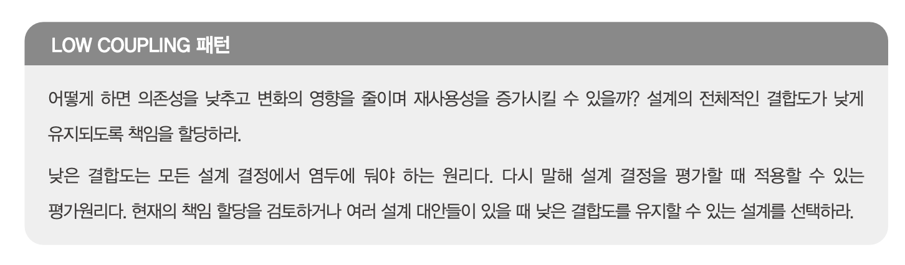

# Chapter5 책임 할당하기

# 책임 주도 설계를 향해

**데이터 중심 설계에서 책임 중심의 설계로 전환하기 위해 필요한 원칙**

- 데이터보다 행동을 먼저 결정하라
- 협력이라는 문맥 안에서 책임을 결정하라

## 데이터 보다 행동을 먼저 결정하라

객체를 설계 하기 위한 순서

1. 이 객체가 수행해야 하는 책임은 무엇인가
2. 이 책임을 수행하는데 필요한 데이터는 무엇인가?

## 협력이라는 문맥 안에서 책임을 결정하라

- 객체에게 할당된 책임이 협력에 어울리지 않는다면 그 책임은 나쁜거다.
- 객체 입장에서 조금 어색해 보여도 협력에 적합 하면 그 책임은 좋은 거다
- 책임은 객체 입장이아닌 객체가 참여하는 협력에 적합해야 한다.

> 메시지를 결정한 후에 객체를 결정하자
“메시지를 전송해야 하는데 누 구에게 전송해야 하지?”라고 질문하는 것. 설계의 핵심 질문을 이렇게 바꾸는 것이 메시지 기반 설계로 향하는 첫걸음이다.
>

## 책임 주도 설계

3장의 내용 복습

- 시스템이 사용자에게 제공해야 하는 기능인 시스템 책임을 파악한다.
- 시스템 책임을 더 작은 책임으로 분할한다.
- 분할된 책임을 수행할 수 있는 적절한 객체 또는 역할을 찾아 책임을 할당한다.
- 객체가 책임을 수행하는 도중 다른 객체의 도움이 필요한 경우 이를 책임질 적절한 객체 또는 역할을 찾는다.
- 해당 객체 또는 역할에게 책임을 할당함으로써 두 객체가 협력하게 된다.

# 책임 할당을 위한 GRASP 패턴

> General Responsibility Assignment Software Pattern(일반적인 책임 할당을 위한 소프트웨어 패턴)
>

> 중요한 것은 설계를 시작하는 것이지 도메인 개념들을 완벽하게 정 리하는 것이 아니다. 도메인 개념을 정리하는 데 너무 많은 시간을 들이지 말고 빠르게 설계와 구현을 진행하라.
>

> INFORMATION EXPERT 패턴은 객체가 자신이 소유하고 있는 정보와 관련된 작업을 수행한다는 일반적인 직관을 표현한 것이다. 여기서 이야기하는 정보는 데이터와 다르다는 사실에 주의하라. 책임 을 수행하는 객체가 정보를 ‘알고’ 있다고 해서 그 정보를 ‘저장’하고 있을 필요는 없다. 객체는 해당 정 보를 제공할 수 있는 다른 객체를 알고 있거나 필요한 정보를 계산해서 제공할 수도 있다. 어떤 방식이 건 정보 전문가가 데이터를 반드시 저장하고 있을 필요는 없다는 사실을 이해하는 것이 중요하다.
>

## 높은 응집도와 낮은 결합도

2장에 있던 설계에서 변경해보자

1. Screening 에서 DiscountCondition 에게 할인 여부를 물어본다
2. Screening 에서 할인 여부를 Movie 에 전달하면서 요금을 계산하라 라고 메시지를 준다.
3. Movie는 `계산` 만 하도록 한다.

위 처럼 설계하게되면 Screening 에서도 DiscountCondition 에 결합도가 추가된다.

(DiscountCondition 이 변경되면 Screening, Movie 둘다 변경을 해야할 수도 있음)

## 창조자에게 객체 생성 책임을 할당하라

영화 예매의 최종 목표는 Reservation 인스턴스를 생성하는거다

협력에 참여하는 어떤 객체는 생성을 하는 `책임` 을 가져야 한다.

`GRASP의 CREATOR(창조자)` 패턴 위같은 상황에서 활용 할 수 있다.

# 구현을 통한 검증

깃 커밋 여기에 넣기

## DiscountCondition 개선하기

위 깃의 커밋로그를 보면 개선해야할게 있다.

- 새로운 할인 조건 추가
    - isSatisfiedBy 메서드 안의 if ~ else 구문을 수정해야 한다.
- 순번 조건을 판단하는 로직 변경
    - isSatisfiedBySequence 메서드의 내부 구현을 수정해야 한다.
- 기간 조건을 판단하는 로직이 변경되는 경우
    - isSatisfiedByPeriod 메서드의 내부 구현을 수정해야 한다.

**코드 변경 기준**

- 함께 초기화되는 속성을 기준으로 코드를 분리해야 한다. ( 생성자 초기화 )
- 메서드들이 인스턴스 변수를 사용하는 방식으로 분리
    - 모든 메서드가 객체의 모든 속성을 사용한다면 응집도가 높은것
- 속성 그룹과 해당 그룹에 접근하는 메서드 그룹을 기준으로 코드를 분리해야 한다.

## Movie 클래스 개선하기

현재 Movie 의 문제점

아래 두개의 정책을 클래스 안에서 구현하고 있다.

- 금액 할인 정책
- 비율 할인 정책

위 2개를 클래스 안에서 구현함으로 써 응집도가 낮아지고 있다.

`다형성` 을 이용하여 구현 해보자.

## 변경과 유연성

설계를 주도하는 것은 변경이다.

개발자로서 변경에 대비할 수 있는 두 가지 방법이 있다.

1. 코드를 이해하고 수정하기 쉽도록 최대한 단순하게 하기
2. 코드를 수정하지 않고도 변경을 수용할 수 있도록 코드를 더 유연하게 만들기

대부분의 경우 `1` 번이 좋다.

현재 무비는 할인 정책을 구현하기 위해 `상속` 을 사용 하고 있다.

그래서 실행 중에 영화의 할인 정책을 변경하기 위해서는 새로운 인스턴스를 생성한 후 필요한 정보를 복사해야 한다.

- 새로운 정책이 추가 될 때 마다 인스턴스를 생성해야 한다.
- 상태를 복사해야 한다.
- 식별자를 관리하는 코드를 추가해야하고, 오류가 발생하기 쉬워진다.

해결방법은 상속 대신 `합성` 을 이용하는 거다.

아래와 같이 금액 정책에도 인터페이스를 두고 합성을 이용하면 유연한 설계가 가능해진다.

(2장의 설계가 아래의 구조다)

# 책임 주도 설계의 대안

숙련된 설계자도 책임과 객체를 선택하는 일에 어려움을 느낀다.

이를 위해 아래 방법대로 진행해보는것을 추천

1. 최대한 빠르게 목적한 기능을 수행하는 코드를 작성 한다.
    1. 아무것도 없는 상태에서 책임과 협력에 관해 고민하기 보다는 일단 실행되는 코드를 만들자.
2. 코드 상에서 책임을 파악하고 책임들을 올바른 위치로 이동시키자.
3. 코드를 수정한 후에 겉으로 드러나는 동작이 바뀌어서는 안된다.
4. 캡슐화를 향상 시키고 응집도를 높이고 결합도를 낮추면서 동작은 유지되어야 한다.
5. 동작은 바꾸지 않고 내부 구조를 변경하는 것을 `리팩터링` 이라고 부른다.