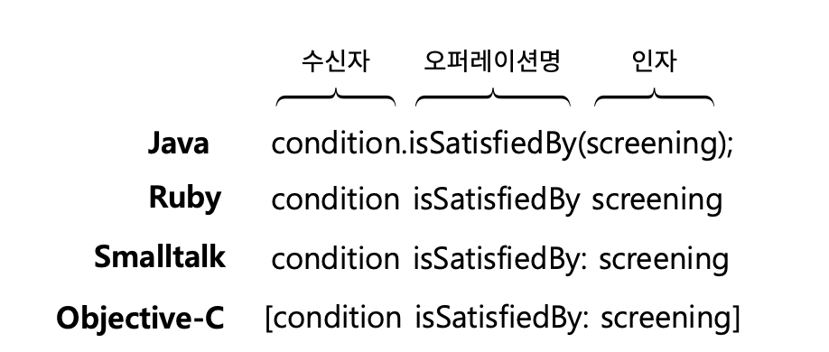

# Chapter6 메시지와 인터페이스


객체지향 프로그래밍에 대한 가장 흔한 오해

- 애플리케이션이 클래스의 집합으로 구성된다는것
- 대부분의 입문자들은 분석, 설계, 구현을 전체 개발활동 중심에 클래스를 놓는다.
- 클래스는 도구다
- 클래스라는 구현 도구에 지나치게 집착하면 경직되고 유연하지 못한 설계에 이를 확률이 높다.


# 1. 협력과 메시지

## 클라이언트-서버 모델

- 두 객체가 협력 할 때 메시지를 보내는 객체를 클라이언트, 메시지를 수신하는 객체를 서버라고 부른다.
- 객체는 협력에 참여하는 동안 클라이언트와 서버의 역할을 동시에 수행하는 것이 일반적이다.
- 협력의 관점에서 객체는 두 가지 종류의 메시지 집합으로 구성된다
    - 객체가 수신하는 메시지 집합
    - 외부의 객체에게 전송하는 메시지의 집합
- 대부분 객체가 수신하는 메시지의 집합에만 초점을 맞추지만 협력에 적합하게 설계하려면 외부에 전송하는 메시지의 집합도 함께 고려해야 한다.

### 메시지와 메시지 전송

**용어 정리**

- 메시지(message)
    - 객체들이 협력하기 위해 사용할 수 있는 유일한 의사소통 수단
- 메시지 전송(message sending), 메시지 패싱(message passing)
    - 한 객체가 다른 객체에게 도움을 요청하는 것을 의미함
- 메시지 전송자(message sender)
    - 메시지를 전송하는 객체
- 메시지 수신자(message receiver)
    - 메시지를 수신하는 객체

**메시지 구성**

- 오퍼레이션명(operation name)
- 인자(argument)
- 메시지 전송 → 위의 구성에 메시지 수신자를 추가함



### 메시지와 메서드

`condition.isSatisfiedBy(screening)`

여기서 condition 은 Discountcondition 이라는 인터페이스로 정의 되어 있지만

실제로 실행되는 코드는 인터페이스를 실체화한 클래스의 종류에 따라 달라진다.

메시지를 수신했을 때 실제로 실행되는 함수 또는 프로시저를 `메서드` 라고 부른다.

- 메시지 전송을 코드상에 표기 할 때는 어떤 코드가 실행될 것인지 `정확하게` 알 수 없다.
- 우리는 그저 메시지에 응답할 수 있는 객체가 존재한다 라고만 믿어야 한다.
- 메시지와 메서드의 구분은 메시지 전송자와 메시지 수신자가 느슨하게 결합될 수 있게 한다.
- 메시지 전송자는 자신이 어떤 메시지를 전송해야 하는지만 알면된다.
- 메시지 전송자는 수신자가 어떤 클래스의 인스턴스인지 어떤 방식으로 처리하는지 알 필요가 없다.

> 메시지 전송자가 어떤 객체가 수신하고 어떻게 처리하는지 알게되면
유연한 설계가 불가능해질거 같다.
>

### 퍼블릭 인터페이스와 오퍼레이션

객체는 안과 밖을 구분하는 뚜렷한 경계를 가진다

외부에서 볼 때 객체의 안은 검은 장막(캡슐화) 가려진 미지의 영역이다.

오직 객체가 공개하는 메시지를 통해서만 상호 작용 해야하며 이러한 메시지의 집합을

`퍼블릭 인터페이스` 라고 부른다.

프로그래밍 언어의 관점에서 퍼블릭 인터페이스에 포함된 메시지를 `오퍼레이션(operation)` 이라고 부른다.

오퍼레이션은 수행 가능한 어떤 행동에 대한 `추상화` 이다

**오퍼레이션**

- DiscoundCondition(interface) 에 있는 isSatisfiedBy

**메서드**

- SequenceCondition, PeriodCondition 에 정의된 isSatisfiedBy

### 시그니처

오퍼레이션(또는 메서드)의 이름과 파라미터 목록을 합쳐 시그니처(signature)라고 부른다.

오퍼레이션은 실행 코드 없이 시그니처만을 정의한 것

메서드는 이 시그니처에 구현을 더한 것

---

# 2. 인터페이스와 설게 품질

**좋은 인터페이스**

- 최소한의 인터페이스와 추상적인 인터페이스라는 조건을 만족해야함
- 최소한의 인터페이스는 꼭 필요한 오퍼레이션만을 인터페이스에 포함 시킨다.
- 추상적인 인터페이스는 어떻게 수행하는지가 아니라 무엇을 하는지를 표현한다.
- 최소주의를 따르면서도 추상적인 인터페이스를 설계할 수 있는 가장 좋은 방법은 `책임 주도 설계 방법` 을 따르는 것이다.

**퍼블릭 인터페이스의 품질에 영향을 미치는 원칙 및 기법**

- 디미터 법칙
- 묻지 말고 시켜라
- 의도를 드러내는 인터페이스
- 명령-쿼리 분리

## 디미터 법칙

4장에서 절차적인 방식의 영화 예매 코드중에서 할인 기능 여부를 체크하는 코드다

```java
public class ReservationAgency {
    public Reservation reserve(Screening screening, Customer customer, int audienceCount) {
        Movie movie = screening.getMovie();

        boolean discountable = false;

        for (DiscountCondition condition : movie.getDiscountConditions()) {
            if (condition.getType() == DiscountConditionType.PERIOD) {
                discountable = screening.getWhenScreened().getDayOfWeek().equals(condition.getDayOfWeek()) &&
                        condition.getStartTime().compareTo(screening.getWhenScreened().toLocalTime()) <= 0 &&
                        condition.getEndTime().compareTo(screening.getWhenScreened().toLocalTime()) >= 0;
            } else {
                discountable = condition.getSequence() == screening.getSequence();
            }

            if (discountable) {
                break;
            }
        }

        Money fee;
        if (discountable) {
            Money discountAmount = Money.ZERO;
            switch(movie.getMovieType()) {
                case AMOUNT_DISCOUNT:
                    discountAmount = movie.getDiscountAmount();
                    break;
                case PERCENT_DISCOUNT:
                    discountAmount = movie.getFee().times(movie.getDiscountPercent());
                    break;
                case NONE_DISCOUNT:
                    discountAmount = Money.ZERO;
                    break;
            }
            fee = movie.getFee().minus(discountAmount);
        } else {
            fee = movie.getFee();
        }
        return new Reservation(customer, screening, fee, audienceCount);

    }
}
```

**문제점**

- ReservationAgency 와 인자로 전달된 Screening 사이의 결합도가 너무 높다
- Screening의 내부 구현을 변경할 때마다 참조하는 객체도 함께 변경해야한다.

> 이처럼 협력하는 객체의 내부 구조에 대한 결합으로 인해 발생하는 설계 문제를 해결하기 위해 제안된 원칙이 바로 `디미터 법칙(Law of Demeter)` 이다
>

**디미터 법칙**

- 객체의 내부 구조에 강하게 결합되지 않도록 협력 경로를 제한하라
- 모든 클래스 C와 C에 구현된 모든 메서드 M에 대해서, M이 메시지를 전송할 수 있는 모든 객체는 다음에 서술된 클래스의 인스턴스여야 한다.
    - M에 의해 생성된 객체
    - M이 호출하는 메서드에 의해 생성된 객체
    - 전역 변수로 선언된 객체
    - 모두 M의 인자로 간주한다.

클래스 내부의 메서드가 아래 조건을 만족하는 인스턴스에만 메시지를 전송하도록 프로그래밍 해야한다

- this 객체
- 메서드의 매개변수
- this의 속성
- this의 속성인 컬렉션의 요소
- 메서드 내에서 생성된 지역 객체

변경된 코드

```java
public class ReservationAgency {
    public Reservation reserve(Screening screening, Customer customer, int audienceCount) {
        Money fee = screening.calculateFee(audienceCount);
        return new Reservation(customer, screening, fee, audienceCount);
    }
}
```

- 메서드의 인자로 전달된 Screening 인스턴스에게만 메시지를 전송함
- Screening 내부에 대한 어떤 정보도 알지 못함
- ReservationAgency 가 Screening의 내부 구조에 결합돼 있지 않아서 Screening의 내부를 변경해도 상위 객체를 변경할 필요가 없음

> 디미터 법칙은 캡슐화를 다른 관점에서 표현한 것이다. 디미터 법칙이 가치 있는 이유는 클래스를 캡슐화하기 위해 따라야 하는 구체적인 지침을 제공하기 때문이다. 캡슐화 원칙이 클래스 내부의 구현을 감춰야 한다는 사실을 강조한다면 디미터 법칙은 협력하는 클래스의 캡슐화를 지키기 위해 접근해야 하는 요소를 제한한다. 디미터 법칙은 협력과 구현이라는 사뭇 달라 보이는 두 가지 문맥을 하나의 유기적인 개념으로 통합한다. 클래스의 내부 구현을 채워가는 동시에 현재 협력하고 있는 클래스에 관해서도 고민하도록 주의를 환기시키기 때문이다.
>

디미터 법칙을 위반하는 전형적인 코드

`screening.getMovie().getDiscountconditions();`

**객체의 내부 구조를 묻는 메시지가 아니라 수신자에게 무언가를 시키는 메시지가 더 좋다.**

## 묻지 말고 시켜라

ReservationAgency 에서 Screening 내부의 Movie 접근하는 대신 Screening에게 직접 요금을 계산하라 요청했다.

디미터 법칙은 훌륭한 메시지는 객체의 상태에 관해 묻지 말고 원하는 것을 `시켜야` 한다는 사실을 강조한다.

`묻지 말고 시켜라(Tell, Don't Ask)` 는 이런 스타일의 메시지 작성을 장려하는 원칙을 가리키는 용어다.

메시지 전송자는 메시지 수신자의 상태를 기반으로 결정을 내린 후 메시지 수신자의 상태를 바꿔서는 안된다

객체의 외부에서 해당 객체의 상태를 기반으로 결정을 내리는 것은 객체의 캡슐화를 위반한다.

**묻지 말고 시켜라 원칙을 따르면?**

- 연관된 정보와 행동을 함께 가지는 객체를 만들 수 있음
- 객체지향의 기본을 따를 수 있음 → 함께 변경될 확률이 높은 정보와 행동을 하나의 단위로 통합
- 객체의 정보를 이용하는 행동을 객체의 외부가 아닌 내부에 위치하기 때문에 자연스럽게 정보와 행동을 동일한 클래스 안에 둘 수 있음
- 자연스럽게 정보 전문가에게 책임을 할당하게 되고 높은 응집도를 가진 클래스를 얻을 확률이 높아짐

## 의도를 드러내는 인터페이스

켄트 벡이 설명한 메서드를 명명하는 두가지 방법

### 메서드가 작업을 어떻게 수행하는지를 나타내도록 이름을 지어라

메서드의 이름은 내부 구현 방법을 드러낸다.

```java
public class PeriodCondition {

	public boolean isSatisfiedByPeriod(Screening screening) { ... }

}
public class SequenceCondition {

	public boolean isSatisfiedBySequence(Screening screening) { ... }

}
```

이런 스타일이 좋지 ㅇ낳은 이유

- 메서드에 대해 제대로 커뮤니케이션 하지 못함
    - 클라이언트 관점에서 isSatisfiedByPeriod 와 isSatisfiedBySequence 모두 할인 조건을 판단하는 동일한 작업을 수행함
    - 동일한 작업이지만 메서드의 이름이 다르기 때문에 두 메서드의 내부 구현을 정확하게 이해하지 못하면 두 메서드가 동일한 작업을 수행한다는 사실을 알아채기 힘듬
- 메서드 수준에서 캡슐화를 위반함
    - 이 메서드들은 클라이언트로 하여금 협력하는 객체의 종류를 알도록 강요함

### 메서드의 이름을 짓는 두 번째 방법은 어떻게가 아니라 무엇을 하는지 드러내라

무엇을 하는지를 드러내도록 만들자 객체가 협력 안에서 수행해야 하는 `책임` 에 관해 고민해서 메소드를 만들자.

```java
public class PeriodCondition {

	public boolean isSatisfiedBy(Screening screening) { ... }

}
public class SequenceCondition {

	public boolean isSatisfiedBy(Screening screening) { ... }

}
```

- 변경된 코드는 둘다 동일한 목적을 가지는 것을 메서드의 이름을 통해 명확하게 표현한다.
- 클라이언트 입장에서 두 메서드는 동일한 메시지를 서로 다른 방법으로 처리하기 때문에 대체 가능

**요약**

- 메서드가 어떻게 수행하느냐가 아닌 무엇을 하느냐에 초점을 맞추자
- 이처럼 어떻게 하느냐가 아니라 무엇을 하느냐에 따라 메서드의 이름을 짓는 패턴을
  `의도를 드러내는 선택자(Intention Revealing Selector)` 라고 부른다.

> 하나의 구현을 가진 메시지의 이름을 일반화하도록 도와주는 간단한 훈련 방법을 소개하겠다. 매우 다른 두 번 째 구현을 상상하라. 그러고는 해당 메서드에 동일한 이름을 붙인다고 상상해보라. 그렇게 하면 아마도 그 순 간에 여러분이 할 수 있는 한 가장 추상적인 이름을 메서드에 붙일 것이다[Beck96].
>

### 인터페이스에 의도를 드러내자

- 인터페이스의 오퍼레이션의 이름은 협력이라는 문맥을 반영해야한다.
- 오퍼레이션은 클라이언트가 객체에게 무엇을 원하는지를 표현해야 한다.
- 객체 자신이 아닌 클라이언트의 의도를 표현하는 이름을 가져야 한다.
- 디미터 법칙은 객체 간의 협력을 설게할 때 캡슐화를 위반하는 메시지가 인터페이스에 포함되지 않도록 제한한다.

---

# 3. 원칙의 함정

디미터 법칙과 묻지 말고 시켜라 스타일은 객체의 퍼블릭 인터페이스를 깔끔하게 만들지만

`절대적인` 것은 아니다. 소프트웨어 설계에 법칙이란 존재 하지 않는다.

`잊지 말자 설계는 트레이드 오프의 산물이다.`

원칙이 현재 상황에 부적합 하면 `과감하게 원칙을 무시하자`

## 디미터 법칙은 하나의 도트(.)를 강제하는 규칙이 아니다.

`IntStream.of(1, 15, 20, 3, 9).filter(x -> x > 10 ).distinct().count();`

- of, filter, distinct 메서드는 모두 IntStream 이라는 동일한 클래스 인스턴스를 반환한다.
- 이 코드는 디미터 법칙을 위반하지 않는다.
- 주의 도트가 있다고 원칙을 위반한건 아니다.

**중요**

- 물으려는 객체가 정말로 데이터인 경우도 있다.
- 디미터 법칙의 위반 여부는 묻는 대상이 객체인지, 자료 구조인지에 달려있다.
    - 객체는 내부 구조를 숨겨야 하므로 디미터 법칙을 따라야 한다.
    - 자료구조 라면 당연히 내부를 노출해야 하므로 디미터 법칙을 적용할 필요가 없다
- 객체에게 시키는 것이 항상 가능한 것은 아니다.
- 소프트웨어 설계에 법칙이란 존재하지 않는다.
- 원칙을 맹신하지 마라
- 원칙과 적절한 상황과 부적절한 상황을 판단할 수 있는 안목을 길러라.
- 설계는 트레이드 오프의 산물이다
- 소프트웨어 설계에 존재하는 몇 안되는 법칙 중 하나는 `경우에 다라 다르다` 라는 사실을 명심하자

---

# 명령-쿼리 분리 원칙

> 명령-쿼리 분리(Command-Query Separation) 원칙
>

어떤 절차를 묶어 호출 가능하도록 이름을 부여한 기능 모듈을 `루틴(routine)` 라고 부른다.

루틴은 다시 `프로시저(procedure)` 와 `함수(function)` 로 구분할 수 있다.

- 프로시저는 절차에 따라 내부의 상태를 변경하는 루틴의 한 종류다
    - 프로시저는 부수효과를 발생시킬 수 있지만 값을 반환할 수 없다
- 함수는 어떤 절차에 따라 필요한 값을 계산해서 반환하는 루틴의 한 종류다
    - 함수는 값을 반환할 수 있지만 부수효과를 발생 시킬 수 없다.

명령과 쿼리는 객체의 인터페이스 측면에서 프로시저와 함수를 부르는 또 다른 이름이다.

객체의 상태를 수정하는 `오퍼레이션` 을 `명령` 이라고 부르고

객체와 관련된 정보를 반환하는 `오퍼레이션을` `쿼리` 라고 부른다.

**명령과 쿼리를 분리하기 위한 두 가지 규칙**

- 객체의 상태를 변경하는 명령은 반환값을 가질 수 없다.
- 객체의 정보를 반환하는 쿼리는 상태를 변경할 수 없다.

## 반복 일정의 명령과 쿼리 분리하기

- 게절은 1년 주기로 순환하고
- 월급날은 한달 주기로 돌아온다.
- 월요병은 일주일 단위로 반복된다.

**일정관리를 개발해보자.**

## 명령-쿼리 분리와 참조 투명성

참조 투명성 이란

> 어떤 표현식 e가 있을 때 e의 값으로 e가 나타나는 모든 위치를 교체하더라도 결과가 달라지지 않는 특성
>

부수효과(side effect)

> 프로그램에서 부수효과를 발생시키는 두 가지 대표적인 문법은 대입문과
(프로시저라 불려야 올바른) 함수다.
함수 내부에 부수효과를 포함한 경우 동일한 인자를 전달하더라도 부수효과에 의해 결과값이 매번 달라질 수 있다.
>

불변성(immutability)

> 어떤 값이 변하지 않는 성질을 불변성 이라고 한다.
어떤 값이 불변하다는 말은 부수효과가 발생하지 않는다는 말과 동일하다.
>

`부수효과가 없는 불변의 세상에서는 모든 로직이 참조 투명성을 만족 시킨다.`

**참조 투명성을 만족시키면?**

- 모든 함수를 이미 알고 있는 하나의 결괏값으로 대체할 수 있기 때문에 식을 쉽게 계산할 수 있다.
- 모든 곳에서 함수의 결괏값이 동일하기 때문에 식의 순서를 변경하더라도 각 식의 결과는 달라지지 않는다.

## 책임에 초점을 맞춰라

### 디미터 법칙

> 협력이라는 컨텍스트 안에서 객체보다 메시지를 먼저 결정하면 두 객체 사이의 구조적인 결합도를 낮출 수
있다. 수신할 객체를 알지 못한 상태에서 메시지를 먼저 선택하기 때문에 객체의 내부 구조에 대해 고민할 필요가 없어진
다. 따라서 메시지가 객체를 선택하게 함으로써 의도적으로 디미터 법칙을 위반할 위험을 최소화할 수 있다.
>

### 묻지 말고 시켜라

> 메시지를 먼저 선택하면 묻지 말고 시켜라 스타일에 따라 협력을 구조화하게 된다. 클라이언트의 관점
에서 메시지를 선택하기 때문에 필요한 정보를 물을 필요 없이 원하는 것을 표현한 메시지를 전송하면 된다.
>

### 의도를 드러내는 인터페이스

> 메시지를 먼저 선택한다는 것은 메시지를 전송하는 클라이언트의 관점에서 메시지의 이름을 정한다는 것이다. 당연히 그 이름에는 클라이언트가 무엇을 원하는지, 그 의도가 분명하게 드러날 수밖에 없다
>

### 명령-쿼리 분리 원칙

> 메시지를 먼저 선택한다는 것은 협력이라는 문맥 안에서 객체의 인터페이스에 관해 고민한다는 것
을 의미한다.
객체가 단순히 어떤 일을 해야 하는지뿐만 아니라 협력 속에서 객체의 상태를 예측하고 이해하기 쉽게 만들
기 위한 방법에 관해 고민하게 된다.
따라서 예측 가능한 협력을 만들기 위해 명령과 쿼리를 분리하게 될 것이다.
>