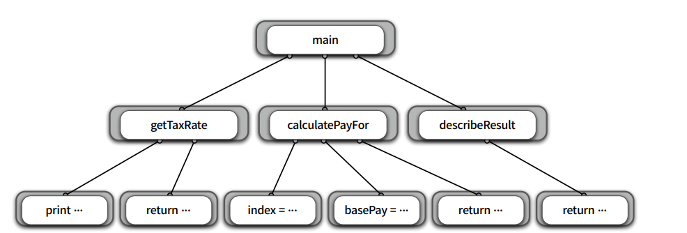

# Chapter7 객체 분해

---

# 1. 프로시저 추상화와 데이터 추상화

**프로시저 추상화**

- 기능 분해 (functional decomposition)
- 기능 분해는 알고리즘 분해라고 부르기도 한다 (algorithmic decomposition)

**데이터 추상화**

- 데이터를 중심으로 타입을 추상화(type abstraction)
- 프로시저를 추상화(procedure abstraction)

---

# 2. 프로시저 추상화와 기능 분해

## 메인 함수로서의 시스템

**기능 분해 ( 알고리즘 분해 )**

- 기능 분해 관점에서는 추상화의 단위가 프로시저이며 시스템은 프로시저를 단위로 분해된다.
- 반복적으로 실행되거나 유사하게 실행되는 작업들을 하나의 장소에 모아놓음으로써 로직을 재사용하고 중복을 방지하는 추상화 방법
- 프로시저를 추상화라 하는 이유 → 인터페이스만 알면 프로시저를 사용할 수 있음 (정보은닉)

**전통 적인 기능 분해 방법 - 하향식 접근법**

- 최상위 기능을 정의
- 최상위 기능을 작은 단계의 하위 기능으로 분해

## 급여 관리 시스템

급여 = 기본급 - (기본급 * 소득세율)

**조건 (하향식 접근)**

- 직원의 급여를 계산한다
    - 사용자로부터 소득세율을 입력 받는다
        - “세율을 입력하세요: “ 라는 문장을 화면에 출력한다
        - 키보드를 통해 세율을 입력받는다
    - 직원의 급여를 계산한다
        - 전역 변수에 저장된 직원의 기본급 정보를 얻는다
        - 급여를 계산한다
    - 양식에 맞게 결과를 출력한다
        - “이름: {직원명}, 급여: {계산된 금액}” 형식에 따라 출력 문자열을 생성한다

> 최상위 기능으로 부터 하나씩 분해 시킴
>

## 급여 관리 시스템 구현

> 급여 시스템을 트리 구조로 표현
논리적이고 체계적인 개발 절차를 가질 수 있음
>

## 하향식 기능 분해의 문제점

- 시스템은 하나의 메인 함수로 구성돼 있지 않다.
- 기능 추가나 요구사항 변경으로 인해 메인 함수를 빈번하게 수정해야 한다.
- 비즈니스 로직이 사용자 인터페이스와 강하게 결합된다.
- 하향식 분해는 너무 이른 시기에 함수들의 실행 순서를 고정시키키 때문에 유연성과 재사용성이 저하된다.
- 데이터 형식이 변경될 경우 파급효과를 예측할 수 없다.

---

# 3. 모듈

## 정보 은닉과 모듈

> 시스템의 변경을 관리하는 기본적인 전략은 함께 변경되는 부분을 하나의 구현
단위로 묶고 퍼블릭 인터페이스를 통해서만 접근하도록 만드는 것이다
- 모듈화 -
>

**모듈이 감춰야하는 비밀**

- 복잡성
    - 모듈이 너무 복잡한 경우 이해하고 사용하기가 어려워짐, 외부에 모듈을 추상화할 수 있는 간단한 인터페이스를 제공해서 모듈의 복잡도를 낮춤
- 변경 가능성
    - 변경 가능한 설계 결정이 외부에 노출될 경우 실제로 변경이 발생했을 때 파급효과가 커진다
    - 변경 발생 시 하나의 모듈만 수정하면 되도록 변경 가능한 설계 결정을 모듈 내부로 감추고 외부에는 쉽게 변경되지 않을 인터페이스를 제공해야함

## 모듈의 장점과 한계

- 모듈 내부의 변수가 변경되더라도 모듈 내부에만 영향을 미친다.
- 비즈니스 로직과 사용자 인터페이스에 대한 관심사를 분리한다.
- 전역 변수와 전역 함수를 제거함으로써 네임스페이스 오염을 방지한다.

---

# 4. 데이터 추상화와 추상 데이터 타입

**추상 데이터 타입을 위한 프로그래밍언어가 가져아할 특징**

- 타입 정의를 선언할 수 있어야 한다.
- 타입의 인스턴스를 다루기 위해 사용할 수 있는 오퍼레이션의 집합을 정의할 수 있어야 한다.
- 제공된 오퍼레이션을 통해서만 조작할 수 있도록 데이터를 외부로부터 보호할 수 있어야 한다.
- 타입에 대해 여러 개의 인스턴스를 생성할 수 있어야 한다.

---

# 5. 클래스

## 클래스는 추상 데이터 타입인가?

명확한 의미에서는 추상 데이터 타입과 클래스는 동일하지 않다.

클래스는 상속과 다형성을 지원하는 데 비해 추상 데이터 타입은 지원하지 못한다.

상속과 다형성을 지원하지 않는 추상 데이터 타입 기반의 프로그래밍 패러다임을 `객체기반 프로그래밍(Object-BasedProgramming)` 라고 부른다.

## 변경을 기준으로 선택하라.

> 단순히 클래스를 구현 단위로 사용한다는 것이 객체지향 프로그래밍을 한다는 것을 의미하지는 않는다. 타입을 기준으로 절차를 추상화하지 않는다면 그것은 `객체지향 분해` 가 아니다.
비록 클래스를 사용 하고 있더라도 말이다.
>

> 이처럼 코드에 영향도 없이 새로운 객체 유형과 행위를 추가 할 수 있는 객체지향의 특성을
`개방-폐쇄 원칙(Open-Closed Principle, OCP)` 라고 부른다.
>

**주의**

- 위 그림으로 클래스 계층에 오퍼레이션의 구현 방법을 분배한다고 객체지향 애플리케이션을 설계 하는 것이 아님
- 객체 지향에서 중요한 것은 `역할`, `책임`, `협력 이다.`
- 객체가 참여할 협력을 결정하고 협력에 따라 필요한 책임을 수행하기 위해 어떠 ㄴ객체가 필요한지에 관해 고민하라.
- 책임을 다양한 방식으로 수행해야 할 때만 타입 계층 안에 각 절차를 추상화 하라.
- 타입 계층과 다형성은 협력이라는 문맥 안에서 책임을 수행하는 방법에 관해 고민한 결과물이어야 하며 그 자체가 목적이 되어서는 안된다.