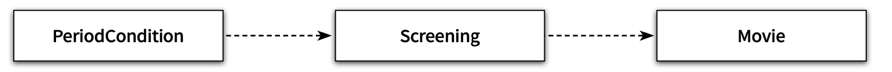

# Chapter8 의존성 관리하기


# 1. 의존성 이해하기

## 변경과 의존성

- 실행 시점
    - 의존 하는 객체가 정상적으로 동작하기 위해서는 실행 시에 의존 대상 객체가 반드시 존재해야 한다.
- 구현 시점
    - 의존 대상 객체가 변경될 경우 의존하는 객체도 함께 변경된다.
- 어떤 객체가 예정된 작업을 정상적으로 수행하기 위해 다른 객체를 필요로 하는 경우 두 객체 사이에 의존성이 존재 한다고 말함

## 의존성 전이 (Transitive Dependency)

PeriodCondition이 Screening에 의존할 경우 Screening이 가지고 있는 Movie, LocalDateTime,

Customer에 PeriodCondition도 간접적으로 의존하게됨



- 의존성은 함께 변경될 수 있는 가능성을 의미하기에 모든 경우에 의존성이 전이되는 것은 아님
- 의존성이 실제로 전이될지 여부는 변경의 방향과 `캡슐화` 의 정도에 따라 달라짐
- 의존성의 종류
    - 직접 의존성(direct dependency)
        - 한 요소가 다른 요소에 직접 의존하는 경우 `PeriodCondition 이 Screening에 의존하는 경우`
    - 간접 의존성(indirect dependency)
        - 직접적인 관계는 존재하지 않지만 의존성 전이에 의해 영향이 전파되는 경우
- 의존성이란 의존하고 있는 대상의 변경에 영향을 받을 수 있는 가능성 `(클래스 만이 아닌 모듈 및 실행시스템 등`

## 런타임 의존성과 컴파일타임 의존성

- 런타임 의존성(run-time dependency)
    - 애플리케이션이 실행되는 시점
- 컴파일 의존성(compile-time dependency)
    - 코드를 컴파일하는 시점
    - 문맥에 따라서는 코드 그 자체
    - 용어보다는 우리가 작성하는 코드의 구조가 중요
    - 컴파일을 안하는 언어도 있기 때문에
        - 컴파일이 진행되는 시점인지 코드를 작성하는 시점인지를 파악하는것도 중요

**객체지향 애플리케이션에서는?**

- 런타임시점의 주인공은 객체다. 런타임 의존성이 다루는 주제는 객체 사이의 의존성
- 코드 관점에서는 클래스 컴파일 타임에서는 클래스 사이의 의존성
- `런타임 의존성과 컴파일타임 의존성이 다를 수 있음`

**영화 예매 시스템으로 들어보는 예시**


- 코드 작성 시점(컴파일 의존성)
    - Movie 클래스에서 AmountDiscountPolicy 와 PercentDiscountPolicy 클래스를 향하는 의존 관게가 없음
- 런타임 의존성
    - 실행 시점이 되면 Movie는 AmountDiscountPolicy 와 PercentDiscountPolicy 와 `협력` 할 수 있어야 한다.
- 코드 작성 시점의 Movie 클래스는 할인 정책을 구현한 두 클래스의 존재를 모르지만 실행 시점에는 두 클래스와 `협력` 가능하게 유연하고 재사용한 설계를 해야한다
    - 동일한 소스코드 구조를 가지고 다양한 실행 구조를 만들 수 있어야함

**유연하고 다양한 실행 구조를 만들려면?**

- 인스턴스가 다양한 클래스의 인스턴스와 협력하기 위해서는 협력할 인스턴스의 구체적인 클래스를 알아서는 안 된다.
- 실제로 협력할 객체가 어떤 것인지는 `런타임` 에 해결 해야 한다.
- 컴파일타임 구조와 런타임 구조 사이의 거리가 멀면 멀수록 `설계가 유연` 해지고 재사용 가능해진다.

## 컨텍스트 독립성

- 클래스는 자신과 협력할 객체의 구체적인 클래스에 대해 알아서는 안 된다.
- 구체적인 클래스를 알면 알수록 그 클래스가 사용되는 특정한 문맥에 강하게 결합된다.
- 클래스가 사용될 특정한 문맥에 대해 최소한의 가정만으로 이뤄져 있다면 다른 문맥에서 재사용하기가 더 수월해진다. 이를 `컨텍스트 독립성` 이라고 부름
- 유연한 설계를 위해선 가능한 한 자신이 실행될 컨텍스트에 대한 구체적인 정보를 최대한 적게 알아야 한다.
- 컨텍스트에 대한 정보가 `적으면 적을수록` 다양한 곳에서 `재사용` 이 가능해지고 유연하고 변경에 탄력적이게 됨

## 의존성 해결하기

> 컴파일타임 의존성을 실행 컨텍스트에 맞는 적절한 런타임 의존성으로 교체 하는 것을 `의존성 해결` 이라고 부른다.
>

**의존성 해결을 위한 일반적인 세 가지 방법**

- 객체를 생성하는 시점에 생성자를 통해 의존성 해결
    - 객체를 생성할 때 구현체를 생성자를 통해 넘겨준다
- 객체 생성 후 setter 메서드를 통해 의존성 해결
    - 객체를 생성한 이후에도 의존하고 있는 대상을 변경할 수 있는 가능성을 열어 놓고 싶은 경우에 유용
    - 객체를 생성하고 의존 대상을 설정하기 전까지는 객체의 상태가 불완전할 수 있다. (NPE)
- 메서드 실행 시 인자를 이용해 의존성 해결
    - 항상 의존성을 알 필요가 없더 특정 계산을 진행할 때만 일시정적으로 알아도 된다면 메서드의 인자로 해결 가능
    - 메서드가 실행 될 때마다 의존 대상이 매번 달라져야 하는 경우에도 유용


# 2. 유연한 설계

> 의존성을 관리하는데 유용한 몇 가지 원칙과 기법을 알아보자
>

## 의존성과 결합도

**의존성**

- 의존성을 받는 객체에서는 협력할 객체의 클래스를 고정할 필요가 없음
- 메시지를 이해할 수 있고 메시지에 대한거를 수행할 수 만 있다면 어떤 타입의 객체와 협력하더라도 상관이 없다.
- 바람직한 의존성이은 `재사용성` 과 관련이 있음
    - 어떤 의존성이 다양한 환경에서 클래스를 `재사용` 할 수 없도록 제한한다면 바람직 하지 못함
    - 어떤 의존성이 다양한 환경에서 `재사용` 할 수 있다면 바람직 한 의존성이다.

**결합도**

- 어떤 두 요소 사이에 존재하는 의존성이 바람직할 때 두 요소가 `느슨한 결합도(loose coupling)`
  또는 `약한 결합도(weak coupling)` 라고 한다.
- 두 요소 사이의 의존성이 바람직하지 못할 때 `단단한 결합도(tight coupling)` 또는 `강한 결합도(strong coupling)` 라고 한다.

## 지식이 결합을 낳는다

- 결합도의 정도는 자신이 의존하고 있는 다른 요소에 대해 `알고 있는 정보의 양` 으로 결정된다
- 한 요소가 다른 요소에 대해 더 `많은 정보` 를 알고 있으면 두 요소는 강하게 결합 된다.
- 한 요소가 다른 요소에 대해 더 `적은 정보` 를 알고 있다면 두 요소는 약하게 결합 된다.
- 즉 Movie 클래스가 추상 클래스인 DiscountPolicy 클래스에 의존하는 경우
    - 구체 적인 계산 방법을 알고 있지 않고, 할인 요금을 계산한다는 사실만 알고 있을 뿐이다.
      `낮은 결합도`

## 추상화에 의존하라

**아래로 갈 수록 클라이언트가 알아야 하는 지식의 양이 적어지기에 결합도가 느슨해짐**

- 구체 클래스 의존성(concrete class dependency)
- 추상 클래스 의존성(abstract class dependency)
- 인터페이스 의존성(interface dependency)

## 명시적인 의존성

아래 코드는 한 가지 실수로 인해 결합도가 불필요하게 높아졌따.

```java
public class Movie {
 ...
 private DiscountPolicy discountPolicy;
 public Movie(String title, Duration runningTime, Money fee) {
 ...
 this.discountPolicy = new AmountDiscountPolicy(...);
 }
```

- 추상 클래스를 사용하는 것처럼 보이지만 아니다.
- 생성자로 객체를 생성 할 때 마다 구체 클래스인 AmountDiscountPolicy에 의존하게 된다.
- 결합도를 느슨하게 만들기 위해서는 인스턴스 변수를 추상 클래스나 인터페이스로 선언하는 것만으론 부족
    - 클래스 안에서 구체 클래스에 대한 모든 의존성을 `제거` 해야함

> 퍼블릭 인터페이스를 통해 할인 정책을 설정할 수 있는 방법을 제공하자
명시적으로 퍼블릭 인터페이스에 노출하자
이를 `명시적인 의존성(explicit dependency)` 이라고 한다.

퍼블릭 인터페이스에 표현되지 않는 것을 `숨겨진 의존성(hidden dependency)` 라고 한다.
>

- `의존성을 감추는 것을 경계 해라`
- `숨겨져 있는 의존성을 밝은 곳으로 드러내서 널리 알려라`

## New는 해롭다

**new 를 잘못 사용하면 클래스 사이의 결합도가 극단적으로 높아진다.**

- new 연산자를 사용하기 위해서는 구체 클래스의 이름을 직접 기술해야 한다. 따라서 new를 사용하는 클라이언트는 추상화가 아닌 구체 클래스에 의존할 수 밖에 없기 때문에 결합도가 높아진다.
- new 연산자는 생성하려는 구체 클래스뿐만 아니라 어떤 인자를 이용해 클래스의 생성자를 호출해야 하는지도 알아야 한다. 따라서 new를 사용하면 클라이언트가 알아야 하는 지식의 양이 늘어나기 때문에 결합도가 높아진다.

**new 를 사용 하면?**

- new는 결합도를 높이기 때문에 해롭다
- new는 클래스를 구체 클래스에 결합시키는 것만으로 끝나지 않는다.
- 협력할 클래스의 인스턴스를 생성하기 위해 어떤 인자들이 필요하고 그 인자들을 어떤 순서로 사용해야 하는지에 대한 정보도 노출 시킨다.
- 구체 클래스에 대한 의존성을 추가한다.

**해결 법**

- 인스턴스를 생성하는 로직과 생성된 인스턴스를 사용하는 로직을 분리 하는 것이다.
- 직접 생성하지 않는다.
- setter메서드를 사용하거나 실행 시에 메서드의 인자 또는 생성자의 인자로 전달해라
- 객체를 생성하는 책임을 객체 내부가 아니라 클라이언트로 옮기는 것으로 부터 시작해라.

## 가끔은 생성해도 무방하다

**예를 들면 아래 조건일 때는 괜찮다.**

- Movie가 대부분의 경우 AmountDiscountPolicy의 인스턴스와 협력한다.
- 아주 가끔씩만 PercentDiscountPolicy 랑 협력한다

> 이럴 경우 클라이언트들 사이에 중복 코드가 늘어나고 Movie 의 사용성도 나빠진다.
>

```java
public class Movie {
 private DiscountPolicy discountPolicy;
	 public Movie(String title, Duration runningTime, Money fee) {
		 this(title, runningTime, fee, new AmountDiscountPolicy(...));
	 }
	 public Movie(String title, Duration runningTime, Money fee, DiscountPolicy discountPolicy) {
		 ...
		 this.discountPolicy = discountPolicy;
	 }
}
```

- 체이닝 하자
- 메서드를 오버 로딩 하는 경우에도 사용할 수 있다.

## 표준 클래스에 대한 의존은 해롭지 않다.

- 자바라면 JDK에 표함된 표준 클래스는 괜찮다.
- `private List<DiscountCondition> conditions = new ArrayList<>();`
- ArrayList 의 코드가 수정될 확률은 0에 가깝다

## 조합 가능한 행동

- 어떤 객체와 협력하느냐에 따라 객체의 행동이 달라지는 것은 유연하고 재사용 가능한 설계가 가진 특징이다.
- 객체가 어떻게(how) 하는지를 장황하게 나열하지 않고 객체들의 조합을 통해 무엇(what)을 하는지 표현하자
- 훌륭한 객체지향 설계란 객체들의 조합을 선언적으료 표현함으로써 객체들이 무엇을 하는지 표현하는 설계다