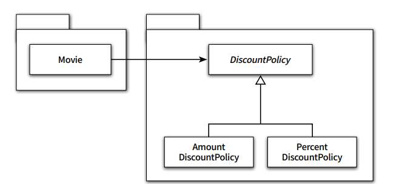

# Chapter9 유연한 설계

> 앞장의 내용이 반복된다는 느낌을 받을 수도 있지만 이름을 가진
설계 원칙을 통해 기법들을 정리하는 것은 장황하게 설명된 개념과 메커니즘을
또렷하게 정리할 수 있게 도와줄뿐만 아니라 설계를 논의할 때
사용할 수 있는 공통의 어휘를 익힌다는 점에서도 가치가 있을 것이다
>

---


# 1. 개방-폐쇄 원칙 (Open_closed Principle, OCP)

> 소프트웨어 개체(클래스, 모듈, 함수 등등)는 확장에 대해 열려 있어야 하고, 수정에 대해서는 닫혀 있어야 한다.
>

- 확장에 대해 열려 있다
    - 애플리케이션의 요구사항이 변경될 때 이 변경에 맞게 새로운 동작을 추가해서 애플리케이션의 기능을 `확장` 할 수 있다
- 수정에 대해 닫혀 있다
    - 기존의 `코드` 를 수정하지 않고도 애플리케이션의 동작을 추가하거나 변경할 수 있다

## 컴파일타임 의존성을 고정시키고 런타임 의존성을 변경하라

- 컴파일타임 에는 Interface 또는 AbstractClass 추상화에 의존하도록 하자
- 런타임에 실제 구체 클래스를 바라 보도록 하자
- 현재의 설계에 상관없이 기존 코드를 수정 안하고 새로운 클래스를 추가하는 것만으로 새로운 기능을 확장 할 수 있도록 만들자

## 추상화가 핵심이다

- 개방-폐쇄 원칙의 핵심은 `추상화에 의존` 하는 것 이다
- 변하지 않는 부분을 고정하고 변하는 부분을 생략하는 추상화 매커니즘이 `개방-폐쇄 원칙` 이다


# 2. 생성 사용 분리

- 특정 클래스 내부에서 구체 클래스의 인스턴스를 생성 해서는 안 된다
- 결합도가 높아질수록 개방-폐쇄 원칙을 따르는 구조를 설계하기가 어려워진다
- 객체에 대한 `생성과 사용을 분리(separating use from creation)` 해야 한다

## FACTORY 추가하기

**구체 클래스를 사용할 client도 생성에 대한 칙임을 지면 안될 때**

```java
public class Factory {
    public Movie createAvatarMovie() {
        return new Movie("아바타",
                Duration.ofMinutes(120),
                Money.wons(10000),
                new AmountDiscountPolicy();
    }
}

public class Client { 
	private Factory factory;

	public Client(Factory factory) {
			this.factory = factory;
	}

	public Money getAvatarFee() {
		Movie avatar = factory.createAvatarMovie();
		return avatar.getFee();
	}

}
```

## 순수한 가공물에게 책임 할당하기

- 책임 할당의 가장 기본 원칙은 책임을 수행 하는데 가장 많은 정보를 알고 있는 Information Expert 에게 책임을 할당 하는것
- 제일 먼저 도메인 모델에서 적절한 후보가 있는지 찾아봐라
- Factory 는 도메인 모델이 아니다

**객체를 분해하는 큰 두가지 방식**

- 표현적 분해(representational decomposition)
    - 도메인 모델에 담겨 있는 개념과 관계를 따르며 도메인과 소프트웨어 사이의 표현적 차이를 최소화 하는 것이 목적
- 행위적 분해(behavioral decomposition)


# 3. 의존성 주입

- 생성자 주입(constructor injection)
    - 객체를 생성하는 시점에 생성자를 통한 의존성 해결
- setter 주입(setter injection)
    - 객체 생성 후 setter 메서드를 통한 의존성 해결
- 메서드 주입(method injection)
    - 메서드 실행 시 인자를 이용한 의존성 해결

**setter 주입의 장 단점**

- 장점
    - 의존성의 대상을 런타임에 변경할 수 있음
- 단점
    - 객체가 올바로 생성되기 위해 어떤 의존성이 필수적인지를 명시적으로 표현할 수 없다
    - setter 는 객체가 생성된 후에 의존성을 주입하기 때문에 누락한다면 객체가 비정상적인 상태가 될 것이다

**메서드 주입**

- 주입된 의존성이 한 두 개의 메서드에서만 사용된다면 각 메서드의 인자로 던달하는 것이 더 나은 방법 일수도 있음

## 숨겨진 의존성은 나쁘다

- Service Locator
    - Service Locator는 의존성을 해결할 객체들을 보관하는 일종의 저장소
    - Service Locator의 경우 객체가 직접 Service Locator에게 의존성을 해결해 줄 것을 요청 함
    - Service Locator 패턴의 가장 큰 단점은 `의존성을 감춤`

```java
public class Movie {
    private String title;
    private Duration runningTime;
    private Money fee;
    private DiscountPolicy discountPolicy;

    public Movie(String title, Duration runningTime, Money fee, DiscountPolicy discountPolicy) {
        this.title = title;
        this.runningTime = runningTime;
        this.fee = fee;
        this.discountPolicy = ServiceLocator.discountPolicy();
    }

    public Money getFee() {
        return fee;
    }

    public Money calculateMovieFee(Screening screening) {
        return fee.minus(discountPolicy.calculateDiscountAmount(screening));
    }

    public void changeDiscountPolicy(DiscountPolicy discountPolicy) {
        this.discountPolicy = discountPolicy;
    }
}

public class ServiceLocator {
    private static ServiceLocator soleInstance = new ServiceLocator();
    private DiscountPolicy discountPolicy;

    public static DiscountPolicy discountPolicy() {
        return soleInstance.discountPolicy;
    }

    public static void provide(DiscountPolicy discountPolicy) {
        soleInstance.discountPolicy = discountPolicy;
    }

    private ServiceLocator() {
    }
}

// 사용
ServiceLocator.provide(new PercentDiscountPolicy(...));
Movie avatar = new Movie("아바타",
 Duration.ofMinutes(120),
 Money.wons(10000));
```

**해결**

- 의존성 주입은 이 문제를 깔끔하게 해결함
- 필요한 의존성은 클래스의 퍼블릭 인터페이스에 명시적으로 드러냄
- 의존성을 이해하기 위해 코드 내부를 읽을 필요가 없음
- 의존성과 관련된 문제도 최대한 컴파일 타임에 잡을 수 있음
- 단위 테스트를 작성할 때 필요한 인자를 전달해 필요한 객체를 생성하면 됨


# 4. 의존성 역전 원칙

## 추상화와 의존성 역전

- 객체 사이의 협력이 존재할 때 그 협력의 본질을 담고 있는 것은 상위 수준의 정책 이다
- Movie와 AmountDiscountPolicy 사이의 협력이 가지는 본질은 영화의 가격을 계산하는 것이다
    - 어떻게 계산할 것인지는 협력의 본질이 아님

**정리**

- 상위 수준의 모듈은 하위 수준의 모듈에 의존해서는 안 된다. 둘 모두 추상화에 의존해야 한다.
- 추상화는 구체적인 사항에 의존해서는 안된다. 구체적인 사항은 추상화에 의존해야 한다.
- 이를 `의존성 역전 원칙(Dependency Inversion Principle, DIP)` 라고 부른다.

## 의존성 역전 원칙과 패키지



**문제점**

- Movie를 다양한 컨텍스트에서 재사용 하려면 불필요한 클래스가 Movie 와 함께 배포되야함
- Movie를 정상적으로 컴파일 하기 위해서는 DiscountPolicy 의 구현 클래스도 같이 컴파일 되야함

**해결(Separated Interface pattern) (잘된 객체지향 구조)**


- 추상화를 별도의 독립적인 패키지가 아닌 클라이언트가 속한 패키지에 포함
- Movie와 추상 클래스인 DiscountPolicy를 하나의 패키지로 모아서 Movie를 특정 컨텍스트로부터 독립
- Moive를 재사용하려면 단지 Movie 와 DiscountPolicy만 재컴파일 하면됨
- 의존성 역전 원칙에 따라 추상화가 제공하는 인터페이스의 소유권 역시 역전 시켜야함


# 5. 유연성에 대한 조언

- 유연하고 재사용 가능한 설계란 런타임 의존성과 컴파일 의존성 `차이` 를 인식 하고 동일한 컴파일 타임 의존성으로부터 다양한 런타임 `의존성` 을 만들 수 있는 코드 구조를 가지는 설계
- 재사용 가능한 설계가 항상 좋은 것은 아님
- 설계의 미덕은 단순함과 명확함으로부터 나온다.
- 변경은 예상이 아니라 현실어야 한다 미래에 변경이 일어날지도 모른다는 불안감은 불필요한 설계를 낳는다. 아직 일어나지 않은 변경은 변경이 아님
- 유연성은 항상 `복잡성` 을 수반한다.
- 유연하지 않은 설계는 단순하고 명확함
- 유연한 설계는 복잡하고 암시적임
- `객체의 협력과 책임이 중요하다`
- `객체를 생성하는 방법에 대한 결정은 모든 책임이 자리를 잡은 후 가장 마지막 시점에 내리는 것이 적절 하다`