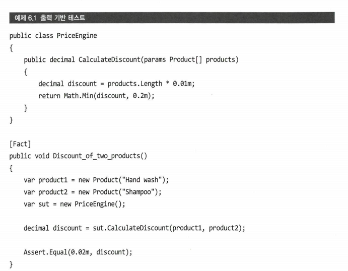
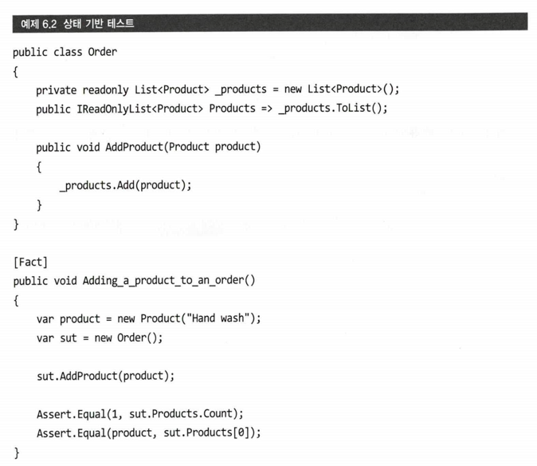
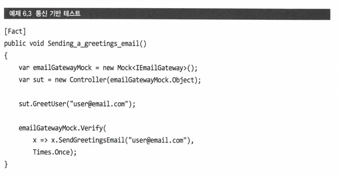
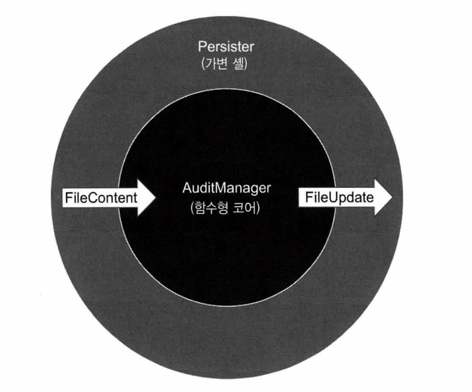

# 정리
1. 출력 기반 테스트는 SUT에 입력을 주고 풀력을 확인 하는 테스트.
2. 출력 기반 테스트가 좋음
   - 세부 구현 사항에 거의 결합되지 않아 리펙터링 내성이 있음
   - 유지보수하기 좋음
   - 출력 기반 테스트)
     - 
   - 상태 기반 테스트)
     - 
   - 통신 기반 테스트)
     - 
3. 출력 기반 테스트를 위한 함수형 프로그래밍!
   - 함수형 아키텍처의 목표는 비즈니스 로직과 부작용을 분리하는것
     - 가변셀과 코어
        - 
4. 함수형 아키텍처와 헥사고날 아키텍처의 차이는 부작용에 대한 처리
   - 함수형 아키텍처는 가변셀로 부작용을 밀어내고,
   - 헥사고날 아키텍처는 각자의 역할에서 처리할 수 있다
5. 함수형 아키텍처의 < 헥사고날 아키텍처
6. 함수형 아키텍처와 전통적인 아키텍처 사이의 선택은 성능과 코드 유지 보수성 사이의 절충이며, 함수형 아키텍처는 유지 보수성 향상을 위해 성능을 희생
7. 모든 코드 베이스를 함수형 아키텍처로 전환할 수는 없다. 함수형 아키텍처를 전약적으로 적용.
