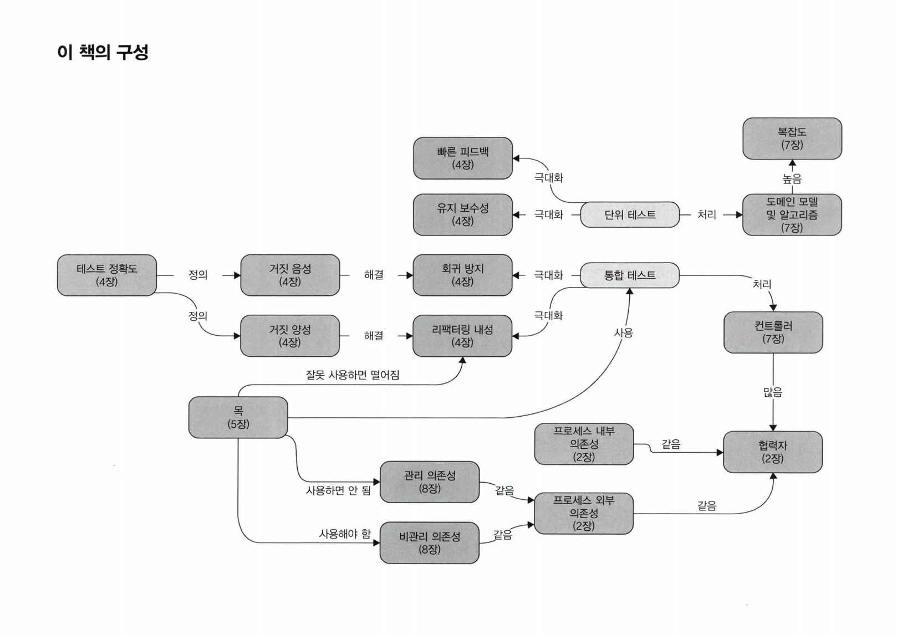

## Unit Testing
<small>Author: [Gyeongsun Park](https://github.com/gngsn)</small>

 

<b>Overview</b>

 

 

<b>CHAPTER 01. 단위 테스트의 목표</b>

 
<a href="https://github.com/2mz1/theory/tree/gngsn/unit-testing/gngsn/chapter01"> 🔗 link </a>
 

**TL;DR**
- **성공적인 테스트 스위트**
    - 1#. 개발 주기에 통합되어 있음
    - 2#. 코드베이스에서 가장 중요한 부분 - _비즈니스 로직 (도메인 모델)_ - 만을 대상으로 함
    - 3#. 최소 유지비로 최대 가치를 끌어냄 (가치 있는 테스트를 식별하고, 작성하라)
- **비용 편익 분석**을 배우고 **안티 패턴**을 피하는 방법을 배워라.
    - **비용 편익 분석 (cost-benefit analysis)**: 여러 가지 대안에 대해 비용과 이익을 분석해서 가장 효과적인 대안을 찾는 방법론.
    - **안티 패턴(anti-pattern)**: 처음에는 괜찮은 것 같지만 미래에 문제를 야기하는 패턴
- 테스트의 장점
    - **소프트웨어 엔트로피(software entropy)** 를 막을 수 있음
        - 지속적인 정리와 리팩터링 등 적절한 관리를 하지 않고 방치하면 시스템이 점점 더 복잡해지고 무질서해짐.
        - 소프트웨어 품질을 떨어뜨리는 코드의 형태.
    - **회귀(regression)에 대한 보험을 제공**
        - **소프트웨어 버그**와 **회귀**는 동의어
          **테스트의 가치와 유지 비용을 모두 고려해야 함**
    - 기반 코드를 리팩터링할 때 **테스트도 리팩터링**하라
    - 각 **코드 변경 시 테스트를 실행**하라
    - **테스트가 잘못된 경고를 발생시킬 경우 처리**하라
    - 기반 코드의 동작을 이해하려고 할 때는 **테스트를 읽는 데 시간을 투자**하라
- 테스트도 **애플리케이션의 정확성을 보장**을 목표하는 **코드베이스**의 일부로 봐야 함
- $`코드\ 커버리지\ (테스트\ 커버리지) = \frac{제품\ 코드\ 라인\ 수}{전체\ 라인\ 수}`$
- $`분기\ 커버리지 = \frac{통과\ 분기}{전체\ 분기\ 수}`$
- **커버리지 지표에 관한 문제점**
    - 1#. 가능한 모든 결과를 검증한다고 보증할 수 없음
    - 2#. 외부 라이브러리 코드 경로를 고려할 수 없음
- **시스템의 핵심 부분은 커버리지를 높게 두는 것이 좋지만, 이 높은 수준을 요구 사항으로 삼는 것은 좋지 않음.**

 

<b>CHAPTER 02. 단위 테스트란 무엇인가</b>

 
<a href="https://github.com/2mz1/theory/tree/gngsn/unit-testing/gngsn/chapter02"> 🔗 link </a>
 

**TL;DR**
- **단위 테스트**
    - ① 단일 동작 단위를 검증 / ② 빠르게 수행  / ③ 다른 테스트와 격리하여 처리
- **런던파** _London School_
    - **테스트 대상 시스템에서 협력자를 격리**
    - **코드**나 **SUT(단일 클래스)** 단위의 테스트
- **고전파** _Classic School_
    - **단위 테스트끼리 격리**
    - **동작** 단위의 테스트
- **테스트 대역**: 테스트를 목적으로 객체를 특정 형태로 대체
- **AAA Pattern**: Assert, Act, Assert Pattern. 준비-실행-검증 패턴.
- **SUT vs MUT**
    - **SUT**: System Under Test. 테스트 검증 시스템, <b>클래스의 전체</b>를 가리킴
    - **MUT**: Method Under Test. 테스트 대상 메서드. 테스트에서 호출한 SUT의 <b>메서드</b>를 가리킴
- **테스트 대역 vs Mock**
    - **테스트 대역**: 실행과 관련 없이 모든 종류의 가짜 의존성을 설명하는 포괄적인 용어
    - **Mock**: 테스트 대상 시스템과 협력자 간의 상호 작용을 검사할 수 있는 특별한 테스트 대역
- **의존성**
    - **공유 의존성** _shared dependecy_: 동일 프로세스 내 영향을 미칠 수 있는 의존성. (ex. `static mutable field`, 데이터베이스)
    - **비공개 의존성** _private dependency_: 공유하지 않는 의존성
    - **프로세스 외부 의존성** _out-of-process dependency_: 애플리케이션 실행 프로세스 외부에서 실행되는 의존성
    - **싱글턴 의존성 singleton**: **보통은 공유 의존성**. 하지만, 각 테스트 별 새 인스턴스 만들 수 있으면 **공유 의존성이 아님**
    - **설정 클래스 configuration class**: 일반적으로 한 개인 공유 클래스. 하지만, 다른 모든 의존성이 SUT에 주입되면 새 인스턴스 생성 가능
    - **휘발성 의존성** _volatile dependency_: 런타임 환경의 설정 및 구성 요구 or 비결정적 동작 (각 호출에 대해 다른 결과를 제공) 포함
-
| 런던파 이점                                  | 고전파를 선호하는 필자의 견해                     |
|-----------------------------------------|--------------------------------------|
| 세밀한 테스트로 입자성이 좋음                        | 테스트는 단위가 아닌 동작 단위를 검증해야 함            |
| 연결된 클래스 그래프가 커져도 테스트가 쉬움 (테스트 대역으로 대체됨) | 애초에 상호 연결된 클래스의 크고 복잡한 그래프를 갖지 않아야 함 |
| 테스트 실패 시 어떤 기능이 실패했는지 알 수 있음            | 큰 이점은 아님. 마지막 수정한 부분이 버그의 원인일 것      |

- **테스트 주도 개발**: TDD는 테스트에 의존해 프로젝트 개발을 추진하는 소프트웨어 개발 프로세스
    1. 추가할 기능과 예상 동작의 실패 테스트 작성
    2. 테스트를 통과할 코드 작성. 코드가 깨끗하거나 명쾌할 필요는 없음
    3. 코드 리팩터링. 통과 테스트 보호하에 코드를 안전하게 정리
- **통합 테스트**: 단위 테스트 기준 중 하나 이상을 충족하지 못하는 테스트
- **엔드 투 엔드 테스트**: 애플리케이션과 함께 작동하는 프로세스 외부 의존성의 전부 또는 대부분에 직접 접근

 

