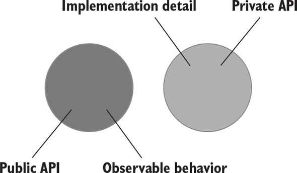

# CHAPTER 5. 목과 테스트 취약성

TL;DR

- 테스트 대역은 테스트에서 비제품 가짜 의존성의 모든 유형을 설명하는 포괄적인 용어
- 테스트 대역의 다섯 가지 변형: 더미, 스팀, 스파이, 목, 페이크 등 -> 목과 스텁로 분류
  - 스파이는 기능적으로 목과 같고, 더미와 페이크는 스텁과 같은 역할을 한다.

* 목은 외부로 나가는 상호 작용(SUT에서 의존성으로의 호출로, 해당 의존성의 상태를 변경)을 모방하고 검사하는 데 도움이 된다. 스텁은 내부로 들어오는 상호 작용 (SUT가 해당 의존성을 호출해 입력 데이터를 가져옴)을 모방하는 데 도움이 된다.
* MOCK(도구)은 목(테스트 대역)이나 스텁을 만드는 데 사용할 수 있는 목 라이브러리의 클래스다.
* 스텁과의 상호 작용을 검증하면 취약한 테스트로 이어진다. 이러한 상호 작용은 최종 결과와 일치하지 않는다. 이는 결과로 가는 중간 단계로, 구현 세부 사항에 해당 한다.
* 명령 조회 분리(CQS) 원칙에 따르면, 모든 메서드가 명령 또는 조회 중 하나여야 하지만 둘 다는 안 된다. 명령을 대체하는 테스트 대역은 목이다. 조회를 대체하는 테스트 대역은 스텁이다.
* 모든 제품 코드는 공개 API인지 비공개 API인지와 식별할 수 있는 동작인지 구현 세부 사항인지라는 두 가지 차원으로 분류할 수 있다. 코드의 공개성은 private, public, internal 키워드 등 접근 제한자에 의해 제어된다. 다음 요구 사항을 하나라 도 충족하면 식별할 수 있는 동작이다. (둘 다 아니면 구현 세부 사항이다.)
  - 클라이언트가 목표를 달성하는 데 도움이 되는 연산을 노출하라. 연산은 계산을 수행하거나 사이드 이펙트를 초래하거나 또는 둘 다 하는 메서드다.
  - 클라이언트가 목표를 달성하는 데 도움이 되는 상태를 노출하라. 상태는 시스템의 현재 상태다.
* 잘 설계된 코드는 식별할 수 있는 동작이 공개 API와 일치하고 구현 세부 사항이 비 공개 AP 뒤에 숨겨져 있는 코드다. 공개 API가 식별할 수 있는 동작 이상으로 커지 면 코드는 구현 세부 사항을 유출한다.
* 캡슐화는 코드를 불변성 위반으로부터 보호하는 행위다. 클라이언트는 구현 세부 사항을 사용해 코드의 불변성을 우회할 수 있기 때문에 구현 세부 사항을 노출하면 캡슐화가 위반되는 경우가 종종 있다. 육각형 이키텍처는 상호 작용하는 애플리케이션의 집합이고 각 애플리케이션은 육형으로 표시한다. 각 육각형은 도메인과 애플리케이션 서비스라는 두 계층으로 구성된다.
* 육각형 아키텍처는 다음과 같은 세 가지 관점을 강조한다.
  - 도메인과 애플리케이션 서비스 계층 간의 영향 분리. 도메인 계층은 비즈니스 로직을 책임져야 하고, 애플리케이션 서비스는 도메인 계층과 외부 애플리케이션 간의 작업을 조정해야 한다.
  - 애플리케이션 서비스 계층에서 도메인 계층으로의 단방향 의존성 흐름. 도메인 계층 내 클래스는 서로에게만 의존해야 하고, 애플리케이션 서비스 계층의 클래 스에 의존해서는 안 된다.
  - 외부 애플리케이션은 애플리케이션 서비스 계층이 유지하는 공통 인터페이스를 통해 연결된다. 아무도 도메인 계층에 직접 액세스할 수 없다.
* 육각형의 각 계층은 식별할 수 있는 동작을 나타내며 각각의 구현 세부 사항이 있다.
* 애플리케이션에는 시스템 내부 통신과 시스템 간 통신이라는 두 가지 통신 유형이 있다. 시스템 내부 통신은 애플리케이션 내 클래스 간의 통신이다. 시스템 간 통신 은 애플리케이션이 외부 애플리케이션과 통신할 때를 말한다.
* 시스템 내 통신은 구현 세부 사항이다. 애플리케이션을 통해서만 접근할 수 있는 외 부 시스템을 제외하고 시스템 간 통신은 식별할 수 있는 동작이다. 애플리케이션을 통해서만 접근할 수 있는 외부 시스템과의 상호 작용도 구현 세부 사항인데. 그 결과의 사이드 이펙트를 외부에서 확인할 수 없기 때문이다.
* 시스템 내 통신을 검증하고자 목을 사용하면 취약한 테스트로 이어진다. 따라서 시 스템 간 통신(애플리케이션 경계를 넘는 통신)과 해당 동신의 사이드 이펙트가 외부 환 경에서 보일 때만 목을 사용하는 것이 타당하다.

- 테스트에서 목을 사용하는 것은 논란의 여지가 있는 주제임
- 분파 간 의견 차이는 테스트 격리 문제에 대한 견해에서 비롯됨
  - 런던파: 테스트 대상 코드 조각을 서로 분리, 불변 의존성을 제외한 모든 의존성에 테스트 대역을 써서 격리
  - 고전파: 단위 테스트를 분리해서 병렬 실행. 테스트 간에 공유하는 의존성에 대해서만 테스트 대역을 사용
- 목과 테스트 취약성 사이에는 깊고 불가피한 관련이 있음

<br/>

## 1. 목과 스텁 구분

<br/>

### 1.1 테스트 대역 유형

<br/>

> **Test Doubles**
> 
> overarching term that describes all kinds of non-production-ready, fake dependencies in tests
>
> _테스트 대역: 모든 유형의 비운영용 가짜 의존성_

- dummy, stub, spy, mock, fake (더미, 스팀, 스파이, 목, 페이크)

#### 테스트 대역

<table>
<tr>
<td></td>
<td>목 mock</td>
<td>스텁 stub</td>
</tr>
<tr>
<td>종류</td>
<td>
✔️ <b>mock</b> : 목 프레임워크의 도움 <br/>
✔️ <b>spy</b> : 수동 작성. '직접 작성한 목handwriten mock'이라고 함
</td>
<td>
✔️ <b>dummy</b> : 널이 값이나 가짜 문자열과 같이 단순하고 하드코딩된 값. SUT의 메서드 시그니처를 만족시키기 위해 사용하고 최종 결과를 만드는 데 영향을 주지 않음<br/>
✔️ <b>stub</b> : dummy 보다 정교. 시나리오마다 다른 값을 반환하게끔 구성할 수 있도록 필요한 것을 다 갖춘 완전한 의존성<br/>
✔️ <b>fake</b> : 대다수의 목적에 부합하는 스텁과 같지만, 생성의 차이. 페이크는 보통 아직 존재하지 않는 의존성을 대체하고자 구현<br/>
</td>
</tr>
<tr>
<th>차이</th>
<td>
✔️ 외부로 나가는 상호 작용을 모방하고 검사<br/>
✔️ SUT와 관련 의존성 간의 상호 작용을 모방하고 검사
</td>
<td>
✔️ 내부로 들어오는 상호 작용을 모방<br/>
✔️ SUT와 관련 의존성 간의 상호 작용을 모방만 함
</td>
</tr>
<tr>
<th>특징</th>
<td>
✔️ SUT가 상태를 변경하기 위한 의존성을 호출하는 것에 해당
</td>
<td>
✔️ SUT가 입력 데이터를 얻기 위한 의존성을 호출하는 것에 해당 
</td>
</tr>
<tr>
<th>Ex</th>
<td>
✔️ 테스트 대상 시스템 -- [이메일 발송 (Mock)] --> SMTP 서버
</td>
<td>
✔️ 테스트 대상 시스템 <-- [데이터 검색 (Stub)] -- 데이터베이스 
</td>
</tr>
</table>

<br/>

### 1.2 도구로서의 목과 테스트 대역으로서의 목

- **목의 의미**: 테스트 대역의 목 & 목 라이브러리

- 도구로서의 목을 사용해 목과 스텁, 이 두가지 유형의 테스트 대역을 생성할 수 있음
  - **도구로서의 목**과 **테스트 대역으로서의 목**을 혼동하지 않는 것이 중요
  - (모든 모킹을 위한 라이브러리가 목 라이브러리라고 하니, Mock이라고 되어 있어도 테스트 대역 목이 아니며, 다른 테스트 대역(스텁)이 될 수 있다)

<br/>

- 목 라이브러리(Moq)에 있는 Mock 클래스를 사용 -> '클래스'는 테스트 대역(목)을 만들 수 있는 도구
  - `Mock Class`: **도구로서의 목** / `클래스 인스턴스 mock`은 **테스트 대역으로서의 목**

<table>
<tr>
<td>

```csharp
[Fact]
public void Sending_a_greetings_email()
{
    var mock = new Mock<IEmailGateway>();      1
    var sut = new Controller(mock.Object);

    sut.GreetUser("user@email.com");

    mock.Verify(                               2
        x => x.SendGreetingsEmail(             2
            "user@email.com"),                 2
        Times.Once);                           2
}
```

1: Mock(도구)으로 mock(목) 생성

2: 테스트 대역으로 하는 SUT의 호출을 검사

</td><td>

```csharp
[Fact]
public void Creating_a_report()
{
    var stub = new Mock<IDatabase>();         1
    stub.Setup(x => x.GetNumberOfUsers())     2
        .Returns(10);                         2
    var sut = new Controller(stub.Object);

    Report report = sut.CreateReport();

    Assert.Equal(10, report.NumberOfUsers);
}
```

1: Mock(도구)으로 stub(스텁) 생성

2: 준비한 응답 설정

</td>
</tr>
<tr>
<td>외부로 나가는 상호 작용, 목적: 사이드 이펙트를 일이키는 것 (이메일 발송)</td>
<td>내부로 들어오는 상호 작용, 즉 SUT에 입력 데이터를 제공하는 호출 모방</td>
</tr>
</table>

<br/>

### 1.3 스텁으로 상호 작용을 검증하지 마라

- **Mock**: SUT에서 관련 의존성으로 나가는 상호 작용을 모방하고 검사
- **Stub**: 내부로 들어오는 상호 작용만 모방하고 검사하지 않음

  - 스텁은 SUT가 출력을 생성하도록 입력을 제공
  - 스텁과의 상호 작용을 검증하지 마라 → 취약한 테스트를 야기하는 **안티 패턴**

<small>테스트에서 거짓 양성을 피하고 리팩터링 내성을 향상시키는 방법 -> 세부 사항이 아니라 최종 결과 검증</small>

<br/>


### 목과 스텁 함께 쓰기


<br/>

### 목과 스텁은 명령과 조회에 어떻게 관련돼 있는가?

- **CQS 원칙**: Command Query Separation. 모든 메서드는 명령이거나 조회. 이 둘을 혼용해서는 안 됨. 

✔️ **명령**: 사이드 이펙트를 일으키고 어떤 값도 반환하지 않는 메서드(void 반환)

- 명령을 대체하는 테스트 대역 👉🏻 목

✔️ **조회**: 사이드 이펙트가 없고 값을 반환

- 조회를 대체하는 테스트 대역 👉🏻 스텁

<br/>

**특징**

- 메서드가 사이드 이펙트를 일으키면 해당 메서드의 반환 타입이 `void`인지 확인하라 
  - 예외 ex. stack.pop()
- 메서드가 값을 반환하면 사이드 이펙트가 없어야 함 
  - 사이드 이펙트 예: 객체 상태 변경, 파일 시스템 내 파일 변경 등 
- 시그니처만 봐도 메서드가 무엇을 하는지 알 수 있음

<br/>

<table>
<tr><th>Mock</th><th>Stub</th></tr>
<tr><td>

```csharp
var mock = new Mock<IEmailGateway>();
mock.Verify(x => x.SendGreetingsEmail("user@email.com"));
```

</td><td>

```csharp
var stub = new Mock<IDatabase>();
stub.Setup(x => x.GetNumberOfUsers()).Returns(10);
```
</td>
<tr>
<td>

- `SendGreetingsEmail()`은 이메일을 보내는 **사이드 이펙트가 있는 명령**
- 명령을 대체하는 테스트 대역이 **목**

</td>
<td>

- `GetNumberOfUsers()`는 값을 반환하고 데이터베이스 **상태를 변경하지 않는 조회**
- 테스트 대역은 스텁

</td>
</tr>
</table>

<br/>

## 5.2 식별할 수 있는 동작과 구현 세부 사항

테스트는 '어떻게'가 아니라 '무엇에 중점을 둬야 함

<br/>

### 식별할 수 있는 동작은 공개 AP와 다르다

제품 코드는 2차원으로 분류: 각 차원의 범주는 겹치지 않음

<br/><br/>

- 공개 API or 비공개 API
- 식별할 수 있는 동작 or 구현 세부 사항

<br/>

- 식별할 수 있는 동작?
    - 클라이언트가 목표를 달성하는 데 도움이 되는 연산 operation을 노출하라.
    - 클라이언트가 목표를 달성하는 데 도움이 되는 상태 state를 노출하라.


<br/><br/>