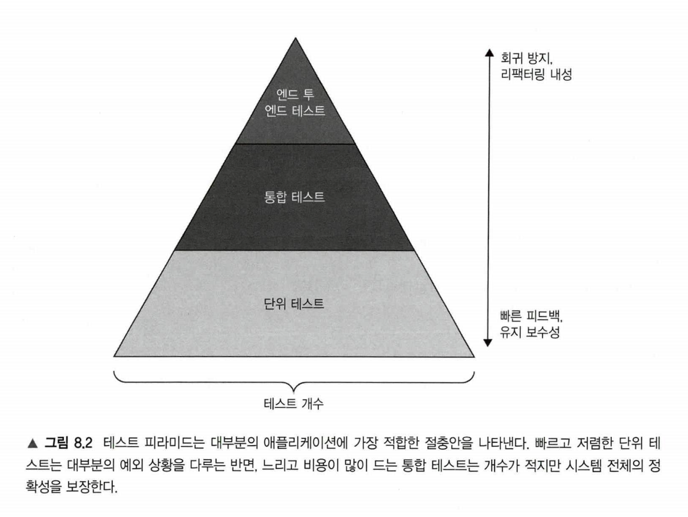
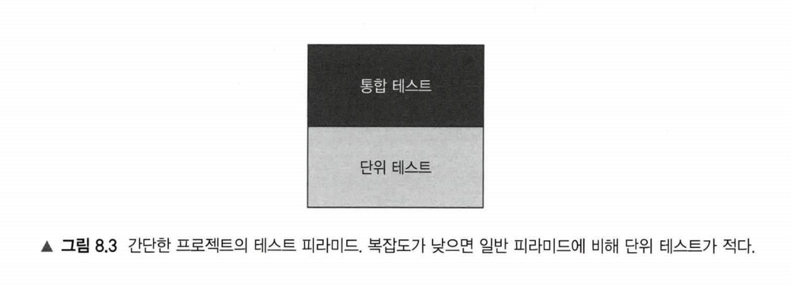
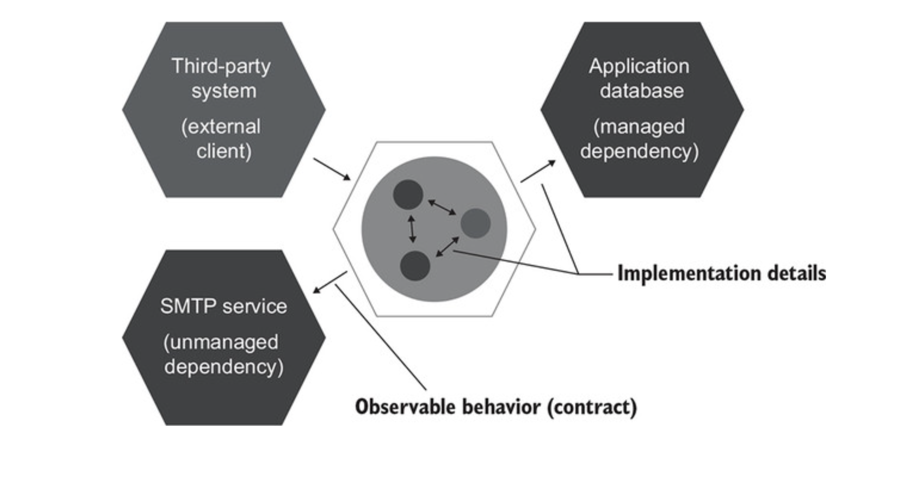
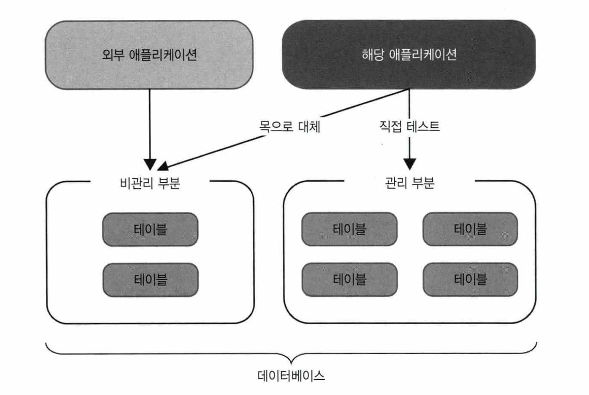
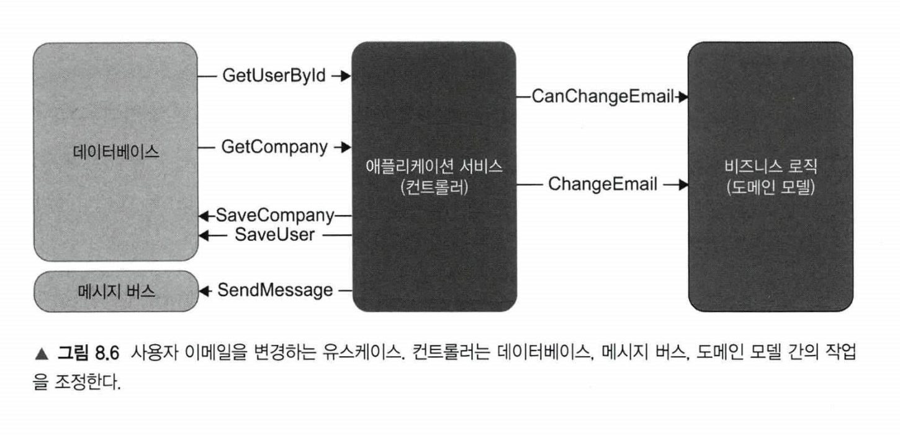

# CHAPTER 8. 통합 테스트를 하는 이유

**TL;DR**

<br/><br/>

---

<br/>

## 1. 통합 테스트는 무엇인가?


통합 테스트
: 단위 테스트 세가지 요구 사항 중 하나라도 충족하지 못하는 테스트

단위 테스트는 다음 세 가지 요구 사항을 충족하는 테스트
- 단일 동작 단위를 검증
- 빠르게 수행
- 다른 테스트와 별도로 처리

→ 컨트롤러 사분면에 속하는 코드

<table style="text-align: center;">
<tr>
    <td></td>
    <td colspan="2"><b>협력자 수</b><br/>
</tr>
<tr>
    <td rowspan="2"><b>복잡도 및 도메인 유의성</b></td>
    <td>도메인 모델 및 알고리즘<br/>- 단위 테스트</td>
    <td>지나치게 복잡한 코드<br/>- 테스트 X</td>
</tr>
<tr>
    <td>간단한 코드<br/>- 테스트 X</td>
    <td><b>컨트롤러</b><br/>- 통합 테스트</td>
</tr>
</table>

<br/>

### 1.2 다시 보는 테스트 피라미드

- 단위 테스트와 통합 테스트 간의 균형을 유지하는 것이 중요

통합 테스트 **단점 - 유지비**
- 프로세스 외부 의존성 운영이 필요함
- 관련된 협력자가 많아서 테스트가 비대해짐

통합 테스트 **장점**
- 코드를 더 많이 거치며 회귀 방지가 단위 테스트보다 우수
- 제품 코드와의 결합도가 낮아 리팩터링 내성 우수

<br/>

**단위 테스트와 통합 테스트의 비율 (필자 경험 기반)**

✔️ **단위 테스트** - 가능한 한 많이 비즈니스 시나리오의 예외 상황을 확인

✔️ **통합 테스트** - 주요 흐름 _happy path_ 과 단위 테스트가 다루지 못하는 기타 예외 상황 edge case을 다룸

<br/>

<pre><b>주요 흐름</b> <i>happy path</i>: 시나리오의 성공적인 실행
<b>예외 상황</b> <i>edge case</i>: 비즈니스 시나리오 수행 중 오류 발생의 경우</pre>

<br/>
<table>
<tr>
<th>테스트 피라미드</th>
<th>간단한 프로젝트의 테스트 피라미드</th>
</tr>
<tr>
<td></td>
<td></td>
</tr>
</table>
<br/>

### 1.3 통합 테스트와 빠른 실패

- 통합 테스트에서 프로세스 외부 의존성과의 상호작용을 모두 확인하려면 가장 긴 주요 흐름을 선택하라.
- 모든 상호작용을 거치는 흐름이 없으면, 외부 시스템과의 통신을 모두 확인하는 데 필요한 만큼 통합 테스트를 추가로 작성하라.

```java
public void changeEmail(String newEmail, Company company){
    assert canChangeEmail() == null;

    /* the rest of the method */
}
```

```java
// UserController
public String changeEmail(int userId, String newEmail) {
    object[] userData = _database.getUserById(userId);
    User user = UserFactory.create(userData);

    String error = user.canChangeEmail();
    if (error != null)
        return error;

    /* the rest of the method */
}
```

단위 테스트로 User의 Pre-condition을 체크하는 것을 지향하고, 
통합테스트, 즉 컨트롤러에서 CanChangeEmail()을 호출하는 것을 지양하라.

<br/>

**빠른 실패 원칙** _Fast Fail principle_
: 예기치 않은 오류가 발생하자마자 현재 연산을 중단하는 것

- **피드백 루프 단축** _Shortening the feedback loop_: 버그를 빨리 발견할수록 더 쉽게 해결할 수 있음. 이미 운영 환경으로 넘어온 버그는 개발 중에 발견된 버그보다 수정 비용이 훨씬 더 큼
- **지속성 상태 보호** _Protecting the persistence state_: 버그는 애플리케이션 상태를 손상시키며, 데이터베이스까지 도달하면 고치기 훨씬 어려움

<br/>

## 2. 어떤 프로세스 외부 의존성을 직접 테스트해야 하는가?

통합 테스트는 시스템이 프로세스 외부 의존성과 어떻게 통합되는지를 검증함

<br/>

### 2.1 두 가지 유형의 외부 의존성


<br/><br/>

- 관리 의존성 통신은 구현 세부사항: 통합 테스트에서 해당 의존성을 그대로 사용하라 (_use such dependencies as-is_)
- 비관리 의존성 통신은 시스템의 식별할 수 있는 동작임
- 해당 의존성은 목으로 대체 해야함

<table>
<tr>
<td></td>
<th>관리 의존성</th>
<th>비관리 의존성</th>
</tr>
<tr>
<td>Feature</td>
<td>

: 전반적인 제어가 가능한 프로세스 외부 의존성

- 애플리케이션을 통해서만 접근 가능
- 의존성과 상호작용 확인 불가능 _not visible_

</td>
<td>

: 전반적인 제어가 불가능한 프로세스 외부 의존성

- 의존성과 상호작용을 확인 가능 _observable_

</td>
</tr>
<tr>
<td>Example</td>
<td>

- 데이터베이스

</td>
<td>

- SMTP 서버, 메시지 버스

</td>
</tr>
<tr>
<td>communications</td>
<td>관리 의존성과의 통신: 구현 세부 사항</td>
<td>비관리 의존성과의 통신: 시스템의 식별할 수 있는 동작</td>
</tr>
<tr>
<td><b>⭐️ How to test</b></td>
<td>실제 인스턴스 사용</td>
<td>목 사용</td>
</tr>
</table>

<br/>

### 2.2 관리 의존성이면서 비관리 의존성인 프로세스 외부 의존성 다루기

관리 의존성과 비관리 의존성 모두의 속성을 나타내는 프로세스 외부 의존성

- ex. 다른 애플리케이션이 접근 할 수 있는 데이터베이스
    - 시스템은 전용 데이터베이스로 시작
    - 이내 다른 시스템이 같은 데이터베이스의 데이터를 요구하기 시작
    - 따라서 그 팀은 단지 다른 시스템과 쉽게 통합할 수 있도록 일부 테이블만 접근 권한을 공유하기로 결정
    - 데이터베이스는 관리 의존성이면서 비관리 의존성


-> 관리 포인트가 많아지는 것보다, API(동기식 통신) 나 메시지 버스(비동기식 통신) 를 사용하는 것이 더 나음
- 다른 애플리케이션에서 볼 수 있는 테이블을 비관리 의존성으로 취급하라
    - 이러한 테이블은 사실상 메시지 버스 역할을 하고, 각 행이 메시지 역할

<br/><br/>

**꼭 필요한 경우가 아니라면 시스템이 해당 테이블과 상호 작용하는 방식을 변경하지 말라!**
- 다른 애플리케이션이 이러한 변경에 어떻게 반응하는지 알 수 없음

<br/>

### 2.3 통합 테스트에서 실제 데이터베이스를 사용할 수 없다면?

데이터베이스를 그대로 테스트할 수 없으면 통합 테스트를 아예 작성하지 말고 도메인 모델의 단위 테스트에만 집중

<br/>

### 3. 통합 테스트: 예제

**CRM 시스템**
&#x3A; 데이터베이스에서 사용자 & 회사 검색, 의사결정을 도메인 모델에 위임한 다음, 결과를 데이터베이스에 다시 저장, 필요한 경우 메시지버스에 메시지를 보냄

<br/><br/>

<br/>

### 3.1 테스트 시나리오 결정

통합테스트에 대한 일반적인 지침은 가장 긴 주요 흐름과 단위 테스트로는 수행 할 수 없는 모든 예외 상황을 다루는 것

**CRM 프로젝트** → 가장 긴 주요 흐름은 기업 이메일에서 일반 이메일로 변경하는 것
  1. 데이터베이스에서 사용자 & 회사 모두 업데이트 됨
    - 유저는 자신의 이메일, 그리고 타입을 '기업 → 일반'으로 변경
  2. 메시지 버스 사용

단위 테스트로 테스트 하지 않는 한 가지 예외 상황이 있는데, 바로 이메일을 변경할 수 없는 시나리오

```java
public void changing_email_from_corporate_to_non_corporate()
```

<br/>

### 3.2 데이터베이스와 메시지 버스 분류

통합테스트를 작성하기 전, 프로세스 외부 의존성을 두 가지로 분류해서 **실제 인스턴스를 사용 할 대상**과 **목**으로 대체할 대상을 결정해야 함

**#1. 데이터베이스: 실제 인스턴스 사용**

1. 데이터베이스에 사용자와 회사를 삽입
2. 데이터베이스에서 이메일 변경 시나리오를 실행
3. 데이터베이스 상태 검증

<br/>

**#2. 메시지 버스**
- 메시지 버스의 목적은 다른 시스템과의 통신을 가능하게 하는 것뿐
- 통합 테스트는 메시지 버스를 목으로 대체하고 컨트롤러와 목 간의 상호작용을 검증

<br/><br/>

