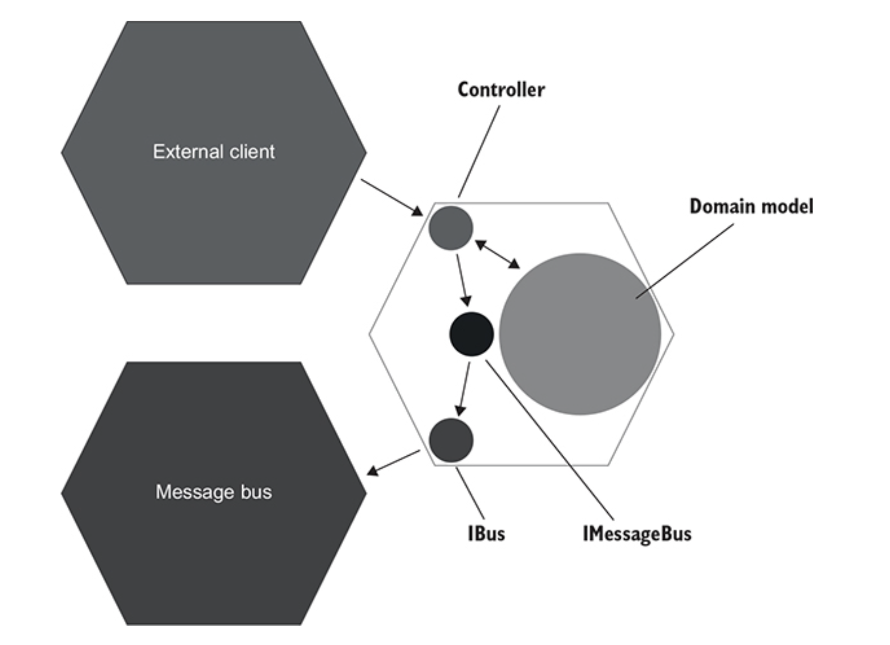

# CHAPTER 9. 목 처리에 대한 모범 사례

**TL;DR**

<br/><br/>

---

<br/>

**Mock**
- 테스트 대상 시스템과 의존성간의 상호작용을 모방하고 검사하는데 도움이 되는 테스트 대역 (5장 참고)
- 비관리 의존성 (외부 애플리케이션에서 식별할 수 있음) 에만 적용해야 함 (8장 참고)

<br/>

## 1. 목의 가치 극대화하기

CRM 유스케이스: 이메일 변경 

이제 진단 로깅은 없고, 지원 로깅 (IDomainLoger 인터페이스)만 남은 상태

<br/>

### 1.1 시스템 끝에서 상호 작용 검증하기

- 목을 사용할 땐, 시스템 끝에서 비관리 의존성과의 상호작용을 검증하라

- `MessageBus`, `IBus` 인터페이스: 둘 다 프로젝트 코드베이스에 속함
- `IBus`: 메시지 버스 SDK 라이브러리 위에 있는 래퍼 wrapper
  - 연결 자격 증명과 같이 꼭 필요하지 않은 기술 세부사항을 캡슐화
  - 임의의 텍스트 메시지를 메시지 버스로 보낼 수 있음

<br/>

<br/><br/>

- 육각형 아키텍처 관점에서 본 `IBus` 와 `IMessageBus`의 위치
- `IBus`는 컨트롤러와 메시지 버스 사이의 타입 사슬에서 마지막 고리이며, `IMesageaus`는 중간


```csharp
[Fact]
public void Changing_email_from_corporate_to_non_corporate() {
    var busMock = new Mock<IBus>();
    var messageBus = new MessageBus(busMock.Object);       // 인터페이스 대신 구체 클래스 사용
    var loggerMock = new Mock<IDomainLogger>();
    var sut = new UserController(db, messageBus, loggerMock.Object);

    /* ... */

    busMock.Verify(
        x => x.Send("Type: USER EMAIL CHANGED; Id: {user.UserId}; NewEmail: new@gmail.com"), // // 메시지 버스로 보낸 실제 메시지 검증                    
        Times.Once);
}
```

**이전 버전**
```csharp
messageBusMock.Verify(
    x => x.SendEmailChangedMessage(user.UserId, "new@gmail.com"),
    Times.Once);
```

- 사용자 정의 클래스에 대한 호출 검증 vs 외부 시스템에 전송한 실제 텍스트
  - 외부 시스템은 애플리케이션으로 부터 텍스트 메시지를 수신하고, MessageBus와 같은 클래스를 호출하지 않음

  - 이러한 메시지를 생성하는데 참여하는 클래스는 단지 구현 세부 사항일 뿐
- **시스템 끝에서 상호작용을 확인하면 회귀 방지가 좋아질 뿐만 아니라 리팩터링 내성도 향상됨**

- 비관리 의존성에 대한 호출은 애플리케이션을 떠나기 전에 몇 단계를 거치며, 마지막 단계를 선택하는 것이 좋음
  - 외부 시스템과의 하위 호환성을 보장하는 가장 좋은 방법이며, 하위 호환성은 목을 통해 달성할 수 있는 목표임

<br/>

### 1.2 Mock을 Spy로 대체하기 

- **Spy**: Mock과 같은 목적을 수행하는 테스트 대역
  - 수동으로 작성하는 반면에 Mock은 Mock 프레임워크의 도움을 받아 생성한다는 것이 유일한 차이점
  - 실제로 Spy는 종종 직접 작성한 Mock

Example. IBus 위에서 작동하는 Spy

<table>
<tr><td>IBus</td><td>Spy</td><td>Test</td></tr>
<tr>
<td>

```csharp
public interface IBus {
    void Send(string message);
}
```

</td>
<td>

```csharp
public class BusSpy : IBus {
    private List<string> _sentMessages = new List<string>();

    public void Send(string message) {
        _sentMessages.Add(message);                // 전송된 모든 메시지를 로컬에 저장
    }

    public BusSpy ShouldSendNumberOfMessages(int number) {
        Assert.Equal(number, _sentMessages.Count);
        return this;
    }

    public BusSpy WithEmailChangedMessage(int userId, string newEmail) {
        string message = "Type: USER EMAIL CHANGED; " +
            $"Id: {userId}; " +
            $"NewEmail: {newEmail}";
        Assert.Contains(_sentMessages, x => x == message);    // 전송 메시지 검증

        return this;
    }
}
```

</td>
<td>

```csharp
[Fact]
public void Changing_email_from_corporate_to_non_corporate() {
    var busSpy = new BusSpy();
    var messageBus = new MessageBus(busSpy);
    var loggerMock = new Mock<IDomainLogger>();
    var sut = new UserController(db, messageBus, loggerMock.Object);

    /* ... */

    busSpy.ShouldSendNumberOfMessages(1)
        .WithEmailChangedMessage(user.UserId, "new@gmail.com");
}
```

</td>
</tr>
</table>
<br/><br/>


- `BusSpy` 와 `MessageBus`: 모두 `IBus` Wrapper
  - `BusSpy`: 테스트 코드
  - `MesageBus`: 제품 코드

<br/>

### 1.3  IDomainLogger는 어떤가?

`DomainLogger`는 `ILogger` 위의 래퍼

```csharp
// Bus 상호 작용 확인
busSpy.ShouldSendNumberOfMessages(1).WithEmailChangedMessage(user.UserId, "new@gmail.com");

loggerMock.Verify(
    // IDomainLogger 상호 작용 확인 
    x => x.UserTypeHasChanged(user.UserId, UserType.Employee, UserType.Customer),
    Times.Once);    
```

- 메시지 버스를 사용하면 외부 시스템이 이러한 변경에 어떻게 반응하는 지 알 수 없으므로 메시지 구조를 변경하지 않는 것이 중요
- 중요한 것은 로그가 있다는 사실과 로그에 있는 정보
- 따라서 `IDomainLogger` 만 목으로 처리해도 보호 수준은 충분
