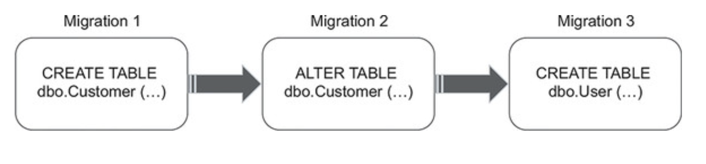

# CHAPTER 10. 데이터베이스 테스트

**TL;DR**


<br/><br/>

---

<br/>

## 1 데이터베이스 테스트를 위한 전제 조건


## 1.1 데이터베이스를 형상 관리 시스템에 유지

**데이터베이스를 테스트하는 첫 번째 단계**
&#x3A; 데이터베이스 스키마를 일반 코드로 취급하는 것
- 데이터베이스 스키마를 형상 관리 시스템 *source control system*에 저장
- 모델 데이터베이스 사용은 데이터베이스 스키마 유지에 좋지 못함
  - **이유 1. No change history** _변경 내역 부재_
    - 데이터 베이스 스키마를 과거 특정 시점으로 되돌릴 수 없음
    - **특정 시점 복귀는 운영 환경의 버그 재현 시 중요**
  - **이유 2. No single source of truth** _복수 원천 정보_
    - 어떤 코드가 해당 시점에 맞는 source 인지 알기 어려움 (_competing source of truth_)
    - Git + Model Database 의 두개의 소스로 관리 상 부담

<br/>

### 1.2 참조 데이터 또한 '데이터베이스 스키마'

- Database schema
  - Tables
  - Views
  - Indexes
  - Stored procedures
  - 구성 설정에 대한 blueprint 관련 내용
  - **\+ 참조 데이터** _reference data_

<br/>

<pre>
✔️ <b>참조 데이터</b> <i>reference data</i>
: 애플리케이션이 제대로 작동하도록 미리 채워야 하는 데이터

<i>vs. 일반 데이터</i>: 애플리케이션이 데이터 수정 가능. (참조 데이터는 불가능)

- 애플리케이션 필수 사항
- 테이블, 뷰, 그리고 다른 데이터베이스 스키마와 함께 SQL INSERT 문 형태로 형상 관리 시스템에 저장해야 함
- 참조/일반 데이터가 종종 동일한 테이블에 공존할 수도 있는데, 수정 가능/불가능 플래그를 두고 참조 데이터를 변경하지 못하게 해야 함
</pre>

<br/>

### 1.3 모든 개발자를 위한 별도의 데이터베이스 인스턴스

- 개발자 (머신) 별 데이터베이스 인스턴스를 사용해야 함
- 실제 데이터베이스로 테스트하는 것은 어려움, 특히 다른 개발자들과 공유해야 할 때
  - 서로 다른 개발자가 실행한 테스트는 서로 간섭됨
  - 하위 호환성이 없는 변경으로 다른 개발자의 작업을 막을 수 있음

<br/>

### 1.4 상태 기반 데이터베이스 배포와 마이그레이션 기반 데이터베이스 배포


<table>
<tr>
<td></td>
<td><b>상태 기반</b><i>The state-based approach</i></td>
<td><b>마이그레이션 기반</b><i>The migration-based approach</i></td>
</tr>
<tr>
<th>Feature</th>
<td>

- 데이터베이스 생성: 형상 관리되는 SQL 스크립트 (모델 데이터베이스 X) 
- 배포 중 비교 도구가 스크립트 생성 후 운영 데이터베이스를 모델 데이터베이스와 비교해 최신 상태로 유지
- 비교 도구: 불필요한 테이블 삭제 / 새 테이블 생성 / 컬럼 명 변경 등의 모델 데이터베이스와 동기화

</td>
<td>



- 특정 번전으로 전환하는 명시적인 마이그레이션
- 데이터 모션 _data motion_ 문제 해결
- ex. flyway

</td>
</tr>
<tr>
<th>형상 관리 대상</th>
<td>
데이터베이스를 작성하는 데 사용할 SQL 스크립트 <br/>
<small>개발 내내 유지 보수하는 모델 데이터베이스를 생성</small>
</td>
<td>
마이그레이션 SQL 스크립트 (데이터베이스 상태 X)
</td>
</tr>
<tr>
<th>데이터베이스 상태</th>
<td>✅ 명시적 Explicit</td>
<td>✅ 암묵적 Implicit</td>
</tr>
<tr>
<th>마이그레이션 메커니즘</th>
<td>✅ 암묵적 Implicit</td>
<td>✅ 명시적 Explicit</td>
</tr>
</table>

<pre>
<b>데이터 모션<b> <i>Data motion</i>
: 새로운 데이터베이스 스키마를 준수하도록 기존 데이터의 형태를 변경하는 과정
</pre>

<br/>

## 2. 데이터베이스 트랜잭션 관리

### 2.1 제품 코드에서 데이터 베이스 트랙잭션 관리

샘플 CRM 프로젝트:
- Database 클래스를 사용해 User 와 Company 관련 작업 수행
- Database는 각 메서드 호출에서 별도의 SQL 연결을 생성

```csharp
public class Database {
    private readonly string _connectionString;

    public Database(string connectionString) {
        _connectionString = connectionString;
    }

    public void SaveUser(User user) {
        bool isNewUser = user.UserId == 0;
        // 데이터 베이스 트랜잭션 사용
        using (var connection = new SqlConnection(_connectionString)) {
            /* Insert or update the user depending on isNewUser */
        }
    }

    public void SaveCompany(Company company) {
        // 데이터 베이스 트랜잭션 사용
        using (var connection = new SqlConnection(_connectionString)) {
            /* Update only; there's only one company */
        }
    }
}

```

<br/>

**User controller**는 단일 비즈니스 연산 간에 **총 네개의 데이터 베이스 트랜잭션 생성**

<pre><code lang="csharp">
public string ChangeEmail(int userId, string newEmail) {
     <b>object[] userData = _database.GetUserById(userId);</b>
     User user = UserFactory.Create(userData);

    string error = user.CanChangeEmail();
    if (error != null)
        return error;

    <b>object[] companyData = _database.GetCompany();
    Company company = CompanyFactory.Create(companyData);

    user.ChangeEmail(newEmail, company);

    _database.SaveCompany(company);
    _database.SaveUser(user);</b>
    _eventDispatcher.Dispatch(user.DomainEvents);

    return "OK";
}
</code></pre>

읽기 연산은 여러 트랜잭션을 열어도 되지만, 비즈니스 연산에 데이터 변경이 포함되면 
해당 연산에 포함된 모든 업데이트 값이 원자적으로 실행되어야 함

<br/>

**데이터베이스 트랜잭션에서 데이터베이스 연결 분리**

- 잠재적인 모순 방지를 위한 
  - 


<br/><br/>