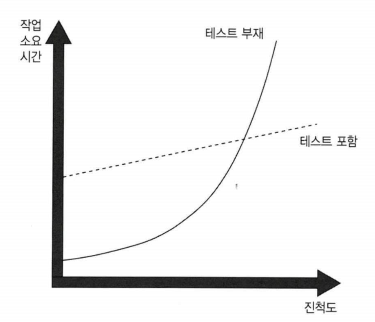

# Chapter1 단위 테스트의 목표

# 1.1 단위 테스트 현황

**현황**

- 단위 테스트가 필수로 자리잡기 시작함
- 기업용 애플리케이션에는 대부분 `단위 테스트` 및 `통합 테스트` 적용 후 좋은 `커버리지` 를 유지중
- 제품 코드와 테스트 코드의 비율은 1:1 에서 1:3 까지 때로는 1:10 까지 유지하는 수준
- 단위 테스트를 작성 해야 하는가? → `좋은 단위 테스트를 작성하는 것은 어떤 의미인가?`

**기업용 애플리케이션의 정의**

- 높은 비즈니스 복잡도
- 긴 프로젝트 수명
- 중간 크기의 데이터
- 낮은 수준이나 중간 수준 정도의 성능 요구

# 1.2 단위 테스트의 목표

**장점**

- 소프트웨어 프로젝트의 지속 가능한 성장을 가능하게 하는 것
- 테스트는 안정망 역할을 해줌
- 테스트는 새로운 기능을 도입하거나 리팩터링 한 후에도 기존 기능이 잘 동작하는지 확인하는데 도움을 줌

**단점**

- 초반에 노력이 많이 필요함

- 처음에는 테스트코드가 발목을 잡아 개발속도가 느림
- 시간이 지나면서 코드베이스가 커지고 프로젝트가 방대해지면서 개발 속도가 느려짐
- 개발 속도가 감소하는 현상을 `엔트로피` 라고도 함

## 1.2.1 좋은 테스트와 좋지 않은 테스트를 가르는 요인

**잘못된 테스트**

- 나쁜 테스트여도 도움은 되지만 추후에는 테스트 부재와 동일하게 변경된다.
- 잘못된 경고가 발생할 수 있다.
- 희귀 오류를 알아내는데 도움이 되지 않는다.
- 유지보수가 어렵고 느려진다.
- 프로젝트의 도움이 되는지 여부에 상관없이 단위 테스트를 작성하는 습관이 생길 수도 있다. 
(테스트 코드를 작성하기 위한 프로덕션 코드 변경)

**어떤 방향성을 가져야 하나?**

- 기반 코드를 리팩터링할 떄 테스트코드도 리팩터링 하라
- 각 코드 변경 시 테스트를 진행 하라
- 테스트가 잘못된 경고를 발생시킬 경우 처리하라
- 기반 코드가 어떻게 동작하는지 이해하려고 할 때는 테스트를 읽는 데 시간을 투자 하라.

# 1.3 테스트 스위트 품질 측정을 위한 커버리지 지표

> 커버리지 지표는 테스트 스위트가 소스 코드를 얼마나 실행하는지를 백분유롤 나타낸 지표
> 

- 일반적으로 커버리지 숫자가 높을수록 좋음
- 커버리지 지표는 중요한 피드백을 주더라도 테스트 스위트 품질을 효과적으로 측정하는데에는 사용할 수 없음
- `커버리지 지표는 괜찮은 부정 지표이지만 좋지 않은 긍정 지표다`
- 코드 커버리지가 너무 낮을경우(10%) 테스트가 충분하지 않은 좋은 증거
- 100%의 커버리지 여도 반드시 양질의 테스트 스위트라고 보장할 수 없음

## 1.3.1 코드 커버리지 지표에 대한 이해

- 라인을  `커버` 만 쳐도 커버리지가 증가함 → 좋은 테스트가 아님

## 1.3.2 분기 커버리지 지표에 대한 이해

- if, switch 같은 분기별 통과에 대한 지표

## 1.3.3 커버리지 지표에 관한 문제점

- 테스트 대상 시스템의 모든 결과를 검증한다고 보장할 수 없다.
- 외부 라이브러리의 코드 경로를 고려할 수 있는 커버리지 지표는 없다.

## 1.3.4 특정 커버리지 숫자를 목표로 하기

- 100%, 90%, 70% 숫자를 목표로 삼기 시작하면 위험 영역으로 이어질 수 있다.
- 커버리지는 지표로만 활용하고 `목표` 로 활용하지 말자

# 1.4 무엇이 성공적인 테스트 스위트를 만드는가?

- 개발 주기에 통합돼 있다.
- 코드베이스에서 가장 중요한 부분만을 대상으로 한다.
    - 인프라 코드
    - 데이터베이스나 서드파티 시스템과 같은 외부 서비스 및 종속성
    - 모든 것을 하나로 묶는 코드
- 최소한의 유지비로 최대의 가치를 끌어낸다.
    - 가치 있는 테스트(더 나아가, 가치가 낮은 테스트) 식별하기
    - 가치 있는 테스트 작성하기