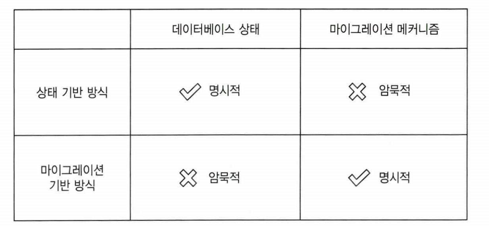

# Chapter10 데이터베이스 테스트

생성일: 2023년 9월 18일 오후 6:28
태그: 10장

---

# 10.1 데이터베이스 테스트를 위한 전제 조건

- 형상 관리 시스템에 데이터베이스 유지
- 모든 개발자를 위한 별도의 데이터베이스 인스턴스 사용
- 데이터베이스 배포에 마이그레이션 기반 방식 적용

## 데이터 베이스 형상 관리 시스템에 유지

- 스키마를 일반 코드로 취급
- 데이터베이스 스키마를 Git과 같은 형상 관리 시스템에 저장
- FlyWay

## 참조 데이터도 데이터베이스 스키마다

- 없으면 INSERT가 불가능한 메타데이터등
- insert query 자체를 형상 관리 해야함

## 모든 개발자를 위한 별도의 데이터베이스 인스턴스

- 데이터 베이스를 개발자끼리 공유하면 테스트가 어려워짐
- 서로 다른 개발자가 실행한 테스트는 서로 간섭됨
- 하휘 호환성이 없는 변경으로 다른 개발자의 작업을 막을 수 있음

## 마이그레이션 방식

- 버전으로 관리
- 1버전 → 2버전
- flyway 같은 라이브러리가 있음

## 상태 기반보단 마이그레이션 방식을 선호하라

- 상태 기반은 상태를 형상관리에 저장함으로써 상태를 명시하고 비교 도구가 마이그레이션을 암묵적으로 제어 할 수 있게 된다. (ORM???????)
- 마이그레이션 기반 방식은 마이그레이션을 명시적으로 하지만 상태를 암묵적으로 둔다.
데이터 베이스 상태를 직접 볼 수 없으며 마이그레이션으로 조합해야 한다.

- 마이그레이션은 `데이터 모션` 문제를 해결하는데 도움이 된다
- 데이터 모션은 새로운 데이터베이스 스키마를 준수하도록 기존 데이터 형태를 변경하는 과정이다.

---

# 10.3 테스트 데이터 생면 주기

- 통합 테스트를 순차적으로 실행하라.
- 테스트 실행 간에 남은 데이터를 제거하라.
- `스프링에서는 테스트에서 트랜잭션을 붙이면 모든 데이터가 롤백 된다`

## 인메모리 데이터베이스 피하기

**장점**

- 테스트 데이터를 제거할 필요가 없음
- 작업 속도 향상
- 테스트가 실행될 때마다 인스턴스화 가능

**사용하면 안되는 이유**

- 일반 데이터베이스와 기능적으로 일관성이 없다.
- 운영환경과 테스트 환경이 일치 하지 않는다.
- 일반 데이터베이스와 인메모리 데이터베이스의 차이로 거짓 양성이 발생할 수 있다.

---

# 10.4 테스트 구절에서 코드 재사용하기

- 비즈니스와 관련 없는 기술적인 부분을 헬퍼 클래스로 추출하라
- 준비 구절에 필요한 공통 코드를 메서드로 분리하라.
- 도움을 주는 클래스는 아래와 같은 방향으로 위치를 옮겨보자
    - 가장 단순하게 해당 기능이 필요한 테스트 클래스에 둬라
    - 코드 복제가 되어 다양한 곳에서 공통적으로 사용할 경우 헬퍼 클래스로 이동 시켜라
    

---

# 10.5 데이터베이스 테스트에 대한 일반적인 질문

- 쓰기 테스트는 철저히 해라
    - 위험성이 높다 쓰기가 잘못되면 데이터가 손상되어 외부까지 영향을 미친다.
- 읽기는 중요한 작업만 테스트하고 나머지는 무시하라.

## 리포지터리 테스트를 해야하는가?

- 리포지터리는 직접 테스트 하지말고 통합테스트에서 포괄적으로 테스트 하라.

---

# 정리