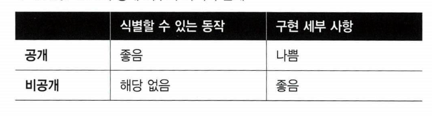

# Chapter11 단위 테스트 안티 패턴

생성일: 2023년 10월 4일 오후 3:58
태그: 11장

---

# 11.1 비공개 메서드 단위 테스트

## 비공개 메서드와 테스트 취약성

- 단위 테스트를 위해 비공개 메서드를 노출하면 식별할 수 있는 동작만 테스트 하는 원칙을 위반함
- 비공개 메서드를 노출하면 리팩터링 내성이 떨어짐
- 비공개 메서드를 테스트 하는 대신 포괄적인 식별할 수 있는 동작으로 테스트 하는 것이 좋음

## 비공개 메서드와 불필요한 커버리지

- 비공개 메서드가 너무 복잡하면 동작으로 테스트하기에 충분한 커버리지를 못 얻을 수도 있음
- 다음과 같은 문제점이 있을 수 있음
    - 죽은 코드다 → 삭제하는 것이 좋음
    - 추상화가 누락돼 있다. 비공개 메서드가 너무 복잡하면 별도의 클래스로 도출해야 하는 추상화가 누락됐다는 징후

## 비공개 메서드 테스트가 타당한 경우



- 식별 가능한 동작 → 공개
- 구현 세부 사항 → 비공개
- 구현 세부 사항이 유출되면 캡슐화를 해친다.

---

# 11.2 비공개 상태 노출

- 단위 테스트 목적으로만 비공개 상태를 노출하는 것은 안티 패턴이다.

---

# 11.3 테스트로 유출된 도메인 지식

- 도메인 지식을 테스트로 유출하는 것은 또 하나의 흔한 안티패턴이다
- 복잡한 알고리즘을 다루는 테스트에서 자주 질일어난다

```java
class Caluclator {
	
	public static int add(int value1, int value2) {
		return value1 + value2;
	}

}

class CaluclatorTests {
		
		@Test
		public void addingTwoNumbers() {
			int value1 = 1;
			int value2 = 2;
			
			int expected = value1 + value2; // 유출

			int actual = Calculator.add(value1, value2);

			Assert.Equal(expected, actual);
		}

		@Test
		@ParameterizedTest
    @CsvSource(value = {"1:2:3"}, delimiterString = ":")
		void addingTowNumbers(int value1, int value2, int expected) {

			int actual = Calculator.add(value1, value2);
			Assert.equal(expected, actual);
		}
}
```

- 구현 코드를 코드 내부에서 계산해서 사용중 안티 패턴이다.
- 단위테스트에서는 예상 결과를 하드코딩 하는 것이 좋다.
- `구현 방식을 유출 하지 말라는 뜻`

---

# 11.6 시간 처리하기

- 시간에 따라 기능이 달라지면 거짓 양성이 발생할 수 있다.

## 앰비언트 컨텍스트로서의 시간

```jsx
public static class DateTimeServcer {

	private static Func<DateTime> _func;
	public static DateTime now => _func();

	public static void init(Func<DateTime func) {
			_func = func;
	}
}

DateTimeServer.Init(() => DateTime.Now); // 운영 초기화 코드
DateTimeService.Init(() => new DateTime(2020,1,1)); // 단위 테스트 환경 초기화 코드
```

- 앰비언트 컨텍스트는 제품 코드를 오염시킴
- 정적 필드는 테스트 간에 공유하는 의존성을 도입해 해당 테스트를 통합 테스트 영역으로 전환한다.

## 명시적 의존성으로서의 시간

```jsx
public interface IDateTimeServer {
	DateTime now {get;}
}

public class DateTimeServer : IDateTimeServer {
	public DateTime now => DateTime.now;
}

public class InquiryController {
	private readonly IDateTimeServer _dateTimeServer;

	public InquiryController(IDateTimeServer dateTimeServer) {
			_dateTimeServer = dateTimeServer;
	}
		
	public void approveInquiry(int id) {
			Inquiry inquiry = GetById(id);
			inquiry.approve(_dateTimeServer.Now); // 시간을 일반 값으로 주입
			saveInquiry(inquiry);
	}

}

```

- 시간을 값으로 주입하는게 더 낫다

---

# 요약

- 단위 테스트를 가능하게 하고자 비공개 메서드를 노출하게 되면 구현에 결합되고
결국 리팩터링 내성이 떨어진다. 비공개 메서드를 직접 테스트하는ㄷ ㅐ신 
식별할 수 있는 동작으로서 간접적으로 테스트하라.
- 비공개 메서드가 너무 복잡해서 공개API로 테스트 할 수 없다면, 추상화가 누락됐다는 뜻이다.
별도의 클래스로 추출하라
- 드물지만 비공개 메서드가 클래스의 식별할 수 있는 동작에 속한 경우가 있따.
보통 클래스와 ORM 또는 팩토리 간의 비공개 계약을 구현하는 것이 여기에 해당한다.
- 비공개였던 상태를 `단위 테스트만을 위해 노출하지 말라` 테스트는 제품 코드와 같은 방식으로
테스트 대상 시스템과 상호작용해야 한다.
- 테스트를 작성할 때 특정 구현을 암시하지말라.
도메인 지식을 테스트에 유출하지 않도록 하라
- 기능을 지키려고 구체 클래스를 목으로 처리해야 하면, 이는 단일책임 원칙 위반이다.
해당 클래스를 두가지 클래스 도메인 로직이 있는 클래스와 프로세스 외부 의존성과 통신하는 클래스로 분리하라