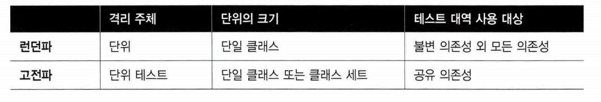

# Chapter2 단위 테스트란 무엇인가

# 2.1 단위 테스트의 정의

- 작은 코드 조각(단위라고도 함)을 검증함
- 빠르게 수행함
- 격리된 방식으로 처리하는 자동화된 테스트
    - 고전파
        - 디트로이트 접근법이라고도 하며, 대표적으로 켄트 백의 `테스트 주도 개발`
    - 런던파
        - 목 추종자로 표현됨

## 2.1.1 격리 문제에 대한 런던파의 접근

- 코드 조각(단위)을 격리된 방식으로 검증한다 → 테스트 대상 시스템을 `협력자` 에게서 격리
- `협력자` 를 테스트 대역으로 대체함
- 클래스에 해당하는 단위 테스트 클래스를 생성하라 (Mock) -

**Mock & Stub & 테스트 대역**

- Mock은 테스트 대역의 부분 집합
- 테스트 대역은 실행과 관련 없이 모든 종류의 가짜 의존성을 설명하는 포괄적 용어
- 목은 테스트 대역의 의존성중 한 종류일 뿐

## 2.1.2 격리 문제에 대한 고전파의 접근

- 단위 테스트를 격리함
- 단위 테스트 끼리 영향을 안주면 몇개를 동시에 테스트 해도 상관 없음
- 공유 의존성을 테스트 대역으로 대체함
    - 테스트 간에 공유되고 서로 결과에 영향을 미칠 수 있는 수단을 제공하는 의존성
    - static mutable field
    - 데이터베이스

# 2.2 단위 테스트의 런던파와 고전파

## 2.2.1 고전파와 런던파가 의존성을 다루는 방법

- 절대 변하지 않는 객체, 불변 객체는 교체하지 않아도됨

- 특정 값을 반환하는 API를 변경하는 기능을 노출하지 않는 한 공유 의존성이 아님
- 이러한 의존성을 테스트 범주에 포함해야할 필요는 없음
- 외부 의존성이 빠르고 연결이 안정적이면 테스트에 사용하도됨
- 대부분 실제 프로젝트에선 외부가 아닌 공유 의존성은 거의 없음

# 2.3 고전파와 런던파의 비교

- 고전파와 런던파간의 주요 차이는 단위 테스트의 정의에서 격리 문제를 어떻게 다루는지에 있음
- 테스트해야 할 단위의 처리와 의존성 취급에 대한 방법
- 저자는 고전파를 좋아함(tmi)

## 한 번에 한 클래스만 테스트하기

- 런던파는 클래스를 단위로 간주
- 객체지향 프로그래밍 개발자들은 모든 코드베이스의 기초가 클래스 → 오해의 소지가 생길 수 있음
- 좋은 코드 입자성을 목표로 하는 것은 도움이 안됨
- 단일 `동작` 단위를 검증하는 한 좋은 테스트

> 테스트는 코드의 단위를 검증해서는 안됨
비즈니스 담당자가 유용하다고 인식할 수 있는 것을 검증해야함
> 

## 고전파와 런던파 사이의 다른 차이점

- 테스트 주도 개발을 통한 시스템 설계 방식
- 과도한 명세 문제

### 런던 스타일

- 단위 테스트는 하향식 TDD
- 전체 시스템에 대한 기대치를 설정하는 상위 레벨부터 시작
- 목을 사용해 예쌍 결과를 달성하고자 시스템이 통신해야 하는 협력자를 설정

### 고전파

- 일반적으로 상향식
- 도메인 모델 시작 → 최종 사용자가 소프트웨어를 사용할 수 있을 때 까지 계층을 위에 더둠

# 2.4 두 분파의 통합 테스트

**단위 테스트**

- 단일 동작 단위를 검증하고
- 빠르게 수행하고
- 다른 테스트와 별도로 처리한다.

통합 테스는 위의 기준중 하나를 충족하지 못함

**통합 테스트**

- 공유 의존성에 접근하는 테스트는 다른 테스트와 분리해 실행할 수 없다.
- 둘 이상의 동작 단위를 검증할 때의 테스트는 통합 테스트다.
- 통합 테스트는 프로세스 외부 의존성을 필요로 하므로 단위 테스트를 전부 충족하지 못함
- `엔드 투 엔드` 테스트도 통합 테스트의 일부

# 정리

## 단위 테스트

- 단일 동작 단위를 검증
- 빠르게 수행함
- 다른 테스트와 별도로 처리

## 격리 문제

- 고전파
    - 단위 테스트를 서로 분리해야 함
    - 동작 단위로 분리함
    - 공유 의존성만 테스트 대역으로 대체해야함
- 런던파
    - 테스트 대상 단위를 서로 분리해야 함
    - 코드의 단위, 단일 클래스, 불변 의존성을 제외한 모든 의존성을 테스트 대역으로 대체해야함

## 통합 테스트

- 단위 테스트 기준 중 하나를 충족하지 못하는 테스트
- 엔드 투 엔드 테스트는 통합 테스트으 ㅣ일부 ( 최종 사용자 관점에서 시스템을 검증함 )
- 엔드 투 엔드 테스트는 애플리케이션과 함꼐 동작하는 외부 의존성의 전부 또는 대부분 접근함

## 나는 평소에 테스트를 어떻게 하는가?

- 테스트를 행동으로 보지 않고 클래스 및 메소드 별로 분리함
- 행동으로 볼 떄도 있긴 하지만 보통 하나의 메소드 = 하나의 행동으로 정의해두고 있어서 섞여진 느낌
- 모든 의존성을 Mock로 대체함
    - A Service 가 B Service 를 의존하면 BService 는 Mock 임