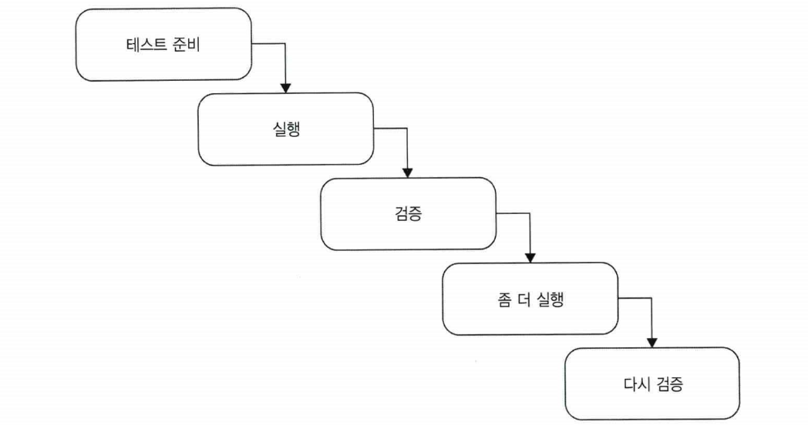

# Chapter3 단위 테스트 구조


# 3.1 단위 테스트를 구성하는 방법

- 준비
- 실행
- 검증

## AAA 패턴 사용

- 준비
    - 테스트 대상 시스템 (Sytstem Under Test)과 해당 의존성을 원하는 상태로 만듬
- 실행
    - SUT 에서 메서드를 호출하고 준비된 의존성을 전달하며 출력 값을 캡처함
- 검증
    - 결과를 검증한다.

## 여러 개의 준비, 실행, 검증 구절 피하기



- 여러개의 실행 구절, 즉 여러개의 동작 단위를 검증하는 테스트다.
- 이러한 테스트는 `통합 테스트` 다

## 테스트 내 if 문 피하기

- if문이 있는 단위 테스트 → 안티 패턴
- 단위 테스트든 통합 테스트든 테스트는 분기가 없어야 한다.

## 각 구절은 얼마나 커야 하는가?

- 준비
    - 가장 큰 구절
    - 실행과 검증을 합친것보다 클 경우 테스트 클래스 내 비공개 메서드 또는 별도의 팩토리 클래스로 도출
    - 오브젝트 마더와 테스트 데이터 빌더 패턴이 도움이됨
- 실행
    - 실행 구절이 한 줄 이상인 경우를 경계하라
    - 실행 구절은 보통 한 줄 → 두 줄 이상인 경우 SUT의 공개 API에 문제가 있을 수도 있음
- 검증
    - 하나의 테스트는 모든 결과를 평가하는 것이 좋음
    - 검증 구절이 너무 커지면 제품 코드에서 추상화가 누락 됐을 수도 있음

## 준비 실행 검증 주석 제거하기

- 테스트 내에서 특정 부분이 어떤 구절에 속해 있는지 파악하는데 동무을 주는 주석

```java
public class UserTests {

	void userSaveTest() {
		// given
		....
		
		// when
		...

		// then

		...
	}

}

public class UserTests {

	void userSaveTest() {
		
		.... <- 준비
		
		
		...  <- 실행

		

		... <- 검증
	}

}
```

- AAA 패턴을 따르고 준비 및 검증 구절에 빈 줄을 추가하지 않아도 되는 테스트라면 구절 주석들을 제거하라
- 그렇지 않으면 구절 주석을 유지하라


# 3.3 테스트 간 테스트 픽스처 재사용

1. 테스트 생성자에서 픽스처를 초기화함 (올바르지 않은), 
    1. 각 테스트가 실행 되기전에 초기화 및 준비를 함 → 안티 패턴
    2. 테스트 간 결합도가 높아짐
    3. 테스트 가독성이 떨어짐
2. 비공개 팩토리 메서드를 두는 것 (더 나은 방법)
    
     
    

## 테스트 간의 높은 결합도는 안티 패턴이다

- 테스트를 수정해도 다른 테스트에 영향을 주어서는 안된다.
- 테스트는 서로 격리 되어야 한다.
- 테스트 클래스에 `공유 상태` 를 두지 말아야 한다.

## 더 나은 테스트 픽스처 재사용법

- 비공개 팩토리 메서드를 두는 것
- 테스트 코드가 짧아짐
- 테스트 끼리 서로 결합 되지 않음
- `기초 클래스(base class)` 를 두어 상속받아 재사용


# 3.4 단위 테스트 명명법

- 엄격한 명명 정책을 따르지 않는다.
- 표현의 자유를 허용하자
- 문제 도메인에 익숙한 비개발자들에게 시나리오를 설명하는 것처럼 테스트 이름을 짓자.
- 단어를 밑줄(_) 표시로 구분한다.


# 3.5 매개변수화된 테스트 리팩터링 하기

- Parameterized test 를 활용하자
- 입력 매개 변수만으로 테스트 케이스를 판단 할 수 있다면 긍정적 부정적 테스트를 모두 하나의 메서드로 두는 것이 좋다. → 반대의 경우 긍정적인 테스트 케이스를 도출하라
- 동작이 너무 복잡하면 매개변수화된 테스트를 조금도 사용하지 말라.
저


# 정리

- 모든 단위 테스트는 AAA 패턴(준비, 실행, 검증)을 따라야 한다.
- 실행 구절이 한줄 이상이라면 SUT의 API에 문제가 있다는 뜻이다.
- SUT의 이름을 sut로 지정해 SUt 테스트에서 구별하자
구절 사이에 빈 줄을 추가하거나 준비, 실행, 검증 구절 주석을 각각 앞에 둬서 구분하라.
- 테스트 픽스처 초기화 코드는 생성자에 두지 말고 팩토리 메서드를 도입해서 재사용하자.
- 엄격한 테스트 명명 정책을 시행하지 말라
쉬운 테스트 메소드 규칙을 만들고, 테스트 대상 메서드 이름을 넣지 말라