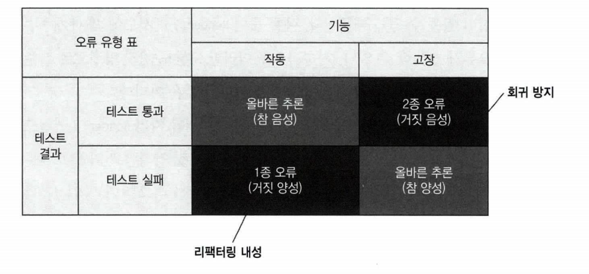

# Chapter4 좋은 단위 테스트의 4대 요소

**좋은 단위 테스트 요소**

- 회귀 방지
- 리팩터링 내성
- 빠른 피드백
- 유지 보수성

# 4.1 좋은 단위 테스트의 4대 요소 자세히 살펴보기

- 회귀 방지
- 리팩터링 내성
- 빠른 피드백
- 유지 보수성

## 회귀 방지

> 소프트웨어 버그를 방지할 수 있어야 한다는 의미
> 

**회귀 방지 평가 고려 사항**

- 테스트 중에 실행되는 코드의 양
    - 코드의 양이 많을수록 테스트 코드에서 회귀가 나타날 가능성이 높음
- 코드 복잡도 및 코드의 도메인 유의성
    - 복잡한 비즈니스 로직을 나타내는 코드가 보일러 플레이트 코드 보다 더 중요
- 단순한 코드를 테스트 하는 것은 가치가 거의 앖다
    - setter , getter
- 테스트가 가능한 한 많은 코드를 실행하는 것을 목표로 해야 함

## 리팩터링 내성

**사례**

1. 기능 개발 완료
2. 테스트 통과
3. 코드 정리 및 리팩터링
4. 기능 정상 → 테스트 코드 fail

- 이러한 상황을 거짓 양성이라고함
- 실제로 기능이 의도한 대로 작동하지만 테스트는 실패

## 무엇이 거징 양성의 원인인가?

- 테스트와 테스트 대상 시스템의 구현 세부 사항이 많이 결합할수록 허위 경보가 더 많이 생김
- 거짓 양성을 줄이는 방법 → 해당 구현 세부 사항에서 테스트를 분리함

## 구현 세부 사항 대신 최종 결과를 목표로 하기

- 코드의 내부 작업과 테스트 사이를 가능한 한 멀리 떨어뜨리고 `최종 결과` 를 목표로 함

# 4.2 첫 번째 특성과 두 번째 특성 간의 본질 적인 관계

(회귀방지와 리팩터링 내성)

- 두개의 속석은 시간에 따라 프로젝트에 영향을 다르게 미침
- 프로젝트 초기 → 회귀 방지를 훌륭히 갖추는게 중요
- 프로젝트 완성 후 → 리팩터링 내성이 필요

## 테스트 정확도 극대화

- 테스트는 통과하거나 실패할 수 있다 (표의 행)
- 기능이 잘 작동할 수도 있고 고장 날 수도 있다 (표의 열)
- 작동 기능과 통과 테스트의 조합에 대한 용어로 `참 음성` 이라 함

> 예시)
독감 검사는 검사를 받는 사람이 독감에 걸렸을 때 긍정(positive)이다.
> 

**정확도 지표 구성 요서**

- 테스트가 버그 있음을 얼마나 잘 나타내는가(거짓 음성(희귀 방지 영역) 제외)
- 테스트가 버그 없음을 얼마나 잘 나타내는가(거짓 양성(리팩터링 내성 영역) 제외)
- 즉 `참 음성` 으로 확인함

# 4.3 세 번째 요소와 네 번째 요소: 빠른 피드백과 유지 보수성

**빠른 피드백**

- 빠른 피드백은 단위 테스트 필수 속성
- 테스트 속도가 빠름 → 더 많은 테스트 수행 가능 더 자주 실행 가능 → 버그 인지가 빨라짐

**유지 보주성**

- 테스트가 얼마나 이해하기 어려운가
    - 테스트는 코드 라인이 적을수록 더 읽기 쉽다.
    - 작은 테스트는 필요할 때 변경하는 것도 쉽다.
    - 단 인위적으로 코드를 압축하지 않을 때
    - 테스트를 작성할 때 절차를 생략하지 마라
    - 테스트 코드를 일급 시민으로 취급하라
- 테스트가 얼마나 실행하기 어려운가
    - 테스트가 외부 종속성으로 작동하면 테스트하기 힘들어짐
        - db, redis.. etc

# 4.4 이상적인 테스트를 찾아서

- 좋은 단위 테스트의 수치를 곱하면 테스트의 가치가 결정됨
- 수학적인 곱셈 → 어떤 특성 하나라도 0이면 전체가 0이됨

## 이상적인 테스트를 만들 수 있는가?

- 이상적인 테스트는 좋은 단위 테스트 속성에서 최대 점수를 받는 테스트
- 이상적인 테스트를 만드는 것은 불가능함
- 회귀 방지, 리팩터링, 빠른 피드백은 상호 배타적 → 셋중 하나를 희생하면 둘을 최대로 할 수 있음

## 극단적인 사례 : 엔드 투 엔드 테스트(사용자 입장 테스트)

- 엔트 투 엔드 테스트는 많은 코드를 테스트 하므로 회귀 방지를 훌륭히 해냄
- 엔드 투 엔드는 거짓 양성에 면역이 돼 리팩터링 내성도 우수함
- 리팩터링은 식별할 수 있는 동작을 변경하지 않으므로 엔드 투 엔드 테스트에 영향을 미치지 않음
- 단점
    - 느린 속도 (빠른 피드백의 점수가 줄어듬)
    

## 극단적인 사례: 간단한 테스트

**사례**

1. setter를 테스트함
2. 변경 가능한지만 확인함

- 매우 빠르게 실행됨 빠른 피드백을 제공함
- 거짓 양성이 생길 가능성이 낮아서 리팩터링 내성도 우수
- 기반 코드에 실수할 여지가 많지 않기 때문에 간단한 테스트는 회귀를 나타내지 않음
(소프트웨어 버그를 방지할 수 없음, 너무 간단해서)
- 간단한 테스트는 `동어 반복 테스트` 를 불러온다.

## 극단적인 사례3: 깨지기 쉬운 테스트

**사례**

1. 사용자를 가져오는 UserRepository 가 올바른 SQL 문을 생성하는지 확인함
`SELECT * FROM dbo.User WHERE UserID = 5` < 쿼리문 검사
- 이 테스트는 리팩터링 내성이 좋지 않음 아래 쿼리대로 해도 결과는 같음
    - SELECT * FROM dbo.[User] WHERE UserID = 5
    - SELECT UserID, Name, Email FROM dbo.User WHERE UserID = 5;
- 회귀를 잡을 가능성이 높지만 거짓 양성이 많은 테스트를 작성하기가 매우 쉬움
- 리팩터링을 견디지 못하고 해당 기능이 고장 났는지 여부와 관계없이 빨간색으로 바뀜
- 이 테스트는 무엇보다 `어떻게` 에 중점을 두고 있음

## 결론

- 좋은 단위 테스트는 회귀방지, 리팩터링 내성, 빠른 피드백은 상호 배타적임
- 하나를 희생해야 두개 특성이 극대화됨
- `리팩터링 내성` 을 최대한 많이 갖는 것을 목표로 하자
- 테스트가 얼마나 버그를 잘 찾아내는지(회귀방지) 와 얼마나 빠른지(빠른 피드백) 사이의 선택 절충으로 귀결

# 4.5 대중적인 테스트 자동화 개념 살펴보기

## 테스트 피라미드 분해

- 테스트 피라미드는 테스트 스위트에서 테스트 유형 간의 일정한 비율을 일컫는 개념
- 단위 테스트
- 통합테스트
- 엔드 투 엔드 테스트

- 각 층의 너비는 테스트 스위트에서 해당 테스트가 얼마나 보편적인지를 나타냄
- 넓을수록 해당 테스트는 많아짐
- 층의 높이 → 최종 사용자의 동작을 얼마나 유사하게 흉내 내는지 나타내는 척도
- 피라미드 상단은 회귀 방지에 유리함, 하단은 실행 속도를 강조

## 블랙박스 테스트와 화이트박스 테스트 간의 선택

- 블랙박스 테스트
    - 시스템의 내부 구조를 몰라도 기능을 검사할 수 있는 소프트웨어 테스트 방법
    - 명세와 요구 사항, 즉 애플리케이션이 어떻게 해야 하는지가 아니라 `무엇` 을 해야하는지를 중심으로 테스트함
- 화이트박스 테스트
    - 애플리케이션 내부 작업을 검증하는 테스트 방식
    - `소스코드` 에서 파생됨

**결론**

- 블랙박스 테스트를 기본으로 선택 하라
- 모든 테스트(단위, 통합, 엔드 투 엔드)가 시스템을 블랙박스로 보게 만들고 문제 영역에 의미 있는 동작을 확인
- 테스트를 통해 비즈니스 요구 사항으로 거슬러 올라갈 수 없다면, 테스트를 재구구성 하거나 삭제하라

# 요약

- 좋은 단위 테스트에는 단위, 통합, 엔드 투 엔드등 테스트를 분석할 수 있는 네 가지 기본 특성이 있음
    - 회귀 방지
        - 테스트가 얼마나 버그의 존재를 잘 나타내는지
    - 리팩터링 내성
        - 테스트가 거짓 양성을 내지 않고 애플리케이션 코드 리팩터링을 유지할 수 있는 정도
    - 빠른 피드백
        - 빠른 실행 빠른 피드백
    - 유지 보수성
        - 테스트 이해 난이도, 테스트가 작을수록 읽기 쉽다
        - 테스트 실행 난이도, 테스트에 관련된 프로세스 외부 의존성이 적을수록 쉽게 운영 가능
- 거짓 양성은 허위 정보 → 테스트가 실패했지만 기능이 의도한대로 동작함
    - 허위 경보에 익숙해지면 코드문제에 대응하려는 능력과 의지가 희석됨
    - 테스트에 대한 신뢰가 없어짐
- 테스트를 수행 과정(단계)이 아닌 최종 결과를 검증하자
- 회귀, 리팩터링, 빠른 피드백은 상호 배타적이기에 모두 최대 점수는 불가능함
- `리팩터링 내성` 은 `타협` 불가능 리팩터링 내성을 최우선으로 하자