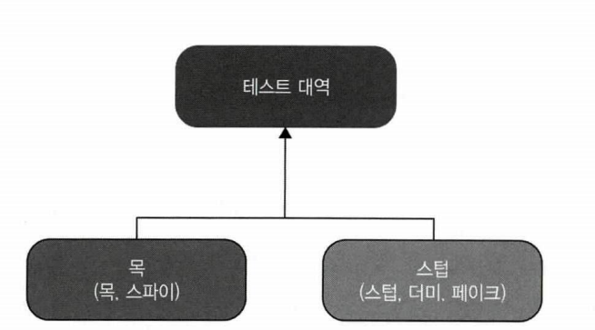

# Chapter5 목과 테스트 취약성

생성일: 2023년 8월 23일 오후 6:08
태그: 5장

---

# 5.1 목과 스텁 구분

- 목은 테스트 대상 시스템과 상호작용을 검사하는 테스트 대역이다.
- 이번장은 목이 무엇이고 스텁이 무엇인지 자세히 살펴볾

## 테스트 대역 유형

- 테스트 대역은 모든 유형의 비운영용 가짜 의존성을 설명하는 포괄적 용어
- 더미
- 스텁
- 스파이
- 목
- 페이크



- 목
    - 외부로 나가는 상호 작용을 모방하고 검사하는데 도움이 됨
    - 테스트 대상 시스템이 상태를 변경하기 위한 의존성을 호출 하는데 해당
- 스텁
    - 내부로 들어오는 상호 작용을 모방하는 데 도움이 됨
    - 테스트 대상 시스템이 데이터를 얻기 위한 의존성을 호출 하는 것에 해당
    


- 이메일 전송 → 이메일 전송이 최종 행위 (목)
- 데이터 검색 → 검색후 반환 값이 최종 행위(스텁)

## 도구로서의 목과 테스트 대역으로서의 목

- 테스트 대역을 생성하기 위한 Mock(라이브러리) 은 목이고, 테스트 대역 `인스턴스`가 테스트 대역으로써의 목이다.

## 스텁으로 상호 작용을 검증하지 말라

- 목은 상호작용을 모방하고 `검증` `verify`  하라
- 스텁은 상호작용만 `모방` 하고 검사하지 말라
- 스텁과의 상호 작용을 검증하는 것은 취약한 테스트를 야기하는 일반적인 안티 패턴
- 최종 결과가 아닌 (디비 조회) 를 검증하는 관행을 `과잉 명세` 라고 부름

## 목과 스텁 함께 쓰기

```java
class Tests {

  void purchase_fails_when_not_enough_inventory() {
			var storeMock = new Mock<IStore>();
			storeMock.setup(x -> x.hashEnoughInventory(product.shampoo, 5)).returns(false);

			var sut = new Customer();
			
			boolean success = sut.purchase(storeMock.object, product.shampoo, 5);
			
			Assert.False(success);
			storeMock.Verify(x -> x.rRemoveInventory(Product.shampoo, 5 ), Times.Never);
	}
}
```

- 테스트 대역은 목이면서 스텁이지만 여전히 목이라고 부르고 스텁이라 부르지 않음
- 테스트는 HasEnoughInventory에서 응답을 설정하고, removeInventory 에서 호출을 검증하므로 스텁과의 상호작용을 검증하지 말라는 규칙이 위배되지 않음

## 목과 스텁은 명령과 조회에 어떻게 관련돼 있는가?

- 명령은 부작용을 일으키고 어떤 값도 반환하지 않는 void 메서드
- 부작용은 객체 상태 변경, 파일 시스템 내 파일 변경 등
- 조회는 그반대로 부작용이 없고 값을 반환함


- 메서드가 부작용을 일으키면 해당 메서드 반환 타입이 void 인지 확인
- 메서드가 값을 반환하면 부작용이 없어야함

---

# 5.2 식별할 수 있는 동작과 구현 세부 사항

## 식별할 수 있는 동작은 공개 API와 다르다

**모든 제품 코드의 2차원적 분류**

- 공개 API 또는 비공개 API
    - public
    - private
- 식별할 수 있는 동작 또는 구현 세부 사항
    - 식별할 수 있는 동작
        - 클라이언트가 목표를 달성하는 데 도움이 되는 연산을 노출하라
        - 클라이언트가 목표를 달성하는 데 도움이 되는 상태를 노출하라
    - 구현 세부 사항
        - 위 두가지 중 아무것도 해당하지 않음( 식별동작 중 )


**Before**

```java
public class User {
	public String name;
	
	public String NormalizeName(String name) {
			String result = (name ?? "").Trim();
			
			if (result.length > 50) {
					return result.subString(0, 50);
			}
			return result)
	}

}

public class UserController {
	public void renameUser(int userId, String newName) {
			User user = GetUserFromDatabase(userId);
			String normalizedName = user.normalizeName(newName);
			user.Name = norimalizedName;
			saveUserToDatabase(user);
	}
}
```

**After**

```java
public class User {
	public String name;
	
	public setName(String newName) {
		this.name = normalizeName(name);
	}

	private String NormalizeName(String name) {
			String result = (name ?? "").Trim();
			
			if (result.length > 50) {
					return result.subString(0, 50);
			}
			return result)
	}

}

public class UserController {
	public void renameUser(int userId, String newName) {
			User user = GetUserFromDatabase(userId);
			user.Name = norimalizedName;
			saveUserToDatabase(user);
	}
}
```

- 단일한 목표를 달성하고자 클래스에서 호출해야 하는 연산의 수가 1보다 크면 해당 클래스에서 구현 세부 사항을 유출할 가능성이 있다.
- 리팩토링 후에는 → 연산의 수가 1회

## 잘 설계된 API와 캡슐화

- 캡슐화는 불변성 위반이라고도 하는 모순을 방지하는 조치
- 불변성은 항상 참이어야 하는 조건
- 위 예제에서는 User 클래스에는 사용자 이름이 50자를 초과하면 안 된다는 불변성이 존재
- 구현 세부 사항 `50자를 초과하는지 검증하는 구현로직` 을 노출하면 불변성 위반을 가져옴
- 묻지 말고 말하라 원칙을 지켜라( 마틴 파울러 )
    - 구현 세부 사항을 숨기면 클라이언트 시야에서 클래스 내부를 가릴 수 있어 내부를 손상 시킬 위험이 적다
    - 데이터와 연산을 결합하면 해당 연산이 클래스의 불변성을 위반하지 않도록 할 수 있다.
    


---

# 5.3 목과 테스트 취약성 간의 관계

- 육각형 아키텍처(hexagonal architecture)
- 내부 통신과 외부 통신 차이점
- 목과 테스트 취약성

## 육각형 아키텍처 정의

**전형적인 애플리케이션**

- 애플리케이션 서비스
    - 데이터베이스 조회 → 해당 데이터로 도메인 클래스 인스턴스 구체화
    - 해당 인스턴스에 연산 호출
    - 결과로 데이터 베이스에 저장
- 도메인 계층


**육각형 아키텍처 목적**

- 도메인 계층과 애플리케이션 서비스 계층 간의 관심사 분리
- 애플리케이션 내부 통신
- 애플리케이션 간의 통신

## 시스템 내부 통신과 시스템 간 통신

- 시스템 내부 통신
    - 애플리케이션 내 클래스 간의 통신
- 시스템 간 통신
    - 애플리케이션이 다른 애플리케이션과 통신하는 것을 말함
- 목을 사용하면 시스템과 외부 애플리케이션 간의 통신 패턴을 확인할 때 좋음
- 목을 클래스 간의 통신을 검증하는 데 사용하면 테스트가 구현 세부 사항과 결합되며 그에 따라 리팩터링 내성 지표가 미흡해짐

## 시스템 내부 통신과 시스템 간 통신의 예

**유스케이스**

- 고객이 상점에서 제품을 구매하려고 함
- 매장 내 제품 수량이 충분하면
    - 재고가 상점에서 줄어듬
    - 고객에게 이메일로 영수증을 발송함
    - 확인 내역을 반환함

**도메인 객체 및 외부 서비스**

- Customer
- Store
- STMP 서비스 (외부)


**테스트**

- 고객이 상점에서 제품을 구매하려고 함
- 매장 내 제품 수량이 충분하면
    - 재고가 상점에서 줄어듬 (스텁)
    - 고객에게 이메일로 영수증을 발송함 (목)
    - 확인 내역을 반환함

---

# 5.4 단위 테스트의 고전파와 런던파 재고


## 모든 프로세스 외부 의존성을 목으로 해야 하는 것은 아니다.

**의존성 유형**

- 공유 의존성: 테스트 간에 공유하는 의존성 (제품 코드가 아님)
- 프로세스 외부 의존성: 프로그램의 실행 프로세스 외의 다른 프로세스를 점유하는 의존성
    - 데이터베이스
    - 메시지 버스
    - SMTP 서비스 등
- 비공개 의존성: 공유하지 않는 모든 의존성


- 모든 `외부 의존성` 을 목으로 해야 할 필요는 없음
- 애플리케이션과 외부 시스템 간의 통신 패턴을 항상 지켜야 하는 요구 사항은 하위 호환성을 지켜야 한다는 점에서 비롯됨 
→ 이럴 떄는 목을 사용해도 좋음
- 애플리케이션이 애플리케이션 외부 시스템에 대한 프록시 같은 역할을 하고 있고, `클라이언트` 가 직접 접근할 수 없으면 하위 호환성 요구 사항이 사라짐 
→ 목을 사용하면 깨지기 쉬운 테스트가 됨
    - 데이터베이스
        - 어떤 외부 시스템도 데이터베이스에 접근할 수 없음
        - 애플리케이션만 접근이 가능함
        - 데이터베이스에서 테이블을 분할하거나 타입이 바뀌면 테스트가 빨간색이 됨

---

# 정리

## 느낀점

- 스텁은 목의 일부다
- 지금 까지 해왔던 JpaRepository(DB) 모킹은 스텁이다
    - verify로 디비를 검증 했던건 `안티 패턴` 이었다.
    - 최종 결과가 아닌 (디비 조회) 를 검증하는 관행을 `과잉 명세`  → 즉 과잉 명세를 하고 있었다.

## **책의 정리**

- 테스트 대역은 테스트에서 가짜 의존성의 모든 유형을 설명하는 포괄적인 용어
    - 더미
    - 스텁
    - 스파이
    - 목
    - 페이크
- 목은 외부로 나가는 상호 작용을 모방하고 검사하는데 도움이 된다.
- 스텁은 내부로 들어오는 상호 작용(SUT가 해당 의존성을 호출해 입력 데이터를 가져옴(DB))을 모방하는데 도움이 됨
- Mock(도구)는 목(테스트 대역) 이나 스텁을 만드는데 활용하는 라이브러리다
- 스텁과의 상호 작용을 검증하면 취약한 테스트로 이어진다(안티 패턴, 과잉 명세)
- 명령 조회 분리 원칙에 따르면 모든 메서드가 명령 또는 조회중 하나여야 하며
명령을 대체하는 테스트 대역은 목, 조회를 대체하는 테스트 대역은 스텁이다.
- 모든 제품 코드는 공개 API 인지 비공개 API 인지 식별할 수 있는 동작인지 구현 세부 사항인지 라는 두가지 차원으로 분류 가능
- 잘 설계된 코드는 식별할 수 잇는 동작이 공개 API 와 일치하고 구현 세부 사항이 비공개 API뒤에 숨겨져 있는 코드다(캡슐화)
- 애플리케이션에서의 통신
    - 시스템 내부 통신
        - 애플리케이션 내 클래스 간의 통신
    - 시스템 간 통신
        - 외부 애플리케이션과의 통신
- 시스템 내 통신을 검증하고자 목을 사용하면 취약한 테스트가 된다.