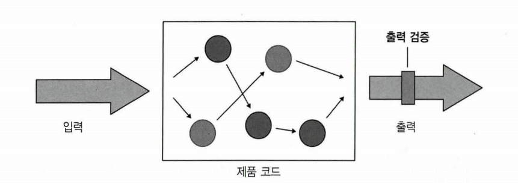

# Chapter6 단위 테스트 스타일

생성일: 2023년 8월 30일 오후 5:30
태그: 6장

---

# 6.1 단위 테스트의 세 가지 스타일

- 출력 기반 테스트(output-based testing)
- 상태 기반 테스트(state-based testing)
- 통신 기반 테스트(communication-based testing)

## 출력 기반 테스트 정의

- 테스트 대상 시스템(SUT)에 입력을 넣고, 출력을 검사
- 내부 상태를 변경햐지 않는 코드에만 적용됨
- 반환 값만 검증하면 됨
- 출력 기반 단위 테스트 스타일은 함수형 이라고도 한다.

## 상태 기반 스타일의 정의

- 작업이 완료 된 후 시스템 상태 확인
- 상태 → SUT나 협력자 중 하나 또는 데이터베이스나 파일 시스템등 외부 프로세스 외부 의존성의 상태 등을 의미 할 수 있음

## 통신 기반 스타일 정의

- 목을 사용해 테스트 대상 시스템과 협력자 간의 통신을 검증

---

# 6.2 단위 테스트 스타일 비교

## 희귀 방지와 피드백 속도 지표로 스타일 비교하기

- 어떤 스타일도 지표에 영향을 안줌
- 통신 기반 스타일만 남용하면 작은 코드 조각을 검증하고 다른 것은 모두 목으로 사용하는 피상적인 테스트가 될 수 있음

## 리팩터링 내성 지표로 스타일 비교하기

- 출력기반 테스트는 테스트가 대상 메서드에만 결합되므로 거짓 양성 방지가 가장 우수
- 상태 기반 테스트는 거짓 양성이 되기 쉽다
- 통신 기반 테스트는 허위 경보에 가장 취약함

## 유지 보수성 지표로 스타일 비교하기

- 출력 기반 테스트의 유지 보수성
    - 다른 스타일보다 유지 보수하기 용이함
    - 출력 기반 테스트는 항상 짧고 간결하므로 유지 보수가 쉽다.
- 상태 기반 테스트의 유지 보수성
    - 출력  기반 보다 유지보수가 쉽지 않음
- 통신 기반 테스트의 유지 보수성
    - 제일 최하
    - 목이 사슬로 엮이면 유지 보수하기 매우 힘들어짐

## 스타일 비교하기 결론

---

# 6.3 함수형 아키텍처 이해

## 함수형 프로그래밍이란?

- 수학적 함수(mathematical function(순수 함수 pure function라고도함)) 을 사용한 프로그래밍
- 수학적 함수는 숨은 입출력이 없는 함수(또는 메서드) 다
- 모든 입출력은 메서드 이름, 인수, 반환 타입으로 구성된 메서드 시그니처에 명시해야 함
- 수함적 함수는 호출 횟수에 상관 없이 주어진 입력에 대해 동일한 출력을 생성해야 함

**숨은 입출력 유형**

- 부작용
    - 메서드 시그니처에 표시되지 않은 출력
- 예외
    - 메서드가 예외를 던지면 시그니처에 설정된 계약을 우회하는 경로가됨
- 내외부 상태에 대한 참조
    - [DateTime.now](http://DateTime.now) 같이 정적 속성을 사용 하는 경우 메서드 시그니처에 없는 실행에 대한 입력이며, 따라서 숨어있음

## 함수형 아키텍처란?

- 어떤 부작용도 일으키지 않는 애플리케이션을 만들 수는 없음
- 비즈니스 로직을 처리하는 코드와 부작용을 일으키는 코드를 분리하는 것이 목표

### 코드 유형 분리

- 결정을 내리는 코드
    - 이 코드는 부작용이 필요 없기 때문에 수학적 함수를 사용해 작성 가능
- 해당 결정에 따라 작용하는 코드
    - 수학적 함수에 의해 이뤄진 모든 결정을 데이터베이스 변경이나 메시지 버스로 전송된 메시지와 같이 가시적인 부분으로 변환

---

# 요약

- 출력 기반 테스트는 SUT에 입력을 주고 출력을 확인 하는 테스트
- 상태 기반 테스트는 작업이 완료된 후의 시스템 상태를 확인한다.
- 통신 기반 테스트는 목을 사용해서 테스트 대상 시스템과 협력자 간의 통신을 검증 한다.
- 단위 테스트의 고전파는 통신 기반 스타일보다 상태 기반 스타일을 선호한다.
런던파는 반대를 선호함, 두 분파 모드 출력 기반 테스트를 사용함
- 출력 기반 테스트가 품질이 가장 좋다.
- 통신 기반 테스트도 안정성을 위해 더 신중해야 한다.
- 함수형 프로그래밍은 수학적 함수로 된 프로그래밍이다.
- 수학적 함수는 숨은 입출력이 없는 함수(도는 메서드)다.
- 함수형 프로그래밍의 목표는 비즈니스 로직과 부작용을 분리하는 것이다.
- 함수형 아키텍처는 부작용을 비즈니스 연산의 가장자리로 밀어내 분리를 이루는데 도움이 된다.
- 함수형 아키텍처는 모든 코드를 함수형 코어와 가변 셸이라는 두 가지 범주로 나눈다.
- 모든 코드베이스를 함수형 아키텍처로 전환할 수는 없다.
코드베이스가 단순하거나 그렇게 중요하지 않으면, 함수형 아키텍처에 필요한 초기 투자는 별 효과가 없다.