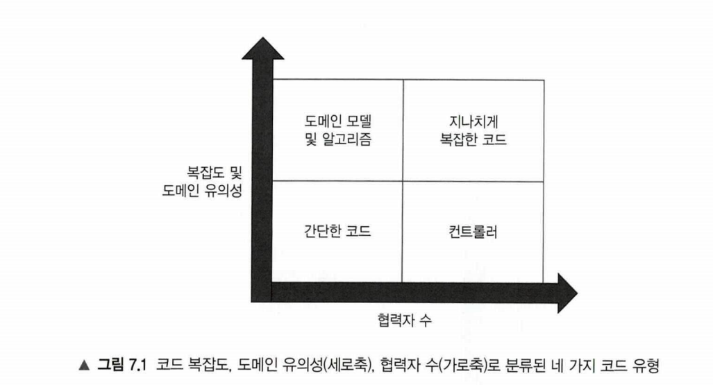

# Chapter7 가치 있는 단위 테스트를 위한 리팩터링

생성일: 2023년 9월 3일 오후 8:42
태그: 7장

---

# 7.1 리팩터링할 코드 식별하기

- 기반 코드를  변경해야 테스트 스위트를 개선할 수 있음
- 코드 유형을 살펴봄

## 코드의 네 가지 유형

**2차원으로 코드 분류**

- 복잡도 도는 도메인 유의성
    - 복잡도는 코드 내 의사 결정(분기) 지점 수로 정의됨
    - 복잡한 코드와 도메인 유의성을 갖는 코드가 단위 테스트에서 가장 이로움
- 협력자 수
    - 가변 의존성 또는 외부 의존성
    - 협력자가 많으면 비용이 많이듬



- 도메인 모델과 알고리즘
    - 도메인과 직접적으로 관련이 없는 복잡한 알고리즘
    - `가장 이로운 단위 테스트 항목`
- 간단한 코드
    - 매개변수가 없는 생성자와 한 줄 속성 등
    - `테스트 할 필요가 없음`
- 컨트롤러
    - 도메인 클래스와 외부 애플리케이션 같은 구성 요소의 작업을 조정
    - `통합 테스트의 일부로서 간단히 테스트`
- 지나치게 복잡한 코드
    - 예를 들어 큰 컨트롤러가 있음
    - `테스트 해야 하지만 어려울 수 있음`

## 험블 객체 패턴을 사용해 지나치게 복잡한 코드 분할하기


**어려운 테스트**

- 비동기
- 멀티스레드 실행
- 사용자 인터페이스
- 프로세스 외부 의존성과의 통신 등


- 테스트가 가능한 부분을 추출


- 함수형 아키텍처가 테스트를 용이하게함
- 함수형 코어에는 협력자도 없고 모두 불변
- 단일 책임 원칙을 지키면 테스트하기 용이해진다.

---

# 7.2 가치 있는 단위 테스트를 위한 리팩터링 하기

- 복잡한 코드를 `알고리즘` 과 `컨트롤러` 로 나누는 방법을 알아봄

## 고객 관리 시스템 리팩터링

```java
public class User {
    public int userId;
    public String email;
    private UserType userType;

    public void changeEmail(int userId, String newEmail) {
        Object[] data = Database.geUserById(userId);
        this.userId = userId;
        this.email = (String) data[1];
        userType = (UserType) data[2];

        if (Objects.equals(email, newEmail)) {
            return;
        }

        Object[] companyData = Database.getCompany();
        String companyDomainName = (String) companyData[0];
        int numberOfEmplyees = (int) companyData[1];

        String emailDomain = newEmail.split("@")[1];
        boolean isEmailCorporate = Objects.equals(emailDomain, companyDomainName);
        UserType newType  = isEmailCorporate ? UserType.EMPLOYEE : UserType.CUSTOMER;

        if (this.userType != newType) {
            int delta = newType == UserType.EMPLOYEE ? 1 : -1;
            int newNumber = numberOfEmplyees + delta;
            Database.save(newNumber);
        }

        this.email = newEmail;
        this.userType = newType;

        Database.save(this);
        MessageBus.sendEmailChangedMessage(userId, newEmail);

    }

    public enum UserType {
        CUSTOMER, EMPLOYEE
    }
}

```

- 도메인 클래스가 스스로 데이터베이스에서 찾고 저장하는 방식을 활성 레코드 패턴 이라함
- Database와 MessageBus는 암시적 존재가됨 복잡한 코드가 되도록 만드는 요소

## 해결 하기

**암시적 존재를 명시적으로**

- 암시적 존재에 대한 인터페이스를둔다
- 이를 사용하는 객체에 주입하도록한다
- 테스트에서는 Mock 으로 처리한다.

**서비스 두기** 

- 서비스에서 의존성을 주입받고 도메인을 컨트롤

**ORM의 도입**

- ORM을 사용하여 데이터베이스를 도메인 모델에 매핑한다
- 도메인 클래스를 인스턴스화하는 팩토리 클래스를 작성

---

# 요약

- 코드 복잡도는 코드에서 의사 결정 지점 수에 따라 명시적으로 그리고 암시적을 정의된다
    - 연산 횟수 + 1 (기본값1)
- 도메인 유의성은 프로젝트의 문제 도메인에 대해 코드가 얼마나 중요한지를 보여준다.
- 복잡한 코드와 도메인 유의성을 갖는 코드는 해당 테스트의 회귀 방지가 뛰어나기 때문에 단위 테스트에서 가장 이롭다
- 협력자가 많은 코드를 다루는 단위 테스트는 유지비가 많이든다.
- 모든 제품 코드는 복잡도 또는 유의성과 협력자 수에 따라 네 가지 유형의 코드로 분류할 수 있다.
    - 도메인 모델 및 알고리즘은 단위 테스트에 대한 노력 대비 가장 이롭다
    (복잡도 또는 도메인 유의성이 높고, 협력자가 없음)
    - 간단한 코드는 테스트할 가치가 전혀 없다
    - 컨트롤러는 통합 테스트를 통해 간단히 테스트 해야 한다
    - 지나치게 복잡한 코드는 컨트롤러와 복잡한 코드로 분할해야 한다.
- 코드가 중요하거나 복잡할수록 협력자가 적어야 한다.
- 도메인 유의성이 있으면 전제 조건을 테스트하고 그외의 경우는 테스트 하지 않는다