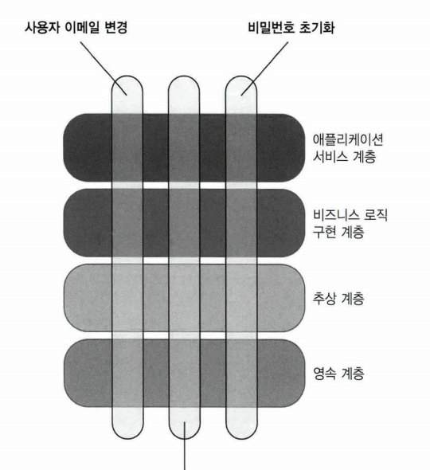

# Chapter8 통합테스트를 하는 이유

생성일: 2023년 9월 13일 오후 5:36
태그: 8장

- 단위 테스트에만 전적으로 의존하면 시스템이 전체적으로 잘 작동하는지 확신 불가
- 단위테스트 → 비즈니스 로직 확인에만 좋음

---

---

# 8.1 통합 테스트는 무엇인가?

- 통합 테스트는 테스트 스위트에서 중요한 역할을 함
- 단위 테스트 개수와 통합 테스트 개수의 균형을 맞추는 것도 중요

## 통합 테스트의 역할

**단위 테스트의 역할**

- 단일 동작 단위를 검증하고
- 빠르게 수행하고
- 다른 테스트와 `별도` 로 처리한다.

> 위 요구 사항중 하나라도 충족하지 못하는 테스트는 통합 테스트 범주에 속한다.
> 

**통합 테스트는**

- 대부분 시스템이 프로세스 외부 의존성과 통합해 어떻게 작동하는지를 검증

## 다시 보는 테스트 피라미드

- 통합 테스트가 프로세스 외부 의존성에 직접 작동하면 느려진고, 유지비가 많이든다
- 유지비 증가 이유
    - 프로세스 외부 의존성 운영이 필요함
    - 관련된 협력자가 많아서 테스트가 비대해짐

## 통합 테스트와 빠른 실패

- 통합 테스트에서 프로세스 외부 의존성과의 상호 작용을 모두 확인하려면 가장 긴 주요 흐름을 선택하라
- 이렇게 모든 상호 작용을 거치는 흐름이 없으면 외부 시스템과 통신을 모두 확인하는 데 필요한 만큼 통합 테스트를 작성하라

---

## 8.2 어떤 프로세스 외부 의존성을 직접 테스트 해야 하는가?

- 관리 의존성(전체를 제어할 수 있는 프로세스 의부 의존성)
    - 애플리케이션을 통해서만 접근할 수 있으며
    - 해당 의존성과의 상호 작용은 외부 환경에서 볼 수 없음
    - ex) 데이터베이스
    - **목을 사용하지 않고 실제 의존성을 주입해서 테스트**
- 비관리 의존성(전체를 제어할 수 없는 프로세스 외부 의존성)
    - SMTP 서버, 메시지 서버
    - **목으로 테스트 하는게 제격**
- 관리 의존성이면서 비관리 의존성
    - 다른 애플리케이션이 접근할 수 있는 데이터베이스(MSA)
    - 다른 방법이 없을 경우에는 테이블의 권한을 열어준다
    - **API나, 메시지 버스를 사용하는게 최고**
    - **목으로 테스트**

**통합 테스트에서 실제 데이터 베이스를 사용할 수 없으면?**

- IT 보안 정책 때문에 불가능
- 통합 테스트 환경에 배포 불가능 일 때
- 통합 테스트를 작성하지 말고 **도메인 모델 단위 테스트에 집중**

---

# 8.4 의존성 추상화를 위한 인터페이스 사용

## 인터페이스와 느슨한 결합

- 많은 개발자가 외부 의존성을 위해 인터페이스를 도입
- 심지어 인터페이스 구현이 하나만 있어도 구현

아래와 같은 상황이 생김

```java
public interface IMessageBus
public class MessageBus : IMessageBus

public interface IUserRepository
public class UserRepository : IUserRepository
```

- 프로세스 외부 의존성을 추상화해 느슨한 결합을 달성하고,
- 기존 코드를 변경하지 않고 새로운 기능을 추가해 공개 폐쇄 원칙을 지키기 때문

**오해**

- 단일 구현을 위한 인터페이스는 `추상화` 가 아님
- 해당 인터페이스를 구현하는 구체 클래스보다 결합도가 낮지 않다.
- 진정한 추상화는 발견하는것이지 발명하는 것이 아님
- 인터페이스가 진정으로 추상화 되려면 구현이 적어도 두 가지는 있어야 함

**YAGNI원칙(You aren’t gonna need it)**

- 기회 비용
    - 현재 필요하지 않은 기능에 시간을 보내면 시간을 허비하는게 됨
- 프로젝트 코드가 적을수록 좋다.

## 프로세스 외부 의존성에 인터페이스를 사용하는 이유는 무엇인가?

- 목을 사용하기 위함으로 구현이 하나만 있어도 인터페이스를 사용
- 목으로 처리할 필요가 없으면 외부 의존성에 대한 인터페이스를 두지 말라

---

# 8.5 통합 테스트 모범 사례

- 도메인 모델 경계 명시하기
- 애플리케이션 내 계층 줄이기
- 순환 의존성 제거하기

## 도메인 모델 경계 명시하기

- 코드베이스에서 명시적이고 잘 알려진 위치에 두자
- 명시적 경계를 지정하면 코드의 해당 부분을 더 잘 보여주고 더 잘 설명할 수 있다.

## 계층 수 줄이기



- 도메인 모델
- 애플리케이션 서비스 계층(컨트롤러)
- 인프라 계층

## 순환 의존성 제거하기

- 순환 의존성이 있으면 해결책을 찾기 힘들어진다.
- 순환 의존성은 테스트를 방해한다.

## 테스트에서 다중 실행 구절 사용

- 준비: 사용자 등록에 필요한 데이터 준비
- 실행: 실행할 테스트 호출
- 검증: 실행이 완료되었는지 검증
- 반복

---

# 요약

- 통합 테스트는 단위테스트가 아닌 테스트에 해당됨
- 통합 테스트는 시스템이 프로세스 의존성과 통합해 작동하는 방식을 검증함
- 통합 테스트의 기준은 단위 테스트 보다 높다.
- 빠른 실패 원칙은 버그가 빠르게 나타날 수 있도록 하며 통합 테스트에서 할 수 있는 대안이다
- 관리 의존성은 애플리케이션을 통해서만 접근할 수 있는 프로세스 외부 의존성이다.
- 비관리 의존성은 다른 애플리케이션이 접근할 수 있는 프로세스 외부 의존성이다
대표적으로 SMTP, 메시지 버스 등이 있다.
- 통합테스트에서 관리 의존성은 실제 의존성을 사용하고 비관리 의존성은 목으로 대체하라
- 구현이 하나뿐이 인터페이스를 사용하기에 타당한 이유는 목을 사용하기 위한 것뿐이다.